# SKJERMER — billedkatalog (rute → skjermbilde → kildefil → formål)

> **Dette er fasiten for hvordan hver skjerm skal SE UT.** Hver rad har et skjermbilde i `screens/`,
> den eksakte `.dc.html`-kildefila (åpne den for pikselnær markup, tekst og tallverdier), ruten, og
> formålet. Mange skjermbilder har en **merknadsstripe øverst** som forklarer faner og navigasjon.
>
> **Versjoner:** der en skjerm finnes i flere varianter (`(hybrid)`, `(terminal-lys)`, `v2`) er den
> **kanoniske** valgt etter gjeldende retning **terminal-lys** (se `../CLAUDE.md` §3). Eldre varianter
> ligger igjen i roten som referanse, men bygg etter den kanoniske kildefila under.
>
> **Knapp → rute** for hver skjerm: se `NAVIGASJON-knapp-til-rute.md`.

---

## A · PlayerHQ — `/portal` (spiller · lys terminal-lys · mobil-først)

### A1 · Dashboard — `/portal`
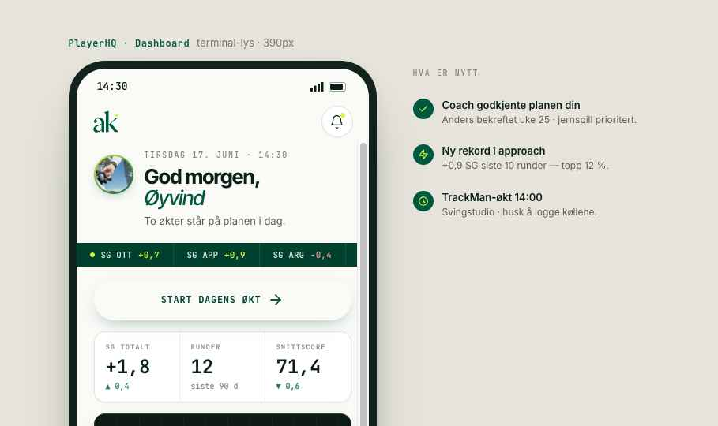
Kildefil: `PlayerHQ Dashboard (terminal-lys).dc.html` · «hva gjør jeg i dag»: hero-hilsen, SG-ticker, «Start dagens økt», KPI-stripe (SG totalt / runder / snittscore), «hva er nytt».

### A2 · Onboarding — `/portal/onboarding`
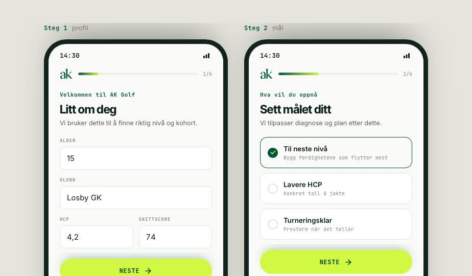
Kildefil: `PlayerHQ Onboarding (terminal-lys).dc.html` · 6-stegs wizard: profil (alder/klubb/HCP/snittscore) → mål (neste nivå / lavere HCP / turneringsklar) → …

### A3 · Analyse — `/portal/analysere`
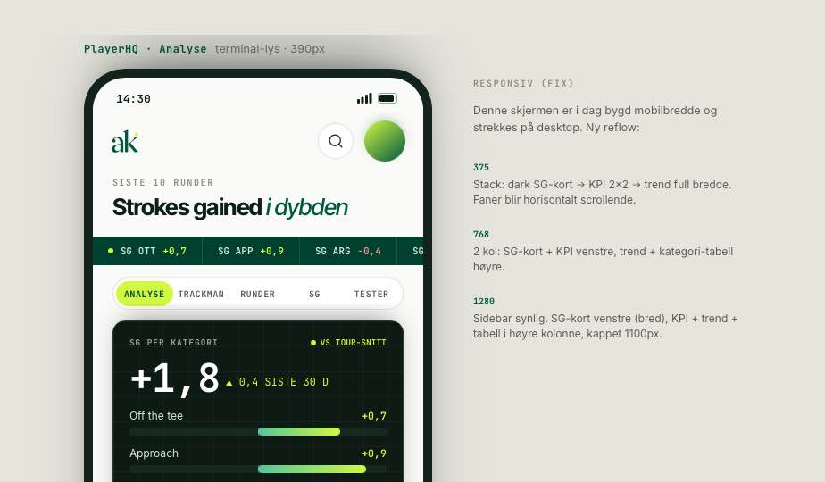
Kildefil: `PlayerHQ Analyse (terminal-lys).dc.html` · diagnose-først: nivå + største gap øverst, så SG-nedbrytning. Faner: Analyse · TrackMan · Runder · SG · Tester.

### A4 · Statistikk / SG — `/portal/statistikk`
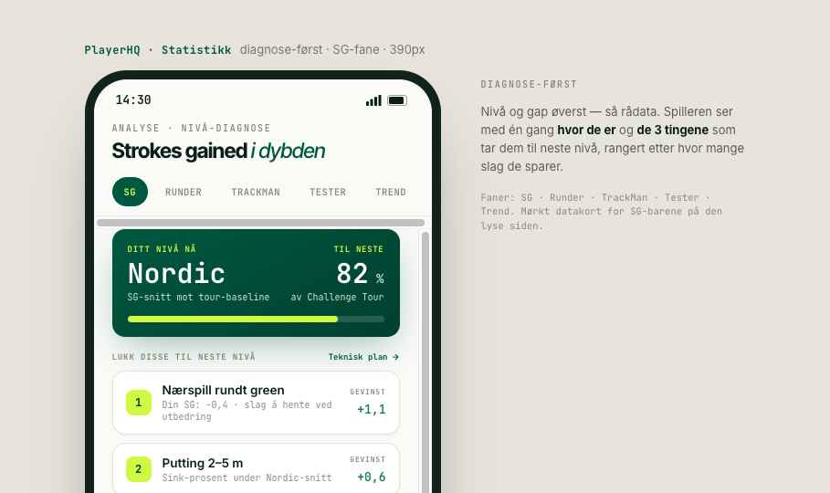
Kildefil: `PlayerHQ Statistikk-SG (terminal-lys).dc.html` · SG per kategori (OTT/APP/ARG/PUTT), trend, mot baseline. Mørke datamoduler.

### A5 · Plan / Workbench-inngang — `/portal/planlegge`
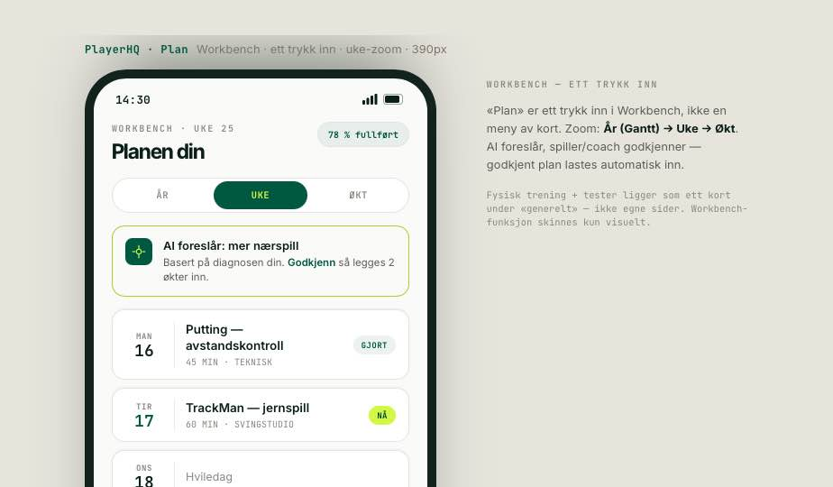
Kildefil: `PlayerHQ Plan-Workbench (terminal-lys).dc.html` · ett trykk inn i Workbench. Zoom År (Gantt) → Uke → Økt.

### A6 · Teknisk plan — `/portal/teknisk`
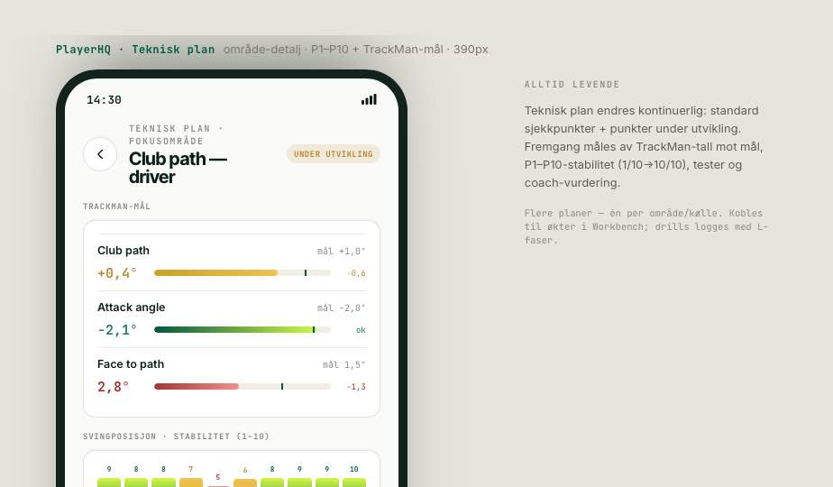
Kildefil: `PlayerHQ Teknisk plan (terminal-lys).dc.html` · spillerens tekniske plan: fokusområder, drills, mål per ferdighet.

### A7 · SG-import — `/portal/statistikk/runder/ny`
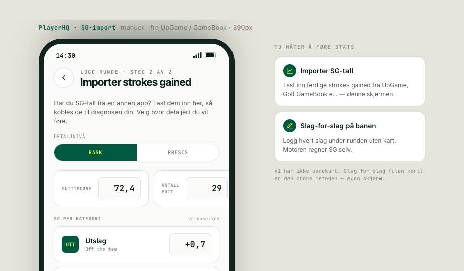
Kildefil: `PlayerHQ SG-import (terminal-lys).dc.html` · manuell SG-import (4 kategorier + total + snittscore + putts). Stats-logging metode (a).

### A8 · On-course logging — `/portal/(fullscreen)/runde`
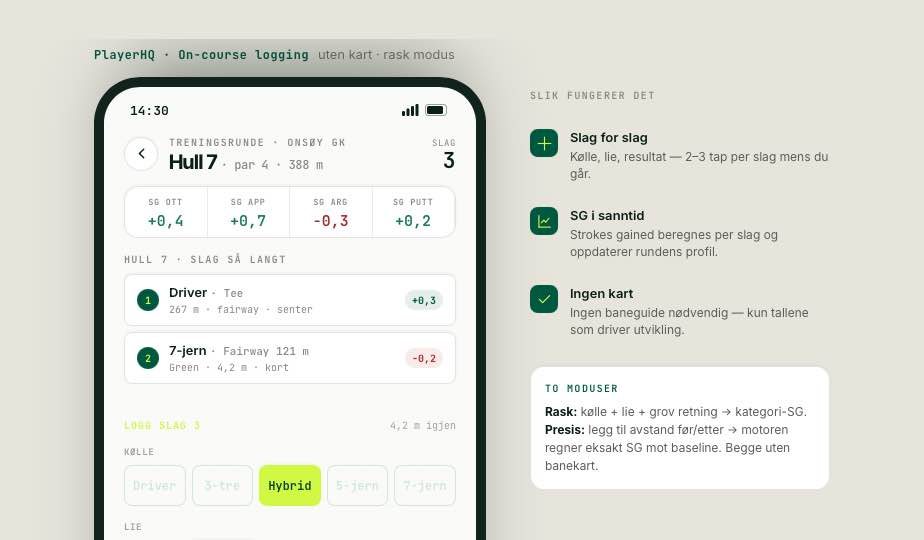
Kildefil: `PlayerHQ On-course logging (terminal-lys).dc.html` · slag-for-slag uten banekart. Rask + Presis modus. Stats-logging metode (b). **INGEN banekart i V1.**

### A9 · TrackMan-økt — `/portal/trackman/[id]`
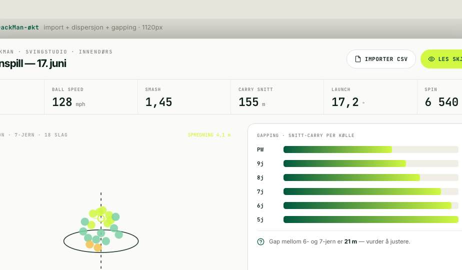
Kildefil: `PlayerHQ TrackMan-okt (terminal-lys).dc.html` · CSV-import + skjermbilde-parse, dispersjon, gapping, SG-kobling.

### A10 · Mot proffene — `/portal/mot-proffene`
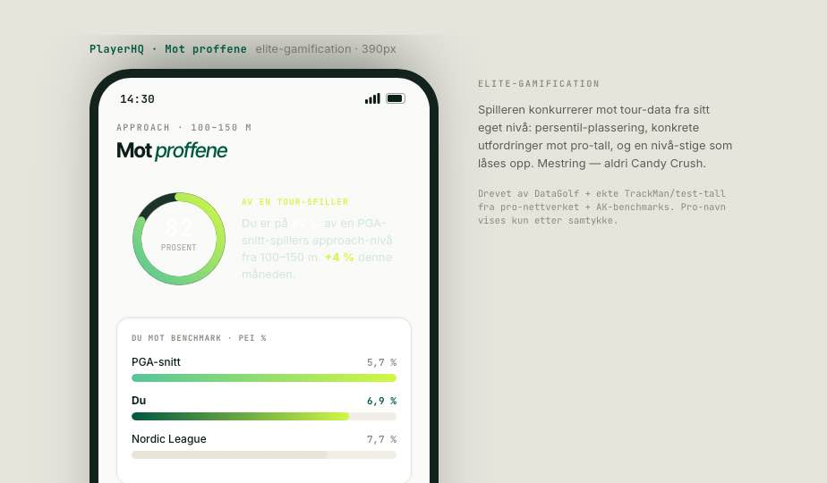
Kildefil: `PlayerHQ Mot proffene (terminal-lys).dc.html` · elite-gamification: persentil mot tour, utfordringer, nivå-stige.

### A11 · Live-økt (range) — `/portal/(fullscreen)/live/[id]`
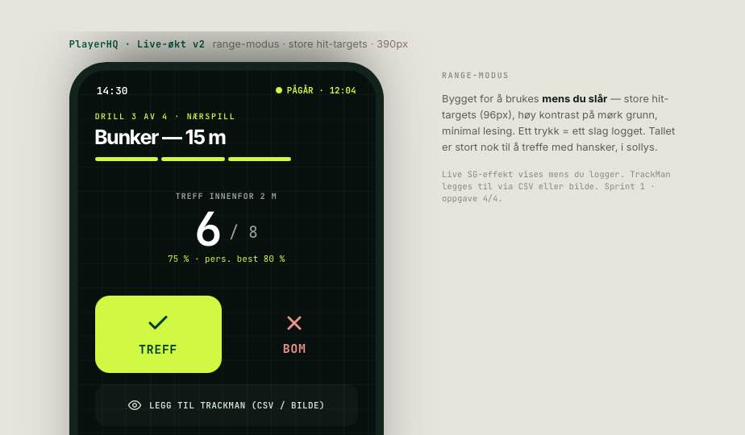
Kildefil: `PlayerHQ Live-okt v2 (range-modus).dc.html` · aktiv økt på range: reps, live-puls, logging.

### A12 · Gjennomføre — `/portal/(fullscreen)/tren`
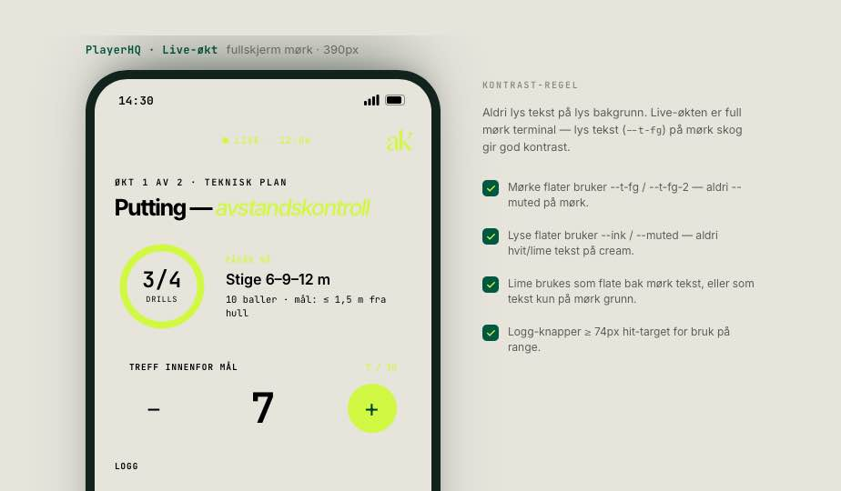
Kildefil: `PlayerHQ Gjennomføre (terminal-lys).dc.html` · gjennomfør planlagt økt steg for steg.

### A13 · Tester-flyt — `/portal/tester`
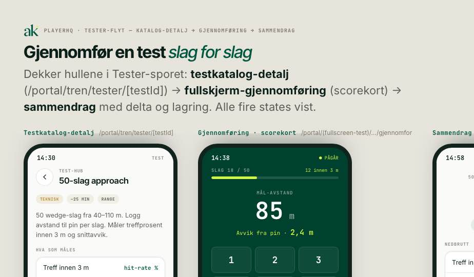
Kildefil: `PlayerHQ Tester-flyt (terminal-lys).dc.html` · testkatalog → live test → sammendrag. Se `TESTBATTERI.md`.

### A14 · Booking-wizard — `/portal/booking`
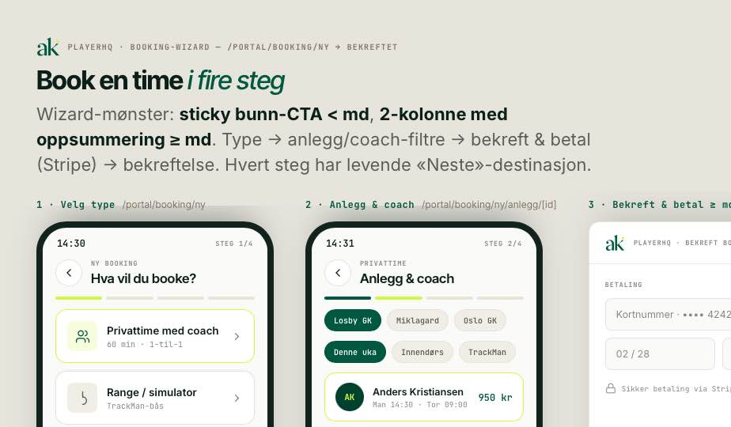
Kildefil: `PlayerHQ Booking-wizard (terminal-lys).dc.html` · bestill økt/coach: type → tid → bekreft.

### A15 · Meg (undersider) — `/portal/meg`
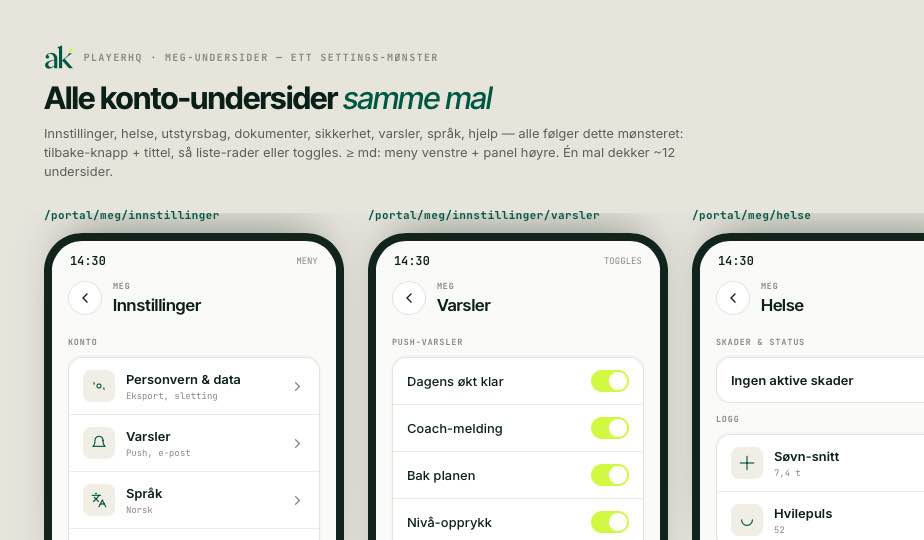
Kildefil: `PlayerHQ Meg-undersider (terminal-lys).dc.html` · profil-hub + undersider (helse, utstyr, dokumenter, innstillinger).

### A16 · Mål-hub — `/portal/mal`
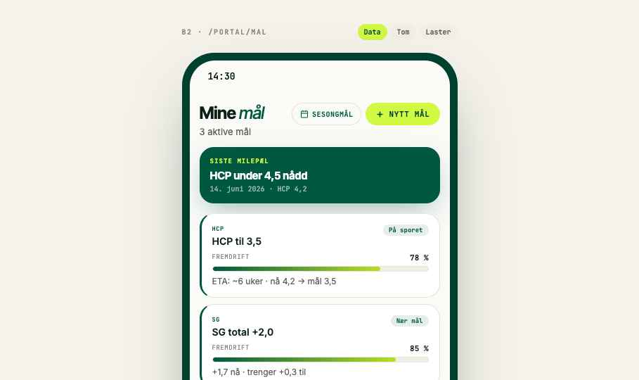
Kildefil: `PlayerHQ Mål-hub (hybrid).dc.html` · aktive mål med fremdrift/ETA. Skjermbildet viser alle 3 tilstander (Data/Tom/Laster).

### A17 · Turneringsdetalj — `/portal/turneringer/[id]`
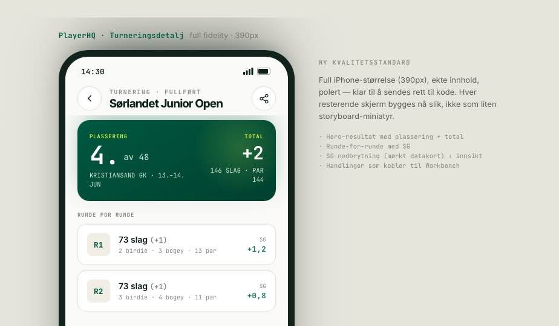
Kildefil: `PlayerHQ Turneringsdetalj (terminal-lys).dc.html` · resultat, runder, SG for én turnering.

### A18 · Coach-dialog (undersider) — `/portal/coach`
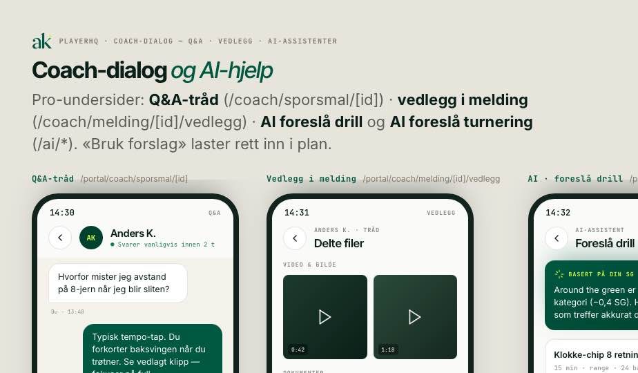
Kildefil: `PlayerHQ Coach-dialog-undersider (terminal-lys).dc.html` · meldinger, coach-notater, delt innhold.

### A19 · Varsler — `/portal/varsler`
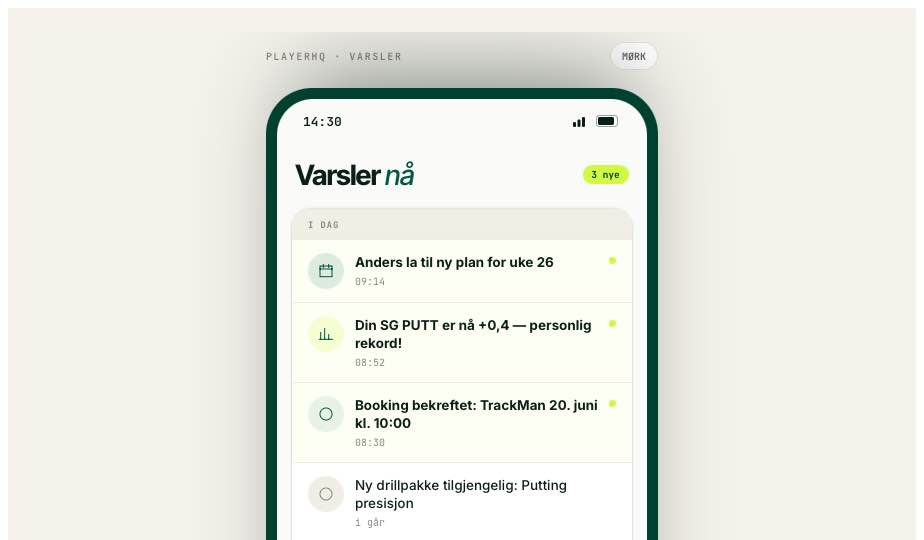
Kildefil: `PlayerHQ Varsler (hybrid).dc.html` · varsel-hub: økt klar, coach-melding, bak planen, nivå-opprykk.

### A20 · Start-økt (L-faser) — `/portal/(fullscreen)/live/[id]/brief`
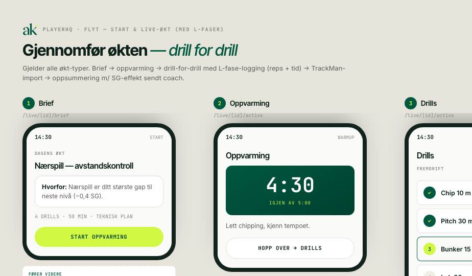
Kildefil: `PlayerHQ Start-okt L-faser (terminal-lys).dc.html` · brief før økt: oppvarming → hovedfase → avslutning.

### A21 · Meg / Abonnement — `/portal/meg/abonnement`
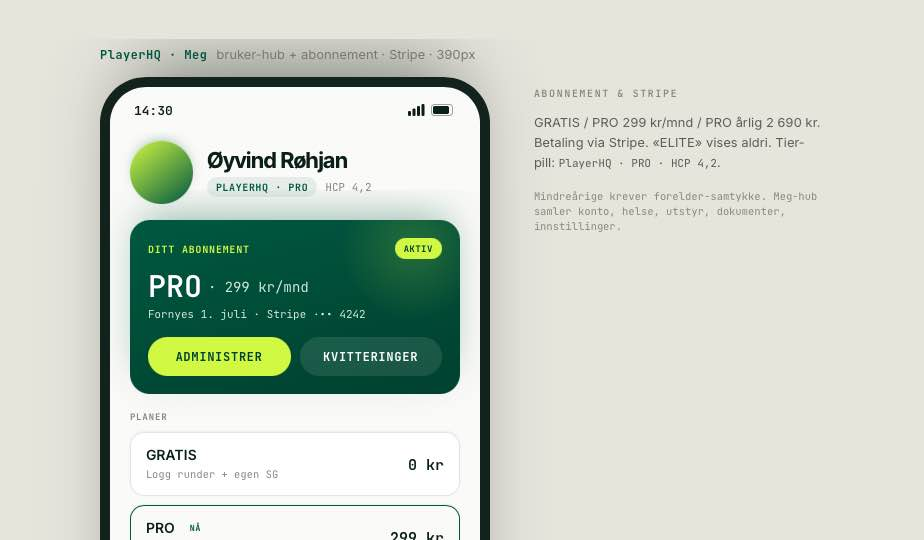
Kildefil: `PlayerHQ Meg-abonnement (terminal-lys).dc.html` · GRATIS vs PRO (299 kr/mnd · 2 690 kr/år). Stripe. **«ELITE» vises aldri.**

### A22 · Talent (undersider) — `/portal/talent`
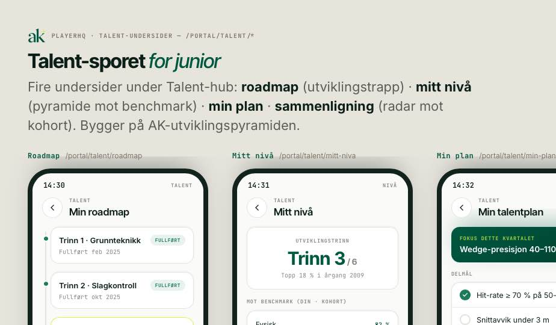
Kildefil: `PlayerHQ Talent-undersider (terminal-lys).dc.html` · talent-spor: sammenligning, utfordringer.

### A23 · Putting / reach-drills — `/portal/drills`
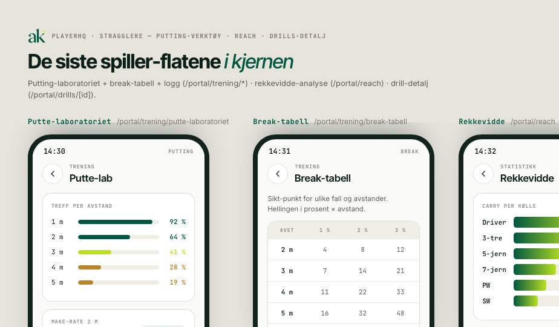
Kildefil: `PlayerHQ Putting-reach-drills (terminal-lys).dc.html` · drill-bibliotek med reach/nærhet-måling.

---

## B · AgencyOS — `/admin` (coach/admin · mørk terminal · desktop-først)

### B1 · Cockpit — `/admin`
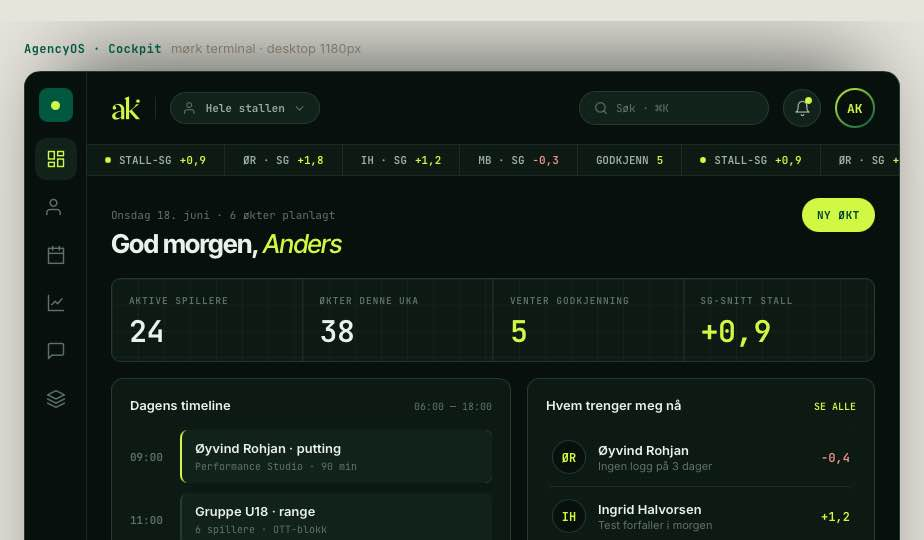
Kildefil: `AgencyOS Cockpit (terminal-lys).dc.html` · coachens terminal: 54px ikon-rail, live-ticker, KPI-rad, «dagens timeline» + «hvem trenger meg nå»-kø.

### B2 · Stall (responsiv) — `/admin/spillere`
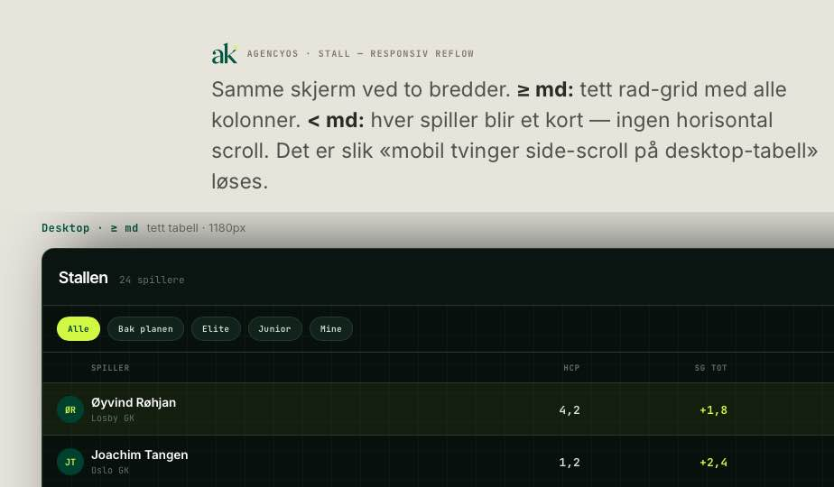
Kildefil: `AgencyOS Stall responsiv (terminal).dc.html` · spillerliste/leaderboard. StatTable → kort under md.

### B3 · Spiller-detalj — `/admin/spillere/[id]`
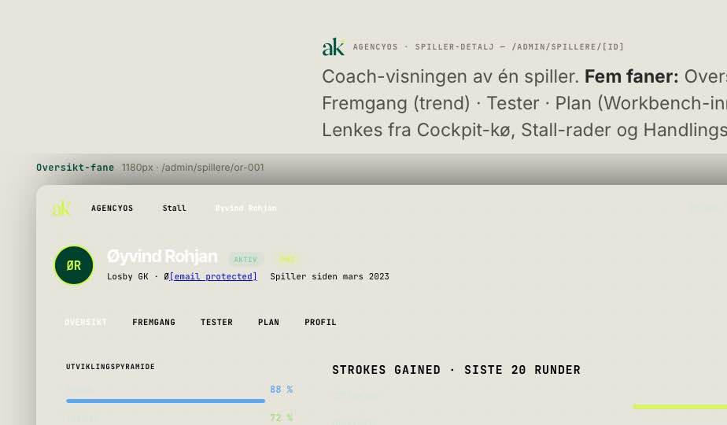
Kildefil: `AgencyOS Spiller-detalj (terminal).dc.html` · én spiller, **fem faner:** Oversikt · Fremgang · Tester · Plan (Workbench-inngang) · Profil.

### B4 · Plans og Maler — `/admin/plans` + `/admin/plan-templates`
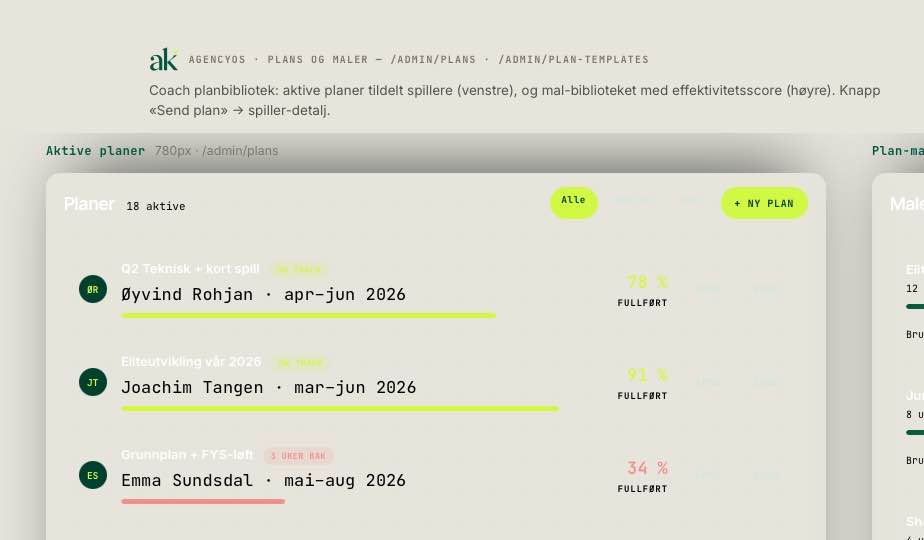
Kildefil: `AgencyOS Plans og Maler (terminal).dc.html` · aktive planer (venstre) + mal-bibliotek m/ effektivitetsscore (høyre). «Send plan» → spiller-detalj.

### B5 · Kalender — `/admin/kalender`
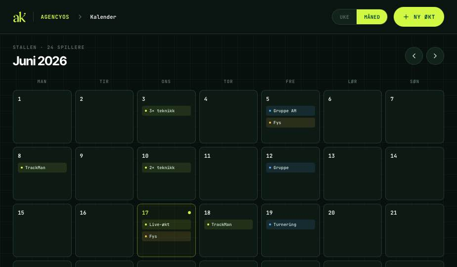
Kildefil: `AgencyOS Kalender (terminal).dc.html` · coach-kalender, kapasitet, økter. (Slå sammen dublett-kalendere.)

### B6 · Gjennomføre-hub — `/admin/gjennomfore`
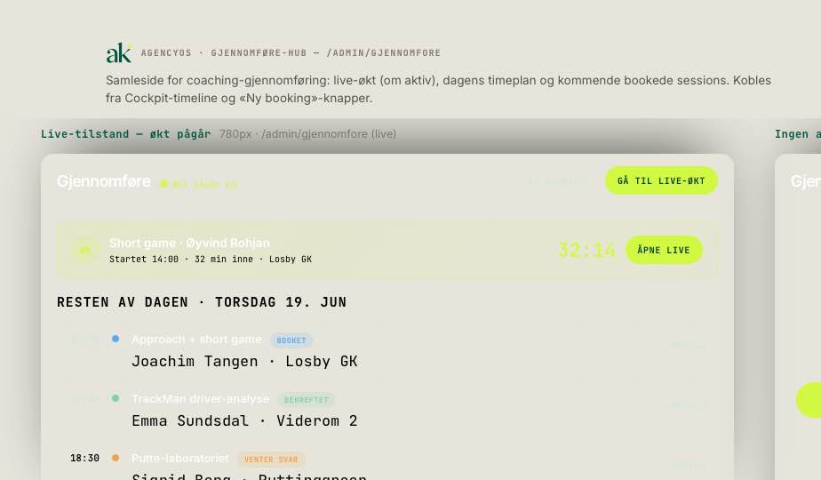
Kildefil: `AgencyOS Gjennomfore-hub (terminal).dc.html` · dagens økter å kjøre, inngang til live-økt.

### B7 · Live-økt (coach) — `/admin/(fullscreen)/live/[id]`
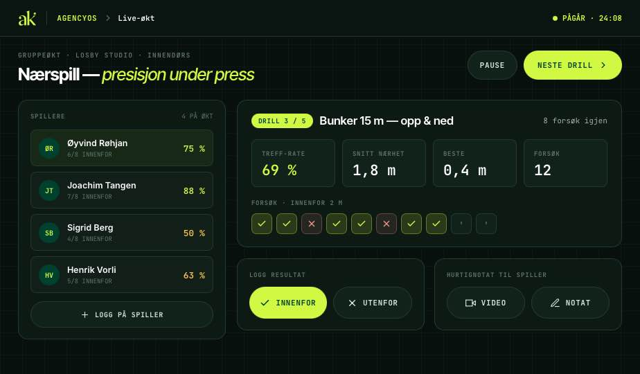
Kildefil: `AgencyOS Live-okt coach (terminal).dc.html` · coach kjører økt: reps, notater, video, vurdering.

### B8 · Test-bygger — `/admin/tester/ny`
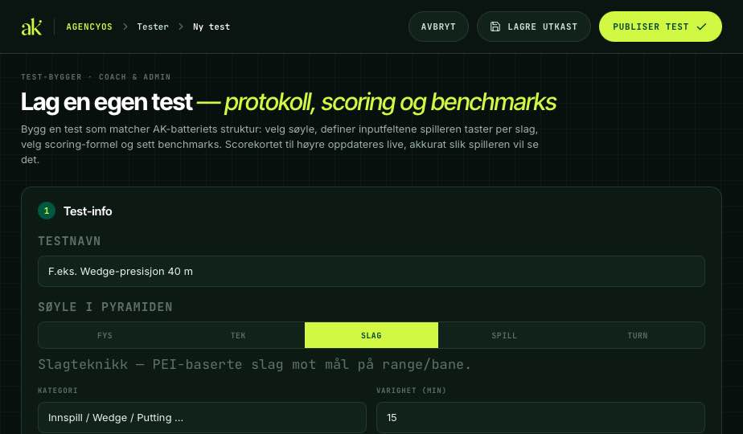
Kildefil: `AgencyOS Test-bygger (terminal).dc.html` · no-code protokoll-bygger: søyle, inputfelter, scoring-type, benchmarks, leaderboard, live scorekort-forhåndsvisning.

### B9 · DataGolf-verktøy — `/admin/datagolf`
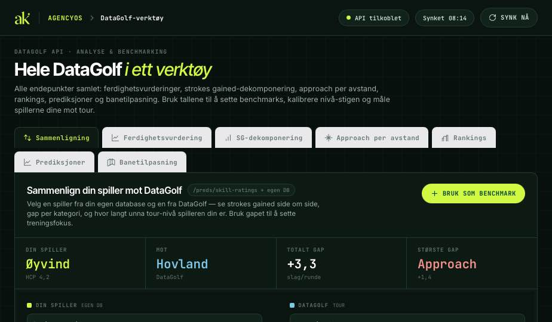
Kildefil: `AgencyOS DataGolf-verktoy (terminal).dc.html` · pro-benchmark, persentiler, sammenligning mot tour.

### B10 · Handlingssenter — `/admin/handlingssenter`
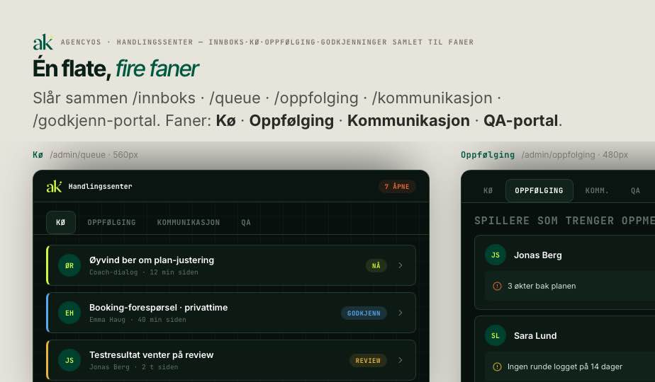
Kildefil: `AgencyOS Handlingssenter-faner (terminal).dc.html` · godkjenninger, innboks, oppgaver i faner.

### B11 · Bookinger og kapasitet — `/admin/bookinger`
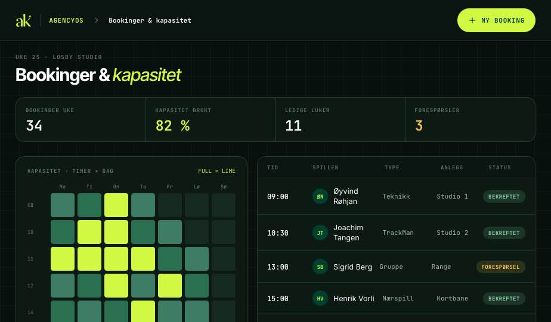
Kildefil: `AgencyOS Bookinger og kapasitet (terminal).dc.html` · booking-oversikt, kapasitetsstyring.

### B12 · Opptak og video — `/admin/opptak`
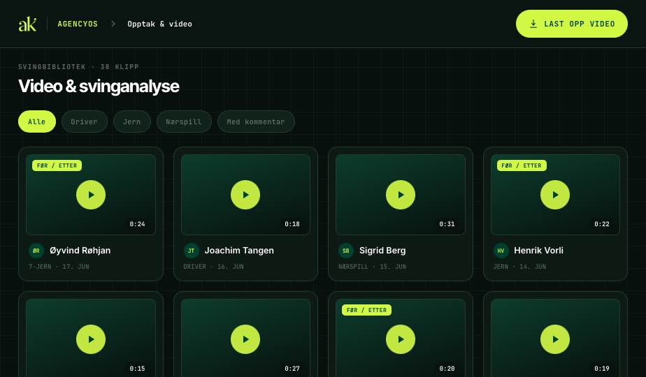
Kildefil: `AgencyOS Opptak og video (terminal).dc.html` · video-bibliotek, svinganalyse, annotering.

### B13 · Evaluering — `/admin/evaluering`
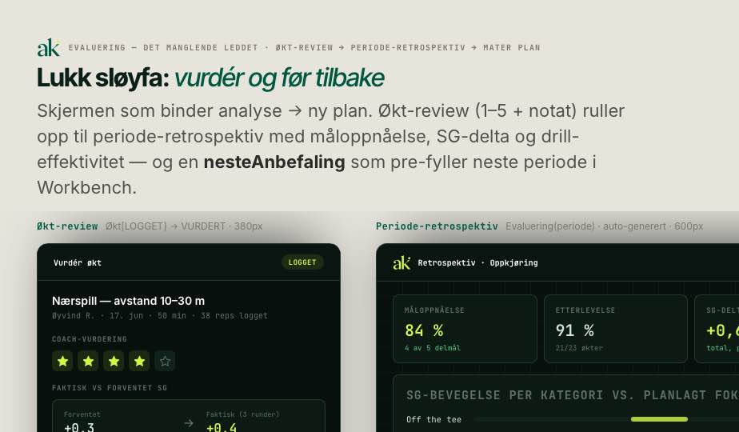
Kildefil: `AgencyOS Evaluering (terminal).dc.html` · ukentlig + per test: fremgang mot benchmark, nytt gap.

### B14 · AI-Caddie og Agenter — `/admin/ai`
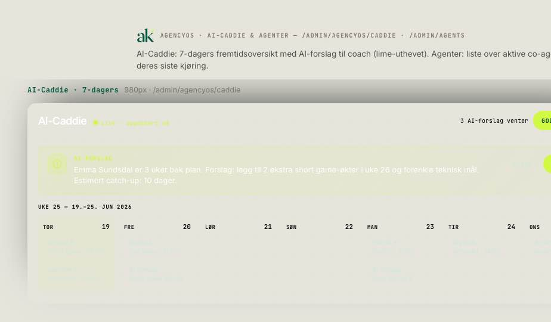
Kildefil: `AgencyOS AI-Caddie og Agenter (terminal).dc.html` · synlig assistent (chat) + usynlige anbefalinger/agenter.

### B15 · Admin (undersider) — `/admin/innstillinger`
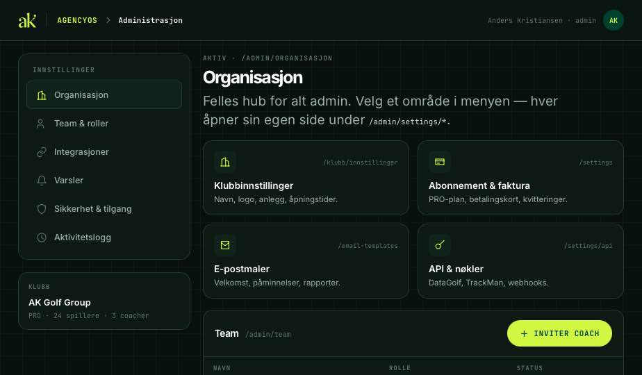
Kildefil: `AgencyOS Admin-undersider (terminal).dc.html` · admin/innstillinger-undersider.

### B16 · Økonomi — `/admin/okonomi`
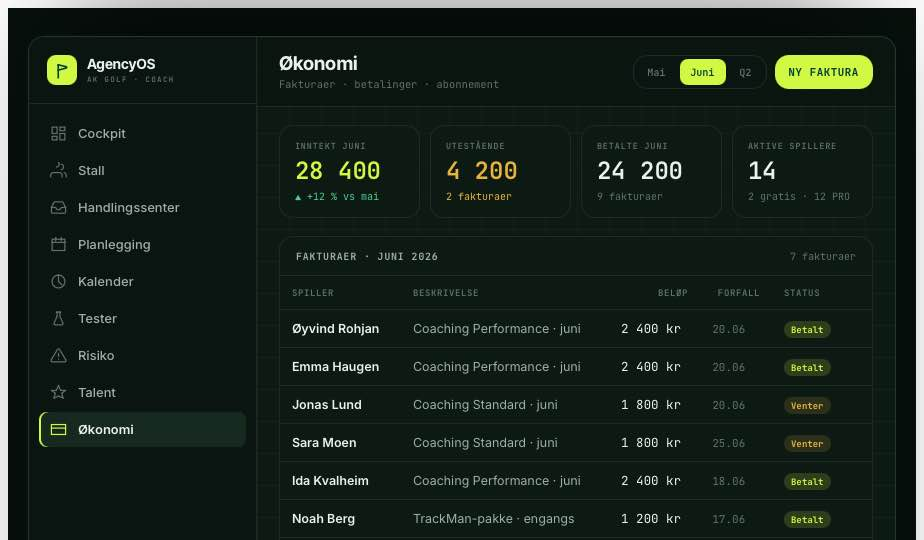
Kildefil: `AgencyOS Økonomi (hybrid).dc.html` · omsetning, abonnement, fakturaer. (Tegnet lyst — skin til mørk terminal.)

### B17 · Talent-modul — `/admin/talent`
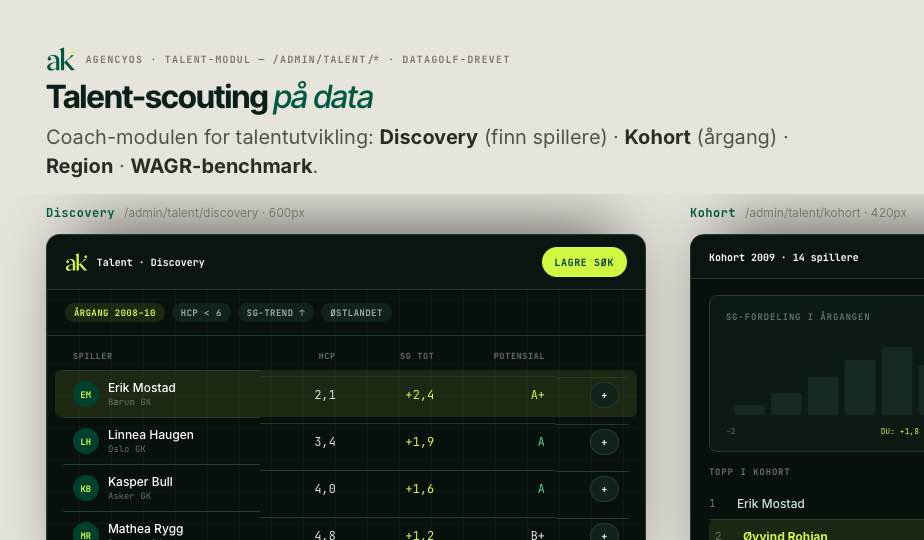
Kildefil: `AgencyOS Talent-modul (terminal).dc.html` · talent-pipeline, identifikasjon, oppfølging.

### B18 · Coach-skill — `/admin/coach-skill`
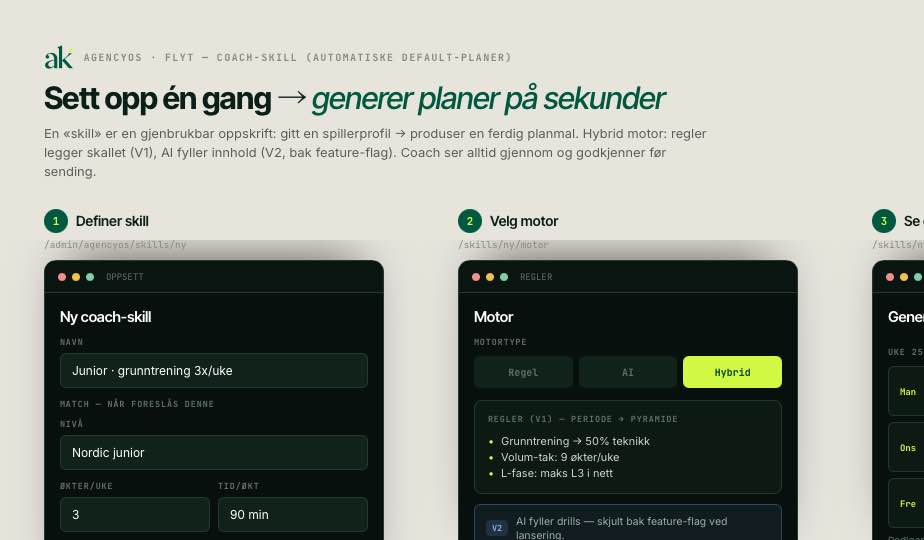
Kildefil: `AgencyOS Coach-skill (terminal).dc.html` · coachens egne ferdigheter/sertifiseringer.

---

## C · Workbench — delt planleggingskjerne (begge apper)

> **Workbench skinnes kun visuelt — funksjon avklares med Anders.** Zoom: År (Gantt) → Uke → Økt.
> **KANONISK REFERANSE:** `Workbench Komplett Hub.dc.html` — én DC med alle 6 faner i mørk terminal.

### Workbench-kobling: hvilken knapp → hvilken fane

| Fra skjerm | Knapp/element | → Workbench-fane | URL-param |
|---|---|---|---|
| PlayerHQ Dashboard | «Workbench →» i Plan-kortet | Uke-visning | `?zoom=uke` |
| PlayerHQ Statistikk/SG | «Teknisk plan →» over gap-lista | Teknisk plan | `?tab=tek` |
| PlayerHQ Mål-hub | «Sesongmål»-knapp i header | Sesongmål | `?tab=seson` |
| PlayerHQ Plan-Workbench | «Åpne Workbench» | Gantt (År) | `?zoom=gantt` |
| AgencyOS Plans og Maler | «Åpne Workbench» / maler-rad | Maler | `?tab=maler` |
| AgencyOS Spiller-detalj | Plan-fane → Workbench-knapp | Teknisk plan | `?tab=tek&spiller=id` |
| AgencyOS Cockpit | «Planlegg»-knapp | Uke (for valgt spiller) | `?zoom=uke&spiller=id` |
| Workbench Teknisk plan | «Gå til økt med dette fokus» | Økt-detalj | `?tab=okt` |
| Workbench Uke | Klikk økt-kort | Økt-detalj | `?tab=okt&okt=id` |

**Tilbake-flyt:** Workbench topbar viser «‹ Dashboard», «‹ Analyse», «‹ Mål-hub» som back-chips avhengig av entry-point. Lagret automatisk.

---

### C0 · Workbench Komplett Hub — alle 6 faner (KANONISK)
**Kildefil: `Workbench Komplett Hub.dc.html`**

#### Fane: Teknisk plan
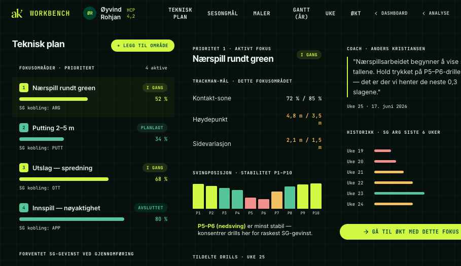
Fokusområder (prioritert 1–4) · TrackMan-mål · P1–P10 stabilitetsgraf · Drills uke 25 · Coach-notat · SG-historikk · «Gå til økt med dette fokus» CTA.

#### Fane: Sesongmål
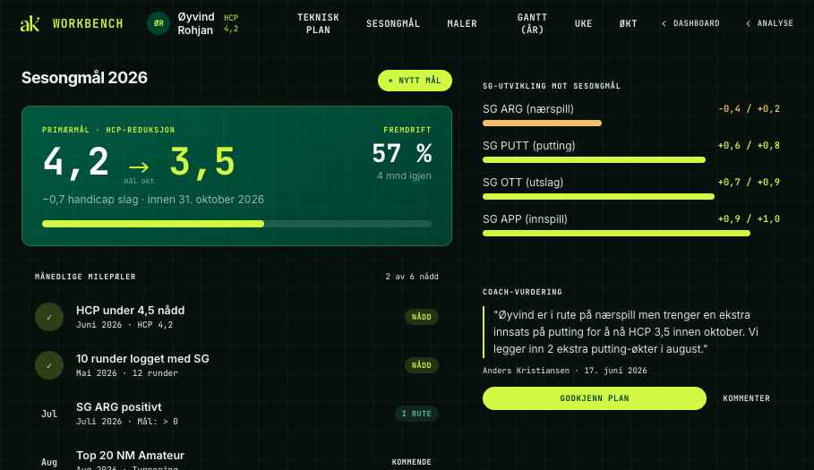
Hero-mål: HCP 4,2 → 3,5 (okt 2026, 57 % fremgang) · Månedlige milepæler (2 av 6 nådd) · Nøkkelturnering-er (NM, Klubbmest., Q-school) · SG-utvikling mot sesongmål · Coach-vurdering + «Godkjenn plan».

#### Fane: Maler
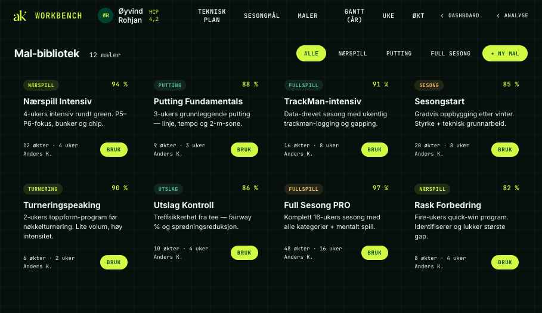
12 maler i 4×grid · Hver: kategori-pill · effektivitetsscore (%) · navn · beskrivelse · antall økter/uker · «Bruk»-knapp. Filter: Alle / Nærspill / Putting / Full sesong.

#### Fane: Gantt (År)
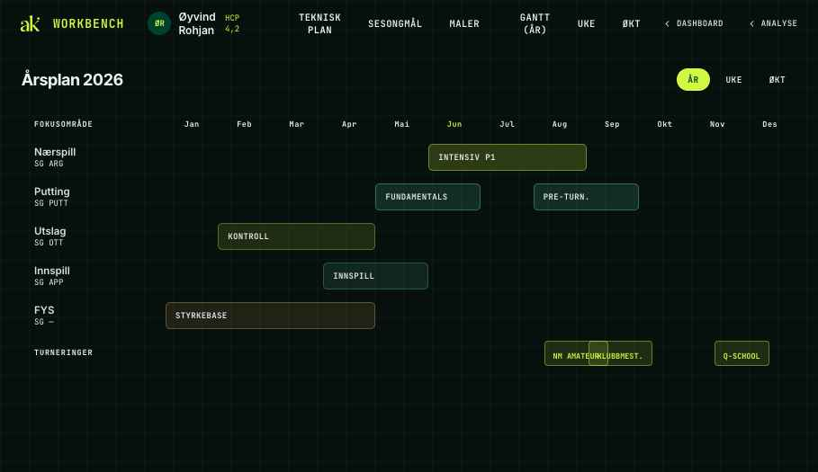
Årsplan 2026 · Fokusområde-rader (Nærspill, Putting, Utslag, Innspill, FYS) med fargede Gantt-barer · Turneringer-rad (NM, Klubbmest., Q-school) · Zoom-toggle År/Uke/Økt.

#### Fane: Uke
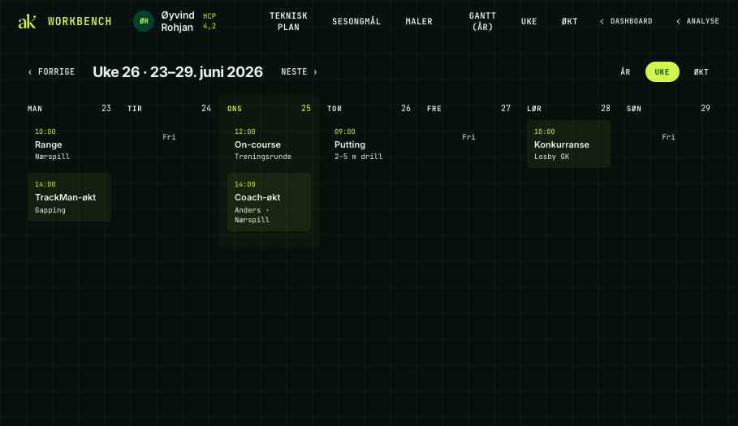
Uke 26 (23–29. juni) · 7-dag grid · Økt-kort per dag (tid + navn + type) · Coach-økter markert med lime-kant · Fri-dager markert.

#### Fane: Økt
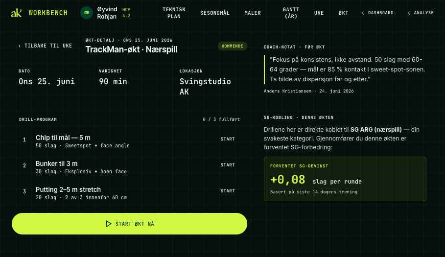
Økt-detalj: TrackMan-økt Nærspill · Ons 25. juni · 3 drills (Chip 5m / Bunker 3m / Putting stretch) · Coach-notat · SG-kobling (forventet +0,08 slag/runde) · «Start økt nå» CTA.

---

#### Fane: Standardøkter
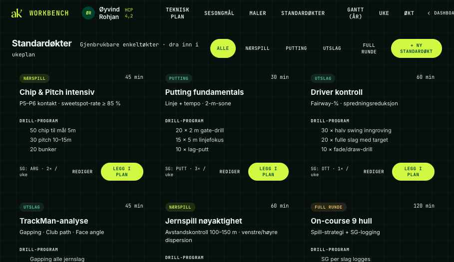
Gjenbrukbare enkeltøkter (6 standardøkter) i 3-kolonne grid: Chip & Pitch intensiv · Putting fundamentals · Driver kontroll · TrackMan-analyse · Jernspill nøyaktighet · On-course 9 hull. Hver viser kategori-pill · varighet · fokus · drill-program · SG-kobling · frekvens · «Legg i plan».

> **Merk:** Alle tidligere Workbench-filer (v2, gap-til-okt, trackman, evaluering osv.) er arkivert i `_arkiv/workbench-arkiv/`. **Bruk kun `Workbench Komplett Hub.dc.html`.**

---

## D · Forelderportal — `/forelder` (lys · mobil + desktop)

### D1 · Hjem — `/forelder`
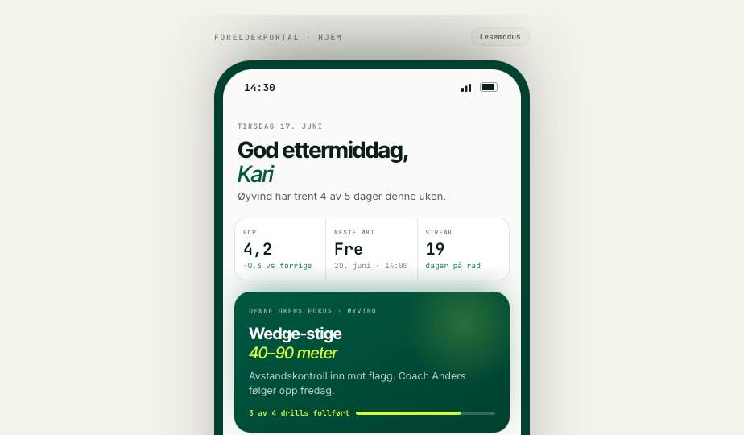
Kildefil: `Forelderportal Hjem (hybrid).dc.html` · oversikt over barnets aktivitet (lesetilgang).

### D2 · Ukerapport — `/forelder/rapport`
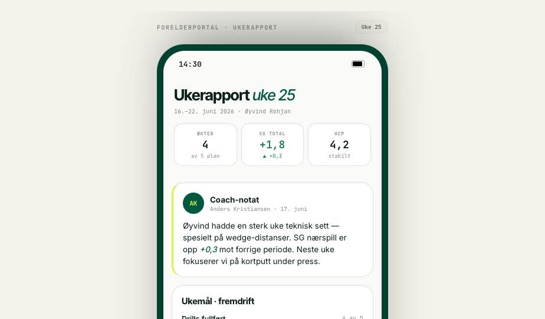
Kildefil: `Forelderportal Ukerapport (hybrid).dc.html` · ukentlig sammendrag av trening/fremgang.

### D3 · Samtykke — `/forelder/samtykke`
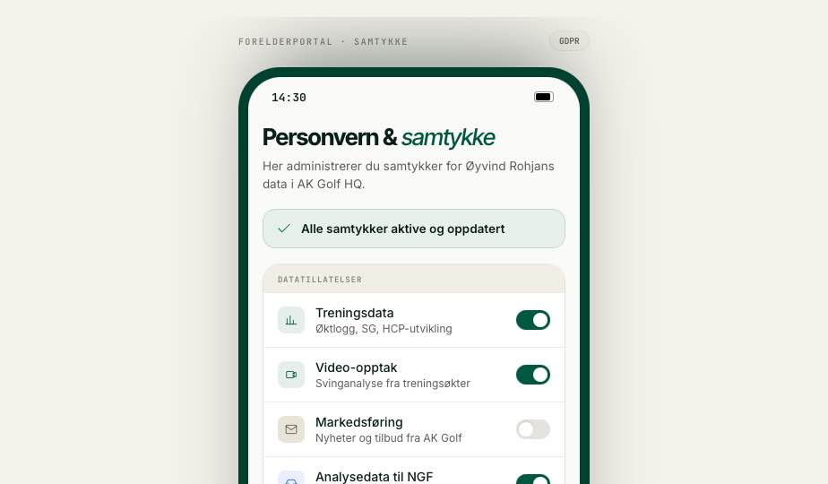
Kildefil: `Forelderportal Samtykke (hybrid).dc.html` · **GDPR-samtykke, PÅKREVD for mindreårige.**

### D4 · Bookinger — `/forelder/bookinger`
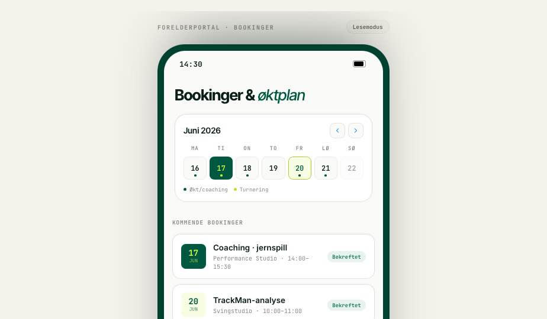
Kildefil: `Forelderportal Bookinger (hybrid).dc.html` · barnets bookinger.

### D5 · Fakturaer — `/forelder/fakturaer`
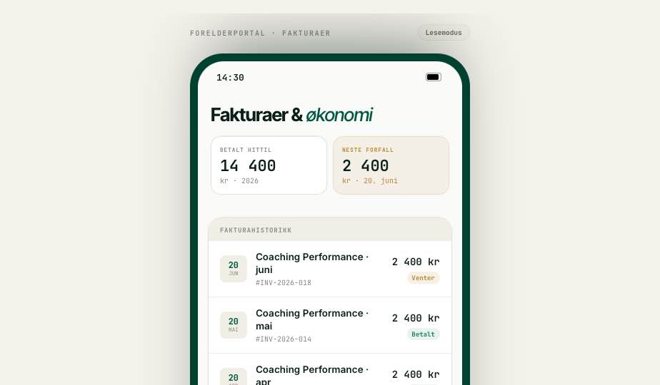
Kildefil: `Forelderportal Fakturaer (hybrid).dc.html` · fakturaer/betaling (Stripe).

---

## E · Marketing — `/` (lys editorial · desktop + mobil)

### E1 · Hjem — `/`

Kildefil: `Marketing Hjem (moderne).dc.html` · landing/lead. Editorial + terminal-energi (SG-ticker).

### E2 · Coacher — `/coacher`
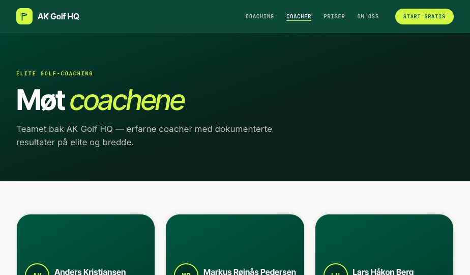
Kildefil: `Marketing Coacher (hybrid).dc.html` · coach-profiler (Markus Røinås Pedersen beholdes på marketing).

### E3 · Cases — `/cases`
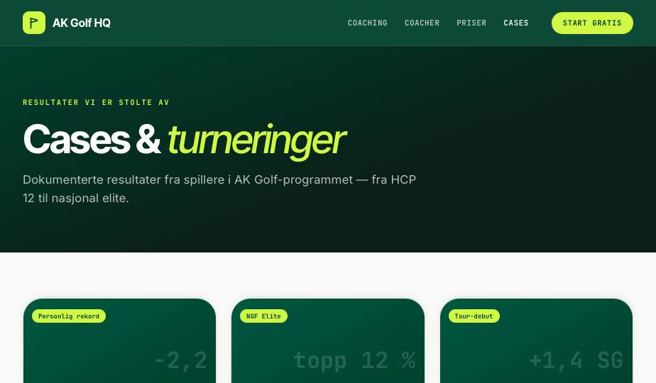
Kildefil: `Marketing Cases (hybrid).dc.html` · resultater/historier.

### E4 · Kontakt — `/kontakt`
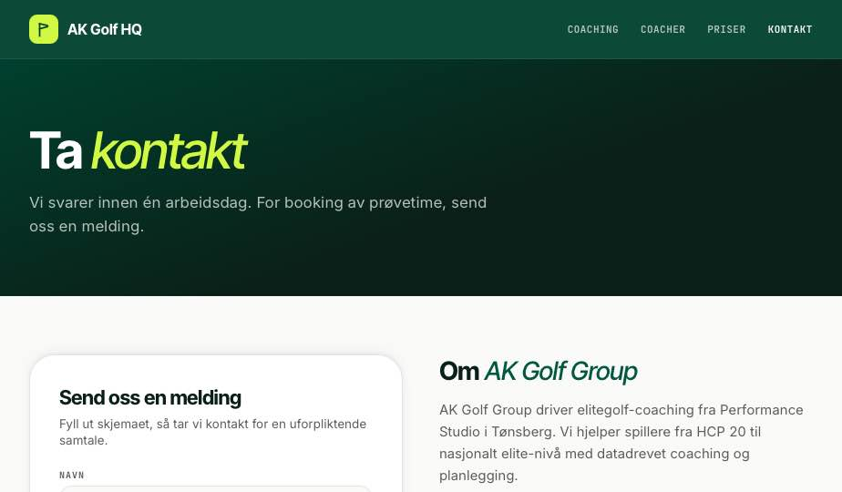
Kildefil: `Marketing Kontakt (hybrid).dc.html` · kontakt/lead-skjema.

---

## F · Auth · Stats · System

### F1 · Innlogging — `/login`
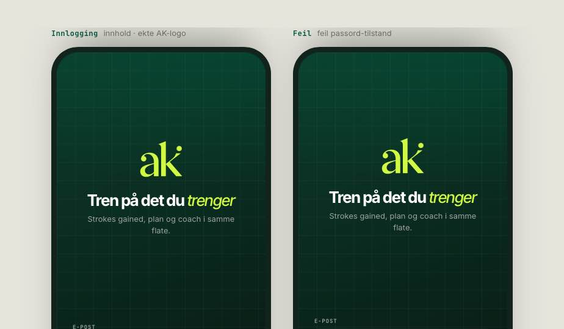
Kildefil: `Auth Innlogging (terminal-lys).dc.html`

### F2 · Registrering og passord — `/registrering` · `/reset`
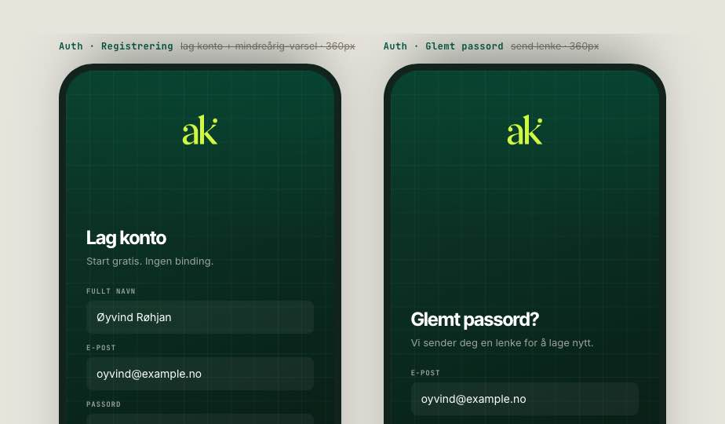
Kildefil: `Auth Registrering og passord (terminal-lys).dc.html`

### F3 · Stats-plattform — `/stats`
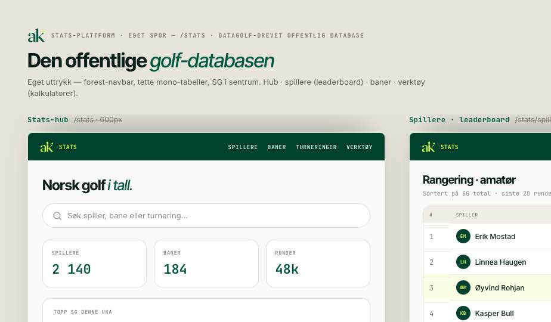
Kildefil: `Stats-plattform (moderne).dc.html` · offentlig golf-statistikkdatabase (eget spor, eget uttrykk).

### F4 · Kommandopalett — global (⌘K)
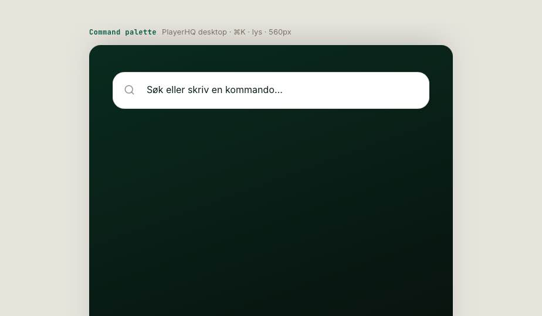
Kildefil: `Command Palette (terminal-lys).dc.html` · global hurtignavigasjon.

---

## G · Flere skjermer uten eget skjermbilde (kildefil + mønster)

Disse er tegnet, men arver uttrykk fra nærmeste skjerm over. Åpne kildefila for detalj; rute/knapp i `NAVIGASJON-knapp-til-rute.md`.

| Skjerm | Kildefil |
|---|---|
| PlayerHQ Meg-undersider (helse/utstyr/dokument) | `PlayerHQ Meg Helse og Sikkerhet (terminal-lys).dc.html`, `PlayerHQ Meg Utstyr Dokumenter Innstillinger (terminal-lys).dc.html`, `PlayerHQ Meg long-tail (terminal-lys).dc.html` |
| PlayerHQ Mål (bygger/detalj/leaderboard) | `PlayerHQ Mål-bygger (hybrid).dc.html`, `PlayerHQ Mål-detalj (hybrid).dc.html`, `PlayerHQ Mål-leaderboard (hybrid).dc.html` |
| PlayerHQ FYS-plan | `PlayerHQ FYS-plan (hybrid).dc.html` (NB: fysisk = ett kort i Workbench «generelt», ikke egen side) |
| PlayerHQ kalendere | `PlayerHQ Ukekalender (hybrid).dc.html`, `PlayerHQ Årskalender (hybrid).dc.html` |
| PlayerHQ Utfordringer (AI) | `PlayerHQ Utfordringer AI (hybrid).dc.html` |
| PlayerHQ Shot-by-shot / Analyse per hull | `PlayerHQ Shot-by-shot (hybrid).dc.html`, `PlayerHQ Analyse Hull Sammenlign Putting (hybrid).dc.html` |
| AgencyOS Multi-pane / overlays | `AgencyOS Multi-pane og overlays (terminal).dc.html` |
| AgencyOS Innstillinger-undersider | `AgencyOS Innstillinger-undersider (terminal).dc.html` |
| AgencyOS Spiller-detalj-faner (full faneutdyping) | `AgencyOS Spiller-detalj-faner (terminal).dc.html` |
| Marketing undersider/stubs | `Marketing Undersider (moderne).dc.html`, `Marketing STUB-sider (moderne).dc.html` |
| Forelder Barn-profil | `Forelderportal Barn-profil (hybrid).dc.html` |

---

## Data-viz-komponenter (bygg som gjenbrukbare komponenter)

Eksakt byggspec for de signatur-datavisualiseringene ligger i to komponentark (åpne i nettleser):
`Data-viz komponentark.dc.html` (SG-bar, dispersjon, pyramide, radar, persentil-ring, gapping) og
`Data-viz komponentark 2 (nye).dc.html` (SG-vannfall, SG per hull, tetthetskart, progresjons-tidslinje,
belastnings-heatmap, pyramide-radar-hybrid, persentil-fordeling, gapping-bag-kart, modenhets-indikator).
Stilflis: `Stilflis - Terminal-energi (PlayerHQ + Landing).dc.html`.
