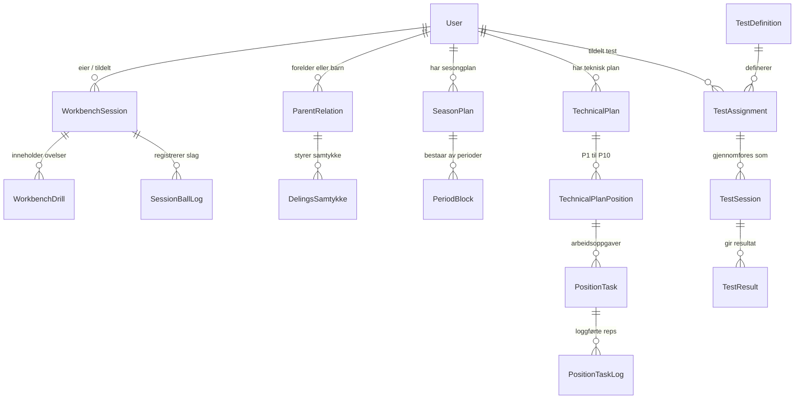
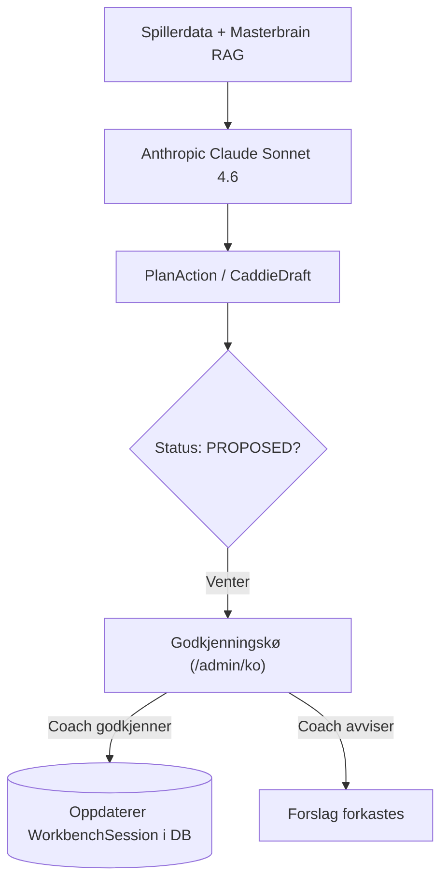

# Arkitekturkart — AK Golf HQ

Dette er den autoritative, tekniske kartleggingen av hele kodebasen til AK Golf HQ per 26. september 2026 (commit `5bc4f20bddb5`). Dokumentet gir et helhetlig, faktabasert overblikk over applikasjonens overflater, datamodeller, planleggingsflyt, AI-infrastruktur og eksterne integrasjoner.

---

## 1. Kort fortalt

1. **Kodebasen er massiv og mangfoldig:** Totalt 571 ruter (Next.js App Router) fordelt på 6 distinkte overflater, drevet av 198 Prisma-datamodeller og 84 enumer.
2. **Tre hovedroller deler systemet:** Spilleren (`/portal`), coachen/administratoren (`/admin`) og foresatte (`/forelder`), supplert med eksterne fagsider for Team Norway (`/team-norway`), WANG Toppidrett (`/team-wang`) og eksternt innsyn (`/innsyn`).
3. **Flere generasjoner av samme funksjon lever side om side:** Treningsøkter modelleres i fire parallelle tabellstrukturer (`TrainingPlanSession`, `TrainingSessionV2`, `WorkbenchSession` og `TechnicalPlan`), bundet sammen av synkroniseringsskript i bakgrunnen.
4. **Coach Workbench er den nye planleggingsmotoren:** Både coach (`/admin/workbench/[playerId]`) og spiller (`/portal/planlegge/workbench`) leser og skriver til `WorkbenchSession`.
5. **Streng visningsgrense for spilleren:** Økter med status `DRAFT` er usynlige for utøveren. Først når coachen trykker «Publiser», settes statusen til `PUBLISHED` og blir synlig i PlayerHQ.
6. **Menneskelig kontroll på all AI (Human-in-the-loop):** Plattformen har 18 LLM-kallflater (Claude Sonnet 4.6, Claude Vision, Whisper). Ingen AI-agent kan endre en treningsplan direkte; alle forslag opprettes som `PlanAction` med status `PROPOSED` og må godkjennes av coachen i `/admin/ko`.
7. **Masterbrain er den faglige fasiten:** 99 kuraterte RAG-dokumenter og strukturerte JSON-kataloger (MORAD P1–P10, 10 primærfeil, Strokes Gained, AK Canon v3.5) tvinger språkmodellene til å holde seg til AK Golfs treningsmetodikk.
8. **GolfBox-integrasjonen er en ekte web-scraper:** Turneringer, starttider og livescorer hentes automatisk fra `scores.golfbox.dk` via Vercel Cron.
9. **TrackMan er manuell fil- og bildeimport:** Det finnes ingen direkte sky-integrasjon mot TrackMan; data importeres via CSV-filer, HTML-rapporter eller mobilbilde av skjermen tolket med Claude Vision.
10. **Stripe og e-post er fullt operative:** Betalinger, abonnementer og webhooks håndteres sikkert via Stripe med idempotens. Resend sender 13 ulike typer transaksjonelle e-poster.

---

## 2. Flatene

| Flate | Formål | Hovedbrukere | Modenhetsgrad | Vedlegg |
|---|---|---|---|---|
| **PlayerHQ** (`/portal`) | Spillerens daglige verktøy: dagens økt, ukeplan, live-logging, tester og profil | Golfspillere / elever | **Ferdig kjerne, noen stubs** (11 stats-ruter skjult i prod) | [playerhq.md](arkitektur/playerhq.md) |
| **AgencyOS** (`/admin`) | Trenerens og administratorens cockpit: stall, Workbench-planlegger, godkjenningskø og booking | Anders / AK Coach-stab | **Ferdig kjerne, eldre lag bevart** (73 redirects, 12 stub-paneler) | [agencyos.md](arkitektur/agencyos.md) |
| **Team Norway** (`/team-norway`) | Landslagsrettet fellesside: testbatterier, referansenivåer og uttakskriterier | Landslagsspillere / trenere | **Halvferdig** (Kriterium 3 mangler DB-modell, kun én felles gruppe) | [team-norway.md](arkitektur/team-norway.md) |
| **WANG Toppidrett** (`/team-wang`) | Skolehverdagen: timeplan, fravær, halvårsplan og LK20-kompetansemål | Elever, lærere, coacher | **Halvferdig** (Statisk årsplanfasit, enkel coach-visning) | [wang.md](arkitektur/wang.md) |
| **Foreldreportal** (`/forelder`) | Innsyn for foresatte: barnas timeplan, timebestilling og GDPR art. 8-samtykke | Foresatte til juniorer | **Ferdig** (Ingen intern toveis chat, ruter til e-post) | [forelderportal.md](arkitektur/forelderportal.md) |
| **AgenticOS / Jarvis** (`/admin/jarvis`, `/meg`) | AI-dispatch, sparring, oppgavekø og personlig assistent | Anders / stab | **Ferdig rammeverk, krever overvåking** (18 kallflater, lokal vektorbase) | [agenticos.md](arkitektur/agenticos.md) |
| **Eksternt Innsyn** (`/innsyn`) | Begrenset lesetilgang for samarbeidspartnere (NGF, WANG-scouts) | Eksterne observatører | **Ferdig** (Styres strengt av delingssamtykker) | [forelderportal.md](arkitektur/forelderportal.md) |

---

## 3. Kartet over ruter (571 totalt)

Plattformen består av **571 ruter** definert som Next.js `page.tsx` eller `route.ts`:

```
Totalt: 571 ruter
├── /portal (PlayerHQ):          175 ruter (142 v2/hoved, 12 fullscreen live, 21 legacy omdirigeringer)
├── /admin (AgencyOS):           163 ruter (90 aktive sider, 73 legacy omdirigeringer)
├── /(marketing) (Nettside):      73 ruter (Offentlige salgs- og informasjonssider)
├── /api (Endepunkter):           67 ruter (Webhooks, cron-jobber, AI-streaming, eksport)
├── /team-norway:                 21 ruter (Tester, profil, ranking og kriterier)
├── /forelder:                    17 ruter (16 sider + 1 GDPR-eksport endepunkt)
├── /auth:                        15 ruter (Innlogging, registrering, 2FA, samtykke)
├── /innsyn:                      11 ruter (Talent- og benchmark-innsyn for eksterne)
├── /team-gfgk / gfgk-junior:      7 ruter (Klubbspesifikke fellessider for Gamle Fredrikstad)
├── /(internal):                   6 ruter (Verktøy for feilsøking og intern testing)
├── /team-wang:                    6 ruter (4 åpne skolesider + 2 coach-sider)
├── /meg:                          3 ruter (Personlig assistentflate: oversikt, innboks, oppgaver)
└── Andre / hjelperuter:           7 ruter (skjermer, kino, vedlikehold, offline, onboarding)
```

### Uoppnåelige og avviklede ruter
* **73 ruter i `/admin`** er rene 301/308-omdirigeringer fra tidligere grensesnittversjoner til dagens standard (f.eks. `/admin/kalender` → `/admin/workbench/[id]`, `/admin/agenticos` → `/admin/jarvis`).
* **21 ruter i `/portal`** er bevart utelukkende for bakoverkompatibilitet fra eldre mobilbokmerker.
* **11 statistikkruter i `/portal/stats/*`** er deaktivert i produksjon (`STATS_PROTOTYPE_PREFIXES`), men filene ligger fortsatt i kildetreet.

---

## 4. Datamodellen

Databasen defineres i `prisma/schema.prisma` med **198 modeller** og **84 enumer**:
* **171 modeller** er aktivt i bruk og spørres direkte via `prisma.<modell>` i kildekoden.
* **27 modeller** har ingen spørringer i `src/` (f.eks. eldre utkast som `MissionControl`, `LegacyPlanSnapshot` og eksperimentelle tabeller).

### Kjernerelasjoner (Mermaid-diagram)



### Problemet med flere generasjoner av treningsøkter
I dag eksisterer fire distinkte tabellstrukturer for det som i praksis er samme konsept: en treningsøkt:
1. **Generasjon 1 (`TrainingPlan` / `TrainingPlanSession`):** Det opprinnelige systemet med faste øktmaler og lineære planer.
2. **Generasjon 2 (`TrainingSessionV2` / `TrainingDrillV2`):** Utviklet for å støtte sanntids-logging og Masterplan-visninger.
3. **Generasjon 3 — Workbench (`WorkbenchSession` / `WorkbenchDrill`):** Dagens operative standard. Lagrer eksakt dato (`@db.Date`), startminutt (0–1410), varighet, status (`DRAFT`, `PUBLISHED`, `COMPLETED`), pyramidekategori og JSON-formel.
4. **Teknisk Plan P1–P10 (`TechnicalPlan` / `PositionTask`):** Spesialisert motor for MORAD-svingtrening med registrering av tørrtrening, lavhastighet og full fart, koblet til TrackMan-tallkrav.

*Konsekvens:* For at eldre visninger og nye Workbench-funksjoner ikke skal sprike, kjører `src/lib/workbench/v2-sync.ts` en kontinuerlig toveis speiling mellom `TrainingPlanSession` og `TrainingSessionV2`, mens nye økter skrives til `WorkbenchSession`.

---

## 5. Planleggingskjeden

Planleggingskjeden bryter ned langsiktige mål til konkrete slag på rangen:

```
Årsplan (SeasonPlan / TrainingPeriod)
  └── Periode (PeriodBlock — f.eks. GRUNN, SPESIAL, TURNERING)
        └── Måned & Uke (Beregnet i minnet via buildMonthViewModel / buildWeekViewModel)
              └── Økt (WorkbenchSession — dato, klokkeslett, status, pyramide)
                    └── Øvelse / Drill (WorkbenchDrill — drill, varighet, AK-formel)
                          └── Teknisk oppgave (PositionTask — P1-P10, motorikk, reps)
```

### Hva er lagret i databasen vs. beregnet i minnet?
* **Lagret i databasen:** De absolutte sannhetene: hvilken dag økten finner sted (`date`), starttid i minutter fra midnatt (`startMinute`), varighet, tittel, pyramidekategori (`FYS`, `TEK`, `SLAG`, `SPILL`, `TURN`) og status.
* **Beregnet i minnet (`src/lib/domain/workbench/operations.ts`):** Månedsrutenettet, ukeoppsettet, timeplankollisjoner og timebudsjetter (`computeBudget`) regnes ut dynamisk on-the-fly av serveren når siden lastes. Ingen månedstabell eller uketabell eksisterer i databasen.

---

## 6. Fra coach til spiller (Dataflyten)

1. **Coach planlegger i AgencyOS:** Coachen åpner `/admin/workbench/[playerId]`, velger dato og legger inn en økt med øvelser. Økten lagres umiddelbart i `WorkbenchSession` med `status = "DRAFT"`.
2. **Spillerens tilgangsskjold:** Spilleren åpner PlayerHQ (`/portal`). Serverkoden sjekker `SPILLER_SYNLIGE_STATUSER = ["PUBLISHED", "IN_PROGRESS", "COMPLETED"]`. Utkastet vises ikke.
3. **Publisering:** Coachen trykker «Publiser». Funksjonen `publishSessions` i `wb-actions.ts` setter `status = "PUBLISHED"` og stempler tidspunkt.
4. **Spilleren ser økten:** Økten dukker opp i spillerens «I dag»-agenda på mobilen (`/portal`).
5. **Gjennomføring:**
   * Spilleren trykker «Start økt» (`status = "IN_PROGRESS"`).
   * Spilleren logger slag via Live Tapper (`/portal/(fullscreen)/live/[sessionId]/tapper`). Slagene skrives fortløpende til `SessionBallLog`.
   * Spilleren fullfører økten. Status settes til `COMPLETED`, og faktisk tidsbruk lagres.
6. **Tilbakeføring til coach:** Coachen ser umiddelbart grønn, fullført status og antall loggede baller i Workbench og på AgencyOS-dashbordet.

---

## 7. Delt, duplisert og isolert kode

* **Delt kode:**
  * Databasetilgang (`src/lib/prisma.ts`).
  * Autentisering og rollevakter (`src/lib/auth/requirePortalUser.ts`).
  * Treningslogikk og Workbench-kjerne (`src/lib/domain/workbench/`).
* **Duplisert kode:**
  * **Øktstatus-oppdatering:** Finnes implementert separat i `src/lib/workbench/wb-actions.ts` (for Workbench) og i `src/lib/portal-gjennomfore/okt-status-actions.ts` (for PlayerHQ legacy-kompatibilitet).
  * **Dato- og ukehjelpere:** Både `src/lib/uke-helpers.ts` og `src/lib/workbench/wb-map.ts` har funksjoner for ukenummer og tidsformatering.
* **Isolert kode:**
  * **Team Norway (`/team-norway`):** Benytter egne design-tokens (mørkeblå `#0B162C` og rød `#BA0C2F`), unike fonter (Jost og Lato) og unngår de felles tema-wrapperne til PlayerHQ.
  * **Masterbrain (`src/lib/masterbrain/`):** Selvdreven kunnskapsmodul som kun konsumeres av AI-agenter og coach-sparring.

---

## 8. Agenter og AI (18 LLM-kallflater)

Plattformen integrerer avansert AI, styrt av en ufravikelig regel: **Ingen uautoriserte automatiske endringer i produksjon.**



### Nøkkelfakta om AI-infrastrukturen:
* **Hovedmodell:** Anthropic Claude Sonnet 4.6 via `@ai-sdk/anthropic` og `@anthropic-ai/sdk`.
* **Syn / OCR:** Claude Vision leser av TrackMan-skjermbilder og konverterer dem til strukturerte tall (`src/lib/trackman/parse-photo.ts`).
* **Tale:** OpenAI Whisper API transkriberer trenerens taleopptak på treningsfeltet til norsk tekst med golfspesifikk terminologi (`src/lib/voice/whisper-transcribe.ts`).
* **Websøk:** Perplexity Sonar benyttes i den personlige assistenten (`src/lib/meg/agent.ts`).
* **Vektorsøk:** Kunnskapsdokumentene indekseres i lokale vektorfiler (`agentdb.rvf` og `ruvector.db`) for rask gjenfinning under prompting.

---

## 9. Eksterne systemer

| Tjeneste | Type integrasjon | Status | Beskrivelse |
|---|---|---|---|
| **GolfBox** | Web-scraper (`scores.golfbox.dk`) | **Ekte og operativ** | Henter offentlige JSON-data for terminlister, runder og ledertavler via automatiske cron-jobber. Ingen hemmelig API-nøkkel nødvendig. |
| **TrackMan** | Fil- og bildeimport | **Ekte, men manuell** | Ingen live maskin-til-maskin skyforbindelse. Data importeres via opplasting av CSV-filer, HTML-rapporter eller mobilfoto. |
| **Stripe** | REST API + Webhooks | **Ekte og fullt kablet** | Håndterer treningsabonnementer, klippekort, timebetalinger og kundeportal. Webhook-mottaket har streng signatursjekk og lagrer unike hendelses-IDer mot dobbelttrekk. |
| **Resend** | REST API | **Ekte og operativ** | Sender 13 kartlagte e-posttyper (bookingbekreftelser, samtykkevarsler, fakturaer, invitasjoner). |
| **Upstash Redis** | REST API | **Operativ med fallback** | Beskytter API-er mot overbelastning. Hvis nøkler mangler i utviklermiljøet, faller koden trygt tilbake til en intern minneteller. |
| **Notion** | REST API (OAuth AES-256) | **Ekte og operativ** | Toveis synkronisering av Anders' gjøremål og prosjekter mot databasens oppgave-cache. |
| **Tripletex** | REST API | **Uverifisert kodeklient** | Defensiv read-only modul med kildekodemerking `// TODO(verifiser-mot-api)`. Venter på testkall med reelle regnskapsnøkler. |

---

## 10. Reisen til én spiller: «Henrik, 16 år»

Vi følger Henrik (16 år, WANG-elev, Team Norway-kandidat og junior i Gamle Fredrikstad GK) gjennom kodebasen:

1. **Onboarding og samtykke:**
   * Henrik registrerer seg på `/auth/register`. Siden han er 16 år, krever lovverket foresattes godkjenning (GDPR art. 8).
   * En bekreftelseslenke sendes via Resend til Henriks far. Faren åpner `/auth/guardian-consent/[token]`, godkjenner vilkårene, og systemet oppretter en `ParentRelation` (`approved: true`) og setter `guardianConsentGivenAt` på Henrik.
2. **Knyttes til grupper og skole:**
   * Coach melder Henrik inn i WANG Toppidrett via `/admin/grupper`. Han får tildelt gruppen `WANG Toppidrett Fredrikstad` og knyttes til LK20-kompetansemål i `GroupMember`.
   * Henrik kan nå se timeplanen og treningsinnholdet på `/team-wang`.
3. **Første treningsøkt planlegges:**
   * Coach åpner `/admin/workbench/[henrikId]` og legger inn en økt: *«P2-P3 bakoversving & 70m wedge»*.
   * Økten lagres som `WorkbenchSession` (`status = "DRAFT"`). Henrik ser ingenting ennå.
   * Coach trykker «Publiser». Status endres til `PUBLISHED`.
4. **Henrik gjennomfører økten på rangen:**
   * Henrik åpner `/portal` på mobilen. Økten ligger øverst under «I dag».
   * Han trykker inn på økten, åpner Live Tapper (`/portal/(fullscreen)/live/[id]/tapper`), og trykker for hvert gjennomførte slag.
   * Når han trykker «Fullfør», lagres dataene atomisk, og coachen kan se gjennomføringen i sin cockpit.
5. **Team Norway-testing:**
   * Henrik gjennomfører nasjonal testprotokoll. Coachen logger tallene på `/team-norway/fellestesting`. Dataene lagres i `TestResult`.
   * Faren kan gå inn på `/forelder/samtykke/deling/[henrikId]` og huke av for at Henriks testresultater kan deles med landslagstrenerne.
   * Landslagstreneren logger inn på `/innsyn` og ser Henriks radarplott mot nasjonale referansetall.
6. **Hvor flyten bryter sammen i dag:**
   * **Bruddpunkt 1 (Kriterium 3 i Team Norway):** Hvis coachen vil vurdere Henriks uttak etter Kriterium 3 (treningsinnsats), finnes det intet datafelt i databasen for å koble Henriks loggede `WorkbenchSession`-timer opp mot Team Norway-siden. Siden viser faste eksempeldata.
   * **Bruddpunkt 2 (TrackMan-kobling):** Henrik slår 50 baller på TrackMan. Slagene overføres ikke automatisk til Henriks profil; coachen eller Henrik må manuelt ta bilde av skjermen eller laste opp en CSV-fil fra datamaskinen.
   * **Bruddpunkt 3 (Meldingsvegg for far):** Faren logger inn på `/forelder/coach` for å gi beskjed om at Henrik er syk. Han finner ingen chattefunksjon, kun en knapp som åpner farens vanlige e-postprogram.

---

## 11. Hull og arkitektonisk risiko

1. **Fire parallelle økttabeller (Synkroniseringsrisiko):**
   * Sameksistensen av `TrainingPlanSession`, `TrainingSessionV2`, `WorkbenchSession` og `TechnicalPlan` krever kompliserte synkroniseringsfunksjoner (`v2-sync.ts`). Hvis en oppdatering feiler halvveis, kan en økt fremstå som fullført i spillerportalen, men ufullført i coach-oversikten.
2. **Skjult statistikk og prototype-ruter i produksjon:**
   * 11 ruter under `/portal/stats/*` holdes kunstig skjult via en hardkodet blokkering i koden (`STATS_PROTOTYPE_PREFIXES`). Dette representerer teknisk gjeld som forvirrer vedlikehold og skaper unødvendig kodevekt.
3. **Ufullstendig Team Norway-uttaksmotor:**
   * Kriterium 3 (treningsinnsats og etterlevelse) mangler reell kobling til databasen. Siden fremstår som funksjonell i grensesnittet, men tallene er delvis frakoblede.
4. **Avhengighet av uoffisiell GolfBox-scraping:**
   * Turneringsterminlister og livescorer hentes ved å skrape GolfBox' offentlige web-endepunkter. Hvis GolfBox endrer sin datastruktur eller innfører strengere blokkeringer, vil turneringssynkroniseringen stanse uten forvarsel.
5. **Døde redirects i admin og portal (94 ruter totalt):**
   * 73 ruter i `/admin` og 21 i `/portal` eksisterer utelukkende for å omdirigere gamle nettadresser. Dette forurenser ruteoversikten og gjør feilsøking mer krevende enn nødvendig.

---

## 12. Anbefalinger for neste byggetrinn

Før neste store funksjonalitetsløft bør følgende tiltak gjennomføres i prioritert rekkefølge:

1. **Ferdigstill saneringen av treningsøkter (Én sannhet):**
   * Gjør `WorkbenchSession` og `WorkbenchDrill` til den eneste autoritative datakilden for all planlegging og gjennomføring.
   * Utfas og slett `v2-sync.ts` og de eldre tabellene `TrainingPlanSession` og `TrainingSessionV2`.
2. **Koble Kriterium 3 i Team Norway mot reelle data:**
   * Etabler en spørring som summerer Henriks faktiske timer fra `WorkbenchSession` og presenterer reell etterlevelse direkte i Team Norway-oversikten.
3. **Saner prototype- og redirect-ruter:**
   * Fjern de 11 skjulte statistikkrutene under `/portal/stats` eller fullfør dem med ekte spørringer.
   * Konsolider de 73 redirect-filene i `/admin` inn i Next.js' sentrale `redirects()`-konfigurasjon i `next.config.ts` for å rydde opp i mappestrukturen.
4. **Verifiser Tripletex-integrasjonen med ekte API-kall:**
   * Gjennomfør en kontrollert test med reelle API-nøkler for å sikre at økonomirapportene i AgencyOS viser verifiserte regnskapstall.
