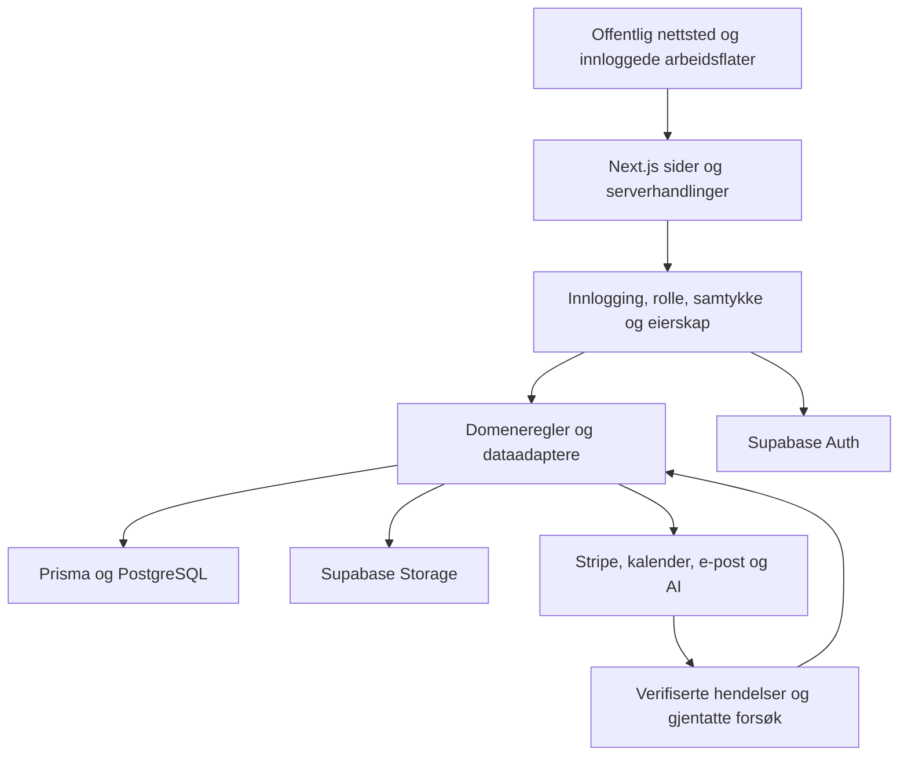

# Kodebaserevisjon av AK Golf HQ — 01.10.2026

## Resultat og bevisgrense

Statisk inventar: 3328 kildefiler, 520 sidefiler, 68 API-ruter, 171 servermoduler
og 216 Prisma-modeller. Sidefilene er ikke et mål på funksjonsdekning.

Grunnlag: `c8e97c66b`, egen gren `codex/codebase-audit-2026-10-01`. Gjennomgangen
kombinerer et statisk inventar av kildefilene med målrettet lesing av kjerneflytene,
feiltester og fem avgrensede forbedringer. Inventaret er en oversikt over kode,
ikke dokumentasjon på at samtlige brukerreiser fungerer. Ingen produksjonsdata,
ekte betalinger, e-postutsendinger, skjemaendringer eller tilgangsendringer er utført.

[Maskinlesbart inventar](kodebase-inventar-2026-10-01.json) inneholder filhash,
filinnganger, importer, produktområder, servermoduler og syntaktiske databasekall.
Genererte filer er utelatt. Testfiler inngår separat. Filer som importgrafen ikke
når, skal ikke slettes automatisk: skript, rammeverket og dynamiske importer kan
fortsatt bruke dem. Filinnganger inkluderer blant annet sider, layout, feil- og
lastetilstander; de er ikke et antall selvstendige funksjoner.

## Arkitektur og dataflyt

Appen er én samlet Next.js-app med flere produktområder. Det er ikke i seg selv
et problem; de viktigste grensene er eierskap, forretningsregler og konsistente
skrivinger. Installerte versjoner og byggkommandoer er kontrollert lokalt, uten
oppgraderinger. React/TypeScript bærer skjermene. Prisma bruker PostgreSQL via
en delt klient med `@prisma/adapter-pg`. Supabase brukes til innlogging og filer.
ME har et separat datagrunnlag og skal ikke blandes med spillerbasen.

| Kjedeutgangspunkt | Faktisk kodeflyt og viktige grenser |
|---|---|
| Registrering → tilgang | Supabase-identitet → `getCurrentUser`/`ensureUser` → appprofil → `resolveTilgang` og `requirePortalUser`. Klientens metadata kan ikke gi COACH/ADMIN eller betalt nivå. `proxy.ts` er bare første port; handlinger trenger egne vakter. |
| Booking → credits → kalender | `createCreditBooking` kontrollerer eier, abonnement, tjeneste og ledig tid. Credit-trekk og booking ligger i samme transaksjon; kollisjonsvern supplerer tilgjengelighetssjekken. Kalender, bekreftelse og varsler er etterfølgende sideeffekter. |
| Betaling → abonnement/booking | Stripe-ruten verifiserer rå body og signatur. `handleStripeEvent` deler behandling med retry-jobben. `ProcessedWebhookEvent` brukes som duplikatvern; `WebhookFailure` bevarer feilede hendelser. Køens lagringsutfall var tidligere skjult. |
| Trenerplan → spiller → gjennomføring | `session-update` skriver plan og V2-speil samlet. `publish-actions` håndterer planstatus og publiseringsgrunnlag. `merge-week-sessions` bruker `generertFraId` for å unngå dobbeltvisning. `getGjennomforeData` leser begge modeller. `markerOktStatus` hadde en separat, ikke-atomisk skrivevei som nå er rettet. |
| Live → oppsummering → analyse | Live-handlingene skriver V2-status, oppsummering og planlogg; planloggen og de ulike øktmodellene er innganger til forskjellige lesere. Det er fortsatt nødvendig å bevise hele kjeden mot lokal database, særlig status, varighet og identitet på tvers. |
| Runde/test → analyse → mål | Rundeoppretting validerer eier og brutto score. SG-beregninger og testprotokoller ligger i delte moduler. `beregnGoalProgress` gjenbrukes av flere lesere; Spiller 360 bruker nå listeberegning med ett SG-oppslag per spiller. Ingen sportslig formel er endret. |
| AI-forslag → godkjenning → handling | Caddie har ADMIN-port, personvernfilter og persisterte forslag. Godkjenningen krever eiet PENDING-forslag og atomisk krav før utførelse. Plan-action-motoren krever PROCESSING. Dette er statisk kontroll av grensen, ikke en prøve av ekstern AI eller alle verktøyene. |
| Samtykke → deling → tilbaketrekking | `ekstern-leser-scope` kombinerer aktiv lesergruppe, aktivt spillermedlemskap og gyldig samtykke per gruppe. Mindreårige krever foresattgrunnlag. Tilgang via én gruppe skal ikke åpne en annen. |
| Eksport/sletting → eksterne lagre | Eksporten henter støttede tabeller og filmanifest. Sletting går via `anonymiserBruker` og `slettEksterneBrukerdata`, som har egne resultater for Auth, Storage og Stripe. Gamle dokumenter som hevder at ingen ekstern sletting finnes, beskriver ikke dagens kode. Ingen virkelig sletting er kjørt. |

Kilder: [agentbrief](../platform/AGENT-BRIEF.md), [produktregler](../platform/BUSINESS-RULES.md),
[kodeinventar](kodebase-inventar-2026-10-01.json). Kodeflytene over er sporet i de
navngitte modulene; grønne modultester er ikke en full nettleserreise.

## Bekreftede funn og rettinger

| ID / prioritet | Problem og konsekvens | Endring og bevis |
|---|---|---|
| A01 / høy | `exportUserData` erstattet lesefeil fra 12 datakilder med tomme lister og returnerte suksess med ordet «komplett». En bruker kunne få en ufullstendig eksport uten å vite det. | Lesefeil avviser hele eksporten. Forsvunnet profil avvises også. Suksessmelding og e-post omtaler støttede data uten fullstendighetsløfte eller påstand om gjennomført nedlasting. E-postadressen er fjernet fra eksportens revisjonsmetadata. 27 tester: 14 feilet før, alle består etter. |
| A02 / kritisk for levering | `recordWebhookFailure` skjulte køens skrivefeil. Stripe-ruten svarte 200 og `queued: true` også uten lagret hendelse; leverandøren kunne slutte å levere en ubehandlet betaling. | Køfunksjonen returnerer bekreftet lagringsutfall. Stripe svarer 503 ved manglende køplass, 200 bare ved lagret køplass eller vellykket behandling. Feiltekster anonymiseres før kølagring; rå signaturfeil returneres ikke. Åtte nye rutetester med SDK-genererte signaturer består, sammen med fem eksisterende signatur-/rekkefølgetester. |
| A03 / høy | `markerOktStatus` skrev kilde og speil sekvensielt. Hvis andre skriving feilet, ble første stående. Nytt forsøk kunne stoppe på COMPLETED/SKIPPED og aldri reparere speilet. | Lesing og begge skrivinger ligger nå i én transaksjon. Betinget statusoppdatering begrenser gjentatte samtidige trykk. Varsel sendes først etter en faktisk endring. 14 tester dekker begge retninger, feil/retry, eierskap, manglende speil og varselfeil. Transaksjonsgrensen er modelltestet; virkelig databasesamtidighet er ikke bevist her. |
| A04 / middels | Spiller 360 kalte samme SG-leser én gang for hvert SG-mål. Fire mål kunne lese de samme ti rundene fire ganger. | `beregnGoalProgressListe` deler én Promise per spiller innen ett kall. Enkeltberegningen består. Fire nye tester viser identiske resultater, 4 → 1 lesing, eierseparasjon og ferske data ved nytt kall. Ingen varig eller global cache. Dette måler antall lesinger, ikke produksjonsresponstid. |
| A11 / middels | `hentPubliserDiff` formaterte dato og klokkeslett med serverens lokale tidssone. På UTC-server viste dialogen andre tider enn spillerens Oslo-plan. | En delt formatter bruker eksplisitt Europe/Oslo og samme tekstform som før. Fem nye tester dekker vinter/sommer, årsskifte, sommertid, skadet tidspunkt og den faktiske publiseringshandlingen. Publiseringstestene er også kjørt med server-TZ=UTC. Ingen lagrede tidspunkter endres. |

Endrede grensesnitt:

- `exportUserData` og `markerOktStatus` beholder inn- og returform.
- `recordWebhookFailure` returnerer nå `Promise<boolean>`: true betyr lagret;
  false betyr at kalleren må håndtere ny levering. Begge kallere er gjennomgått.
  Health-ingest beholder sitt eksisterende 500-svar og ignorerer returverdien.
- `beregnGoalProgressListe` er en ny intern listefunksjon med samme rekkefølge og
  beregningsresultater som enkeltkall. Ingen datamodell eller sportslig regel endres.

Stripe anbefaler håndtering av gjentatt levering og dokumenterer automatiske
nye forsøk ved leveringsfeil. Rettet 503-svar bruker denne eksisterende mekanismen.
Kilde: [Stripe — webhooks](https://docs.stripe.com/webhooks#automatic-retries).
Installerte Stripe CLI 1.35.0 manglet `docs`; den offentlige dokumentasjonen ble
lest direkte. Ingen innlogging, global oppgradering eller betaling ble utført.

## Åpne svakheter og konkret videre arbeid

| ID / prioritet | Kildeverifisert forhold | Strategi og ferdigkriterium |
|---|---|---|
| A05 / høy | Etterlevelse har ulike beregninger og datagrunnlag. `domain/etterlevelse` teller økter, mens `workbench/compliance` vekter planminutter. Funksjonene håndhever ikke selv fireukersvinduet; enkelte kallere filtrerer allerede. Den bindende beslutningen krever faktisk tid mot plan siste fire uker. | Lag én delt beregning med adaptere for faktisk registrert tid og dedupliserte økter. Bytt lesere i ukesrapport, digest, forelder, stall, Workbench og motor samlet. Lås 28-dagersgrense, ingen data, null minutter, tidlig fullføring og speil-ID i tester. Bevis samme spiller/tall på alle flater. Ingen ny sportslig regel skal gjettes. Dette er gjenstående implementering, ikke et uavklart systemvalg. |
| A06 / høy | Datakilde-listen i eksporten dekker ikke alle spillerdata: blant annet Workbench-/planmodeller og abonnement ligger utenfor denne innhentingen. Rettet feilbehandling gjør ikke listen fullstendig. | Bruk datakart og relasjoner til å utvide et eksplisitt eksportregister, med tester for hver eiet modell og filtype. Begrens andres profilfelt i relasjoner etter avklart innsynsomfang. Rapportér eventuell bevisst utelatelse. Ingen påstand om juridisk fullstendighet før dette er kontrollert. |
| A07 / høy | Duplikatkvitteringen opprettes før Stripe-behandlingen. `angreBehandlet` skjuler slettefeil, og cron-jobben tolker enhver eksisterende kvittering som ferdig behandlet. Prosessstopp eller mislykket tilbakeføring kan derfor etterlate ubehandlet arbeid som ser ferdig ut. `after()`-sideeffekter har dessuten en annen feilgrense enn hovedbehandlingen. | Klargjør en varig hendelsesmodell som skiller mottatt, under behandling og ferdig, med tidsbegrenset krav og egne sideeffektkvitteringer. Lag feiltester for stopp etter krav, feil i tilbakeføring, parallelle leveranser og gjenopptakelse. Nødvendig skjemaendring må bestilles konkret før implementering. A02 retter den skjulte køfeilen, ikke hele denne garantien. |
| A08 / høy testdekning | CI kjører `npm run verify`, men ingen innloggede nettleserreiser. `credit-booking.spec.ts` hopper eksplisitt over full booking/avbestilling; andre kjernetester kan hoppe over ved manglende konto eller økt. | Etabler separat lokal CI-testrigg med syntetiske kontoer og oppsamling av utsendinger. La manglende grunnlag feile de obligatoriske kjernetestene. Krev booking→saldo→avbestilling og trener→publisering→spiller→Live→analyse på 390/1440 px. Ikke kjør skriveprøver mot produksjonen. |
| A09 / middels vedlikehold | Importgrafen viser en faktisk rundkobling mellom `WorkbenchV2` og `WorkbenchV2Mobil`: mobilvarianten importerer visning og verdier fra foreldremodulen. Store aktive filer samler mange ansvar. | Flytt delte visninger/verdier til en nedre modul som begge importerer. Del store handlingsfiler etter brukstilfelle bak eksisterende eksportnavn. Ikke erstatt godkjent design eller slett gamle modeller automatisk. Lås oppførsel med eksisterende reise-/komponenttester før flytting. |
| A10 / avhengigheter, eksponering må vurderes | `npm audit` mot låsefilen registrerer 10 pakker: én kritisk, seks høye, én middels og to lave. Dette er pakkeregisterets klassifisering, ikke ti bekreftede angrep mot appen. | Gjennomgå hver berørt bruksmåte før en separat, avgrenset oppdatering. Ikke bruk automatisk major-oppgradering eller nedgradering fra audit-forslaget. Rammeverksoppgraderinger er utenfor denne bestillingen. |

[Avhengighetsmålingen](kodebase-avhengigheter-2026-10-01.json) har tidspunkt,
låsefilhash, pakker og kildelenker. Den kritiske registreringen gjelder Next.js
16.3.3 og Node.js `ImageResponse` ved angriperkontrollert SVG-innhold. Det ble
ikke funnet `ImageResponse`, `next/og` eller `@vercel/og` i appens kildefiler.
Dermed er en nåbar utnyttelse ikke påvist. Kilden oppgir 16.3.6 som første
rettede versjon; audit-verktøyet foreslår 16.3.8. Se
[Next.js' sikkerhetsmelding](https://github.com/advisories/GHSA-vcvr-r3jv-pc5j).
DOMPurify-bruken i spiller-sammenligningen har heller ikke de `IN_PLACE`-/hook-
valgene den registrerte meldingen krever. Øvrige transitive pakker må vurderes
mot faktisk runtime og byggebruk før de betegnes som app-sårbarheter.

A03 hindrer nye delvise statusoppdateringer på denne skriveveien. Den reparerer
ikke automatisk eventuelle tidligere inkonsistente rader; en slik kontroll og
retting må gjennomføres separat i autorisert miljø.

A07 er også reprodusert med den faktiske `markerBehandlet`/`angreBehandlet`-koden
og en simulert slettefeil: første krav lykkes, tilbakeføringen returnerer uten
feilmelding, og neste krav avvises som duplikat. Den diagnostiske prøven ligger
ignorert under `.codex/environments/codebase-audit/receipt-risk.test.ts`.
Dette er ikke en observert tapt produksjonsbetaling.
A09 er ikke bevis på treg app. Ingen SQL-injeksjon eller omgåelse av rolleport
påstås bare ut fra tekstsøk: det kontrollerte rå-SQL-kallet i cron bruker en
fast streng, og Caddies ADMIN-port ligger hos kalleren.

De største aktive kodefilene inkluderer `WorkbenchV2` (3905 linjer), `wb-actions`
(1942), `WorkbenchV2Sheets` (1775) og `load-workbench` (1158) ved første måling.
Tabeller og faste kildegrunnlag telles separat som kontekst; mange linjer gjør
ikke en referansetabell til dårlig kode. Gjenbruk delte domeneregler og adaptere
før det vurderes nye tjenester eller større arkitekturendringer.

## Dekning per produktområde

Alle områdene nedenfor er med i statisk inventar. «Delvis undersøkt» betyr at
representative kodekjeder er lest, ikke at hver side, handling eller integrasjon
er prøvd. «Uverifisert» gjelder funksjonell kontroll i denne økten.

| Område | Kontrollstatus |
|---|---|
| Offentlig nettsted / marketing | Delvis undersøkt: rutekart og sammenheng til booking/statistikk. Hele nettstedet uverifisert i nettleser. |
| Portal / PlayerHQ | Delvis undersøkt: øktmodeller, gjennomføring, runder, mål og eksport. Fire rettinger har avgrensede modultester. |
| Admin / AgencyOS / Workbench | Delvis undersøkt: eierskap, planlesing, oppdatering, publisering, Spiller 360 og agentutførelse. Hel treningsreise uverifisert. |
| API-er / cron | Delvis undersøkt: Stripe, retry, health-ingest, Google Calendar, OAuth og AI-innganger. Øvrige API-er er inventarisert, ikke fullstendig gjennomgått. |
| Auth / onboarding / inviter | Delvis undersøkt: profiloppretting, rollebegrensning, samtykke, redirect og pending-kobling. Leverandørflytene uverifisert. |
| Forelder | Delvis undersøkt: relasjon, booking på vegne av barn, samtykke og etterlevelsesleser. Full reise uverifisert. |
| Innsyn | Delvis undersøkt: samtykke- og gruppeavgrensning. Full innlogget reise uverifisert. |
| Team WANG | Delvis undersøkt: delt økt-/tilgangsgrunnlag og eksisterende modellgrenser. Elevreise og WANG-tilgang uverifisert. |
| Team Norway | Delvis undersøkt: delingsgrunnlag, SG-/testprotokoller og egne rutefiler. Hel organisasjonsreise uverifisert. |
| GFGK-junior / team-gfgk | Statisk inventarisert; funksjonelt uverifisert. |
| Meg / separat ME | Delvis undersøkt: separat databasegrense og health-ingest-kaller. Dataintegrasjoner uverifisert. |
| Kino | Statisk inventarisert; funksjonelt uverifisert. |
| Offline / service worker | Statisk inventarisert; byggkommando undersøkt. Frakoblet brukerreise uverifisert. |
| Demos / design-system / skjermer | Statisk inventarisert; ingen designendring eller visuell godkjenning. |
| Vedlikehold / rot og felles layout | Statisk inventarisert; produksjonsoppsett og visuell oppførsel uverifisert. |

## Kontroll og gjenopptakelse

Målrettede nye tester: 27 eksport + 8 Stripe-rute + 14 øktstatus + 4 mål +
5 publiseringstid = 58.
Eksisterende tester for signatur, hendelsesrekkefølge og målfremdrift er også kjørt.
Alle bruker syntetiske data; Stripe-signaturprøvene bruker SDK-et uten nettverk.
Ingen reell database, Auth, Storage, kalender, AI eller betaling er brukt i de
nye feiltestene. Ingen produksjonsytelse er målt.

Sikkerhet/personvern: de eksisterende rolle-, eier- og samtykkevaktene er
beholdt. Nye tester avviser annen eier og stopper eksport før lesing ved manglende
samtykke. Ingen miljøfiler, persondata eller produksjonshemmeligheter inngår i
endringene. Feiltekster i køen anonymiseres og eksportens e-postadresse fjernes
fra revisjonsmetadata. Skjema, tilgangsregler og produksjonsoppsett er uendret.

Samlet sluttkontroll: `npm run verify` er bestått med Node.js 24.14.0:
alle statiske kontroller, 3873 enhets-/modultester og 14 komponenttester
(3887 totalt, ingen hoppet over), Next.js/TypeScript-bygg og Serwist.
`npm run prosjekt:sjekk` er også bestått. CI og innloggede nettleserreiser er
ikke kjørt i denne økten.

Arbeidskopien fikk en egen `npm ci` fra uendret låsefil etter at delte
avhengigheter ga lokale Turbopack-feil. Ingen miljøfiler er kopiert,
pakkeversjoner oppgradert eller produksjon kontrollert.

Neste implementeringsrekkefølge: A05/A06 innen eksisterende datamodell,
deretter faktisk koblet lokal trenings- og bookingreise (A08), og separat
beslutningsgrunnlag for A07. A09 følger funksjonsbevis og valgt designoverlevering.
Ingen nye arbeidsoppgaver sendes til andre chatter fra denne økten.
