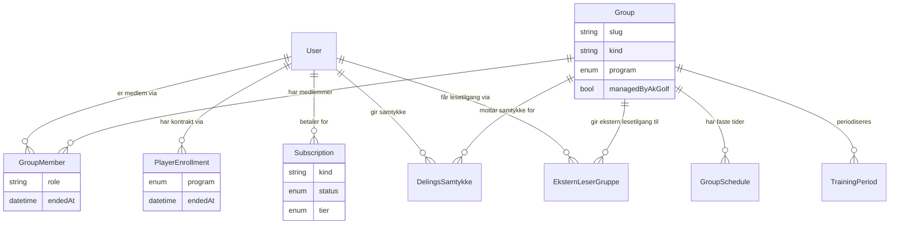

# Kartlegging: PlayerHQ ↔ WANG Toppidrett ↔ Team Norway

Ren kartlegging, ingen kodeendringer. Skrevet 30.08.2026 mot gjeldende kode i `akgolfsoftware/Golf_Headquarters` (main). Spiller-ID-er brukt der eksempler trengs, aldri navn på mindreårige.

---

## 1. Sammendrag

- **Team Norway finnes ikke som egen rute/flate i koden.** Det eneste sporet er generisk "ekstern leser"-infrastruktur (`/innsyn`) og en `Group`-rad med `slug: "team-norway"`. Alt annet i `beslutninger.md` om «TN-Workdesk» er beslutning/plan, ikke bygget kode.
- **WANG har en egen, fungerende flate** (`/team-wang/*`), men den er **ikke lenket i noe nav** — nås kun via direkte URL/delt lenke.
- **En WANG-/Team Norway-spiller er samme `User`-rad som PlayerHQ-brukeren.** Ingen egen elev-tabell å synke — koblingen er `GroupMember` (og for WANG også `PlayerEnrollment`).
- WANG uttrykkes med **to parallelle koblinger** (`PlayerEnrollment.program` + `GroupMember` mot `Group.slug="wang-toppidrett"/"wang-ung"`); Team Norway har **kun én** (`GroupMember` mot `Group.slug="team-norway"`, `kind:"ekstern"`).
- **Utmelding er håndtert** som soft-end (`GroupMember.endedAt`, `PlayerEnrollment.endedAt`) — data slettes ikke, bare markeres avsluttet.
- **Tilgangsstyring er tre lag uten felles mekanisme:** `proxy.ts` sjekker kun innlogging, rolle/eierskap sjekkes i Prisma `where`-fragmenter (`coachScopedPlayerWhere`, `ekstern-leser-scope.ts`), og RLS i Supabase er reelt **koblet ut** i produksjon fordi appen kobler til Postgres direkte via `DATABASE_URL` (ikke Supabase-klient med RLS-håndheving).
- **Abonnement er alltid per bruker** (`Subscription.userId`, `@@unique([userId,kind])`) — det finnes ingen org-betalt/sete-basert Stripe-modell i koden. Gratis institusjonstilgang løses via `Group.managedByAkGolf` (ikke Stripe), ikke via betaling fra organisasjonen.
- **Den nylig besluttede "spillerlisens"-modellen (30.08.2026, organisasjonen betaler spillerens lisens) har intet teknisk grunnlag i dagens Stripe/Subscription-kode** — det finnes ingen mekanisme for at en tredjepart (WANG/TN) er betalende part for en annen brukers `Subscription`.
- **Dobbel fakturering er en reell, ubehandlet risiko:** en spiller kan ha egen betalt `Subscription` OG være i en `managedByAkGolf`-gruppe samtidig — ingenting i koden kansellerer den ene når den andre gir gratis tilgang.
- **Workbench-domenet (`src/lib/domain/workbench/`) er godt egnet som byggestein** — statusmaskin, drag-and-drop (`@dnd-kit`) og periodisering (`GroupSchedule`, `TrainingPeriod`) finnes allerede, men er bygget for coach↔spiller, ikke for institusjon↔gruppe.
- `GroupSchedule.kind` har allerede verdiene `SAMLING`/`HELDAGSSAMLING` — nærmeste eksisterende byggestein for en "samling"/"testdag"-modell, men uten kobling til individuell økt-planlegging.

---

## 2. Datamodell

### 2.1 Relevante Prisma-modeller

| Modell | Tabell | Nøkkelfelter | Rolle |
|---|---|---|---|
| `User` | `users` | `id, authId, email, role, tier, profilType, school, dateOfBirth, requiresGuardianConsent, primaryCoachId, deletedAt, anonymisertAt` | Kjernemodell — samme rad for PlayerHQ-bruker, WANG-elev, Team Norway-spiller |
| `Group` | `groups` | `id, name, slug (unik), level, coachId, kind ("kontrakt"\|"program"\|"adhoc"\|"ekstern"), program (PlayerProgram?), managedByAkGolf, maxParticipants, hovedcoachId, arkivertAt` | Institusjon/gruppe-representasjon. WANG og Team Norway er kanoniske rader her, ikke egne tabeller |
| `GroupMember` | `group_members` | `groupId, userId, role ("PLAYER"\|"ASSISTANT"\|"COACH"), joinedAt, endedAt` — `@@unique([groupId,userId])` | Medlemskap i gruppe. `endedAt: null` = aktivt |
| `PlayerEnrollment` | `player_enrollments` | `userId, program (PlayerProgram), coachId?, enrolledAt, endedAt?, notes` | Programkontrakt (kun brukt for WANG/GFGK/Academy, ikke Team Norway) |
| `DelingsSamtykke` | `delings_samtykker` | `userId, scope ("TEST_RESULTATER"\|"STATS"), mottakerGruppeId, gitt, gittAvUserId, gittAvRolle ("SELV"\|"FORESATT"), createdAt` | Append-only samtykkelogg. Nyeste rad per (bruker, scope, gruppe) vinner |
| `EksternLeserGruppe` | `ekstern_leser_grupper` | `userId, groupId, opprettetAvId?, createdAt, revokedAt?` — `@@unique([userId,groupId])` | Gir en GUEST-bruker (f.eks. TN-/WANG-ansvarlig) lesetilgang til én gruppe |
| `Subscription` | `subscriptions` | `userId, kind ("COACHING"\|"PLAYERHQ"), plan, status (ACTIVE\|PAST_DUE\|CANCELLED\|TRIALING), tier, stripeSubscriptionId, currentPeriodEnd` — `@@unique([userId,kind])` | Abonnement, alltid koblet til bruker, aldri organisasjon |
| `GroupSchedule` | — | `recurring (WEEKLY\|NONE), kind (SAMLING\|HELDAGSSAMLING\|null)` | Faste/gjentakende gruppetreningstider — nærmeste "samling"-konsept |
| `TrainingPeriod` | — | `periode (GRUNN\|SPES\|TURN\|Testuke\|TURN-rest), tone, competenceGoalIds` | AK-periodisering per gruppe/skoleår |
| `CompetenceGoal`, `SchoolScheduleEntry` | — | — | WANG-årsplan-støtte |

`PlayerProgram`-enum: `WANG_TOPPIDRETT, WANG_UNG, GFGK_MINI, GFGK_BREDDE, GFGK_JENTER, GFGK_ELITE, AK_ACADEMY, AK_ACADEMY_JUNIOR, PLATFORM_ONLY`. **Ingen `TEAM_NORWAY`-verdi finnes.**

### 2.2 Svar på nøkkelspørsmål

1. **Samme entitet.** WANG-/Team Norway-spilleren ER PlayerHQ-brukeren (`User`). Ingen egen elev-tabell, ingen synk-problem — koblingen er relasjonell (`GroupMember`), ikke duplisert data.
2. **Ulik mekanisme for WANG vs. Team Norway.** WANG: `PlayerEnrollment.program` (kontraktsforhold) + `GroupMember` (gruppetilhørighet), begge parallelt. Team Norway: kun `GroupMember` mot `Group{slug:"team-norway", kind:"ekstern", managedByAkGolf:false}` — ingen `PlayerEnrollment`, fordi det ikke finnes en `PlayerProgram`-verdi for det.
3. **Utmelding er håndtert, ikke ignorert.** `GroupMember.endedAt` og `PlayerEnrollment.endedAt` er soft-end — historikk og treningsdata beholdes, medlemskapet bare avsluttes. Selve datasletting/GDPR-anonymisering er en separat mekanisme (`User.deletedAt`/`anonymisertAt`).
4. **WANG-trener ser spillere kun via AgencyOS**, gjennom `coachScopedPlayerWhere` (`src/lib/auth/coached.ts:75-106`) — brukt i `src/app/admin/grupper/[id]/page.tsx` og `src/app/admin/grupper/page.tsx`. Det finnes ingen egen "WANG-trener-app" utenom `/team-wang/coach` (se skjermkart), som er en egen, ulenket flate ved siden av AgencyOS — to forskjellige inngangsdører til delvis samme data.

### 2.3 Relasjonsdiagram

**Merk:** diagrammet viser skjematisk struktur. WANG (`slug:"wang-toppidrett"/"wang-ung"`) og Team Norway (`slug:"team-norway"`) er begge RADER i `Group`, ikke egne tabeller — de har ulik `kind`/`managedByAkGolf`/`program`-verdi, ikke ulik modell.

---

## 3. Skjermkart

| Rute | Filsti | Rolle med tilgang | Hva den gjør | Lenket i nav? |
|---|---|---|---|---|
| `/innsyn` | `src/app/innsyn/page.tsx` + `layout.tsx` | Innlogget bruker med capability `VIEW_SHARED_TEST_RESULTS` eller `VIEW_SHARED_STATS` (fremtidig TN/WANG-ansvarlig, GUEST-type) | Oversikt over grupper/spillere leseren har samtykkebasert tilgang til | **Nei** — nås kun via `redirect("/innsyn")` fra `src/app/auth/etter-innlogging/page.tsx` |
| `/innsyn/[spillerId]` | `src/app/innsyn/[spillerId]/page.tsx` | Samme som over + `harEksternLeserTilgang()`-sjekk (IDOR-vern) | Spillerdetalj: kun samtykkede CANON-testresultater og SG-nøkkeltall | **Nei** |
| `/team-wang` | `src/app/team-wang/page.tsx` + `layout.tsx` | Ingen — bevisst åpen, ingen PII | WANG-fellesside: årsplan-faner Trening/Skole/Kalender/Foreldre | **Nei** |
| `/team-wang/logg-inn` | `src/app/team-wang/logg-inn/page.tsx` | Åpen (login-side) | Egen innlogging for WANG-flaten | **Nei** |
| `/team-wang/coach` | `src/app/team-wang/coach/page.tsx` | `proxy.ts` (innlogget) + `requirePortalUser({allow:["ADMIN","COACH"]})` i siden | Trenerens periodiserte årsplan med elevnavn/roster + IUP-lenker (PII) | **Nei** |
| `/team-wang/coach/iup/[elevId]` | `src/app/team-wang/coach/iup/[elevId]/page.tsx` | Samme gate som over | IUP-samtale for én elev | **Nei** |
| `/team-gfgk` | `src/app/team-gfgk/page.tsx` + `layout.tsx` | Ingen — åpen (`noindex`) | Foreldremøte-presentasjon: differensiering elitegruppe, resultatoversikt | **Nei** |
| `/gfgk-junior` | `src/app/gfgk-junior/page.tsx` + `layout.tsx` | Ingen — offentlig, indekseres | Markedsside GFGK juniorgolf | **Nei** i shell, men refereres fra `cookie-banner.tsx` |
| `/gfgk-junior/kalender` | `src/app/gfgk-junior/kalender/page.tsx` | Ingen | Kalendervisning GFGK junior | **Nei** |
| `/gfgk-junior/treningsplaner` | `src/app/gfgk-junior/treningsplaner/page.tsx` | Ingen | Treningsplaner-oversikt | **Nei** |
| `/gfgk-junior/veileder` | `src/app/gfgk-junior/veileder/page.tsx` | Ingen | Veileder-artikler | **Nei** |

**Team Norway (NGF landslag) som egen rute finnes ikke** — ingen treff på `team-norway`, `Workdesk`, `landslag` som faktisk kode utover `Group.slug="team-norway"` og generisk kommentarer i `ekstern-leser-scope.ts` om fremtidig bruk.

**Nav-treet i `src/components/v2/shell.tsx`** har tre grener — ingen av dem peker på noen av flatene over:
- **Portal:** `/portal`, `/portal/planlegge`, `/portal/analysere`, `/portal/meg`
- **Admin/AgencyOS:** `/admin/agencyos`, `/admin/innboks`, `/admin/kalender`, `/admin/spillere`, `/admin/planlegge`, `/admin/analyse`, `/admin/settings`, `/admin/agenticos`, `/admin/grupper`, `/admin/agencyos/okonomi`, `/admin/profile`
- **Forelder:** `/forelder` + 8 underruter

Alle rader i skjermkartet over er dermed **orphans** i praksis: de har fungerende `page.tsx`, men nås kun via direkte URL, delt lenke eller `redirect()` fra auth-flyten — aldri via en klikkbar meny.

---

## 4. Tilgangsstyring

Tre lag, **ingen felles mekanisme** — dette er selve funnet, ikke en beskrivelsesfeil:

1. **`src/proxy.ts`** — kun autentisering. `erBeskyttet` (linje 183–190) fanger `/portal`, `/admin`, `/intern`, `/innsyn`, `/team-wang/coach*`, redirect til login hvis ikke innlogget (linje 206–215). Ingen rollesjekk her — dokumentert eksplisitt i kommentar (linje 219–221) at rolle for `/admin/*` sjekkes i `admin/layout.tsx`, ikke proxyen.
   - Historisk hendelse (kommentar linje 170–181): `/team-wang/coach` lå åpen uten sperre en periode fra 15.08.2026 — nå lukket dobbelt.
2. **`src/lib/feature-flags.ts:100-140`** — `resolveTilgang` beregner FULL/TALENT/INGEN. Prioritert rekkefølge: lanseringsvindu → betalt PLAYERHQ-abonnement → coaching-pakke → `Group.managedByAkGolf`-medlemskap → prøveperiode → TALENT-profil → INGEN.
3. **`src/lib/auth/requirePortalUser.ts:34-74`** — sentral gate brukt i 300+ filer. Henter bruker, sjekker rolle mot `options.allow`, GDPR-samtykkesperre for mindreårige, og tilgangsnivå (kun for `role==="PLAYER"`). Brukes bl.a. i `/team-wang/coach/page.tsx`.
4. **`src/lib/auth/ekstern-leser-scope.ts`** — samtykkemodell for TN/WANG-lesere. Tre-faktor-sjekk (linje 6–11): aktiv `EksternLeserGruppe` + aktivt `GroupMember`-medlemskap i samme gruppe + gyldig `DelingsSamtykke` for samme gruppe. Håndhevingsfunksjon `harEksternLeserTilgang` (linje 143–150), kalt fra `src/app/innsyn/[spillerId]/page.tsx:58,61`.
5. **RLS i Supabase — reelt frakoblet i produksjon.** Policies finnes (`rounds_select`, `test_results_select`, `trackman_sessions_select`), men er grovkornede rollesjekk (enhver `ADMIN`/`COACH` ser alt, uten gruppe-scoping) — **ikke** organisasjons-bevisste. Viktigere: appen kobler til Postgres via `DATABASE_URL` (direkte pooler-tilkobling, `src/lib/prisma.ts:16`), ikke via Supabase-klient med anon-nøkkel — så RLS håndheves **ikke** i den faktiske dataflyten. `delings_samtykker` og `ekstern_leser_grupper` har RLS på, men ingen egne policies funnet (default-deny for `anon`/`authenticated`).
6. **`coachScopedPlayerWhere`** (`src/lib/auth/coached.ts:75-106`) — dominerende AgencyOS-mønster. `COACH` ser spillere via egen `PlayerEnrollment`, egen gruppe (`Group.coachId`), eller gruppe der coachen selv er aktivt medlem. `assertCoachTilgangTilSpiller` (linje 113–125) er den påkrevde eierskapssjekken før skriving.

**Team Norway-coach vs. klubbtrener:** ingen egen "Team Norway"-rolle finnes i `role`-enumet (`PLAYER/COACH/ADMIN/PARENT`). Differensieringen er strukturell, ikke en rolle-bryter: en ekstern leser (GUEST) ser kun det samtykke + `EksternLeserGruppe` gir tilgang til; en vanlig klubbtrener (`role=COACH`) ser alt gruppeeierskap gir, uavhengig av samtykke. To arkitektonisk atskilte tilgangsveier for to ulike brukertyper.

**IDOR:** ingen konkret manglende sjekk funnet i kjernefunksjonene (`assertCoachTilgangTilSpiller`, `harEksternLeserTilgang` er eksplisitt bygget mot dette) — men dekningen på tvers av alle 300+ bruksteder av `requirePortalUser` er **ikke uttømmende verifisert** i denne kartleggingen. Se punkt 7.

---

## 5. Kommersiell modell

- **`Subscription`** (`prisma/schema.prisma:2225-2264`): `userId, kind ("COACHING"|"PLAYERHQ"), plan, status (ACTIVE|PAST_DUE|CANCELLED|TRIALING), tier (GRATIS|PRO|ELITE), stripeSubscriptionId, stripeCustomerId, currentPeriodEnd`. `@@unique([userId,kind])` — maks én COACHING- og én PLAYERHQ-rad per bruker.
- **Priser** (`src/lib/domain/abonnement.ts:33-36`): PLAYERHQ 299 kr/mnd eller 2 690 kr/år. Stripe price-ID-er leses fra env (`STRIPE_PRICE_ID_PRO`, `STRIPE_PRICE_ID_PRO_AAR`, `STRIPE_PRICE_ID_PERFORMANCE`, `STRIPE_PRICE_ID_PERFORMANCE_PRO`) — ingen hardkodede Stripe-ID-er i kode.
- **Webhook:** `src/app/api/stripe/webhook/route.ts` → `src/lib/stripe/handle-event.ts:290-503`. Håndterer `customer.subscription.*` (synker `Subscription`-rad), `checkout.session.completed/expired`, `payment_intent.*`, `invoice.*`, `charge.refunded`.
- **Betalingsmodell: per bruker, aldri per organisasjon eller sete.** Det finnes ingen Stripe-produkt/pris for "institusjon" eller "spillerlisens-pakke" i koden.
- **Gratis institusjonstilgang går UTENOM Stripe:** `Group.managedByAkGolf: true` gir automatisk FULL-tilgang til alle aktive `GroupMember`-er i gruppen, håndhevet i `resolveTilgang` (`feature-flags.ts:124-125`, via `akGruppeCount`). Team Norway er eksplisitt satt til `managedByAkGolf: false, kind: "ekstern"` (`src/lib/domain/grupper.ts:49-61` — "de er ikke et AK-…").
- **Medlemskapsendring trigger ikke fakturering.** `leggTilGruppemedlem`/`fjernGruppemedlem` (`src/app/admin/grupper/[id]/actions.ts`) gjør ren `GroupMember`-skriving — ingen Stripe-import, ingen kall. Tilgangseffekten er indirekte og evalueres live neste gang `resolveTilgang` kjøres.
- **Betalende part ved dobbeltmedlemskap:** brukeren selv er alltid den tekniske betaleren av `Subscription` (kortet er alltid registrert på `userId`). Det finnes ingen mekanisme for at WANG eller Team Norway er Stripe-kunde på vegne av en spiller.
- **Dobbeltfakturering — reell, ubehandlet risiko:** en spiller kan samtidig ha en aktiv, betalt `Subscription` (kortet trekkes) OG være i en `managedByAkGolf`-gruppe som ville gitt gratis FULL-tilgang. Ingenting i koden oppdager eller kansellerer det overflødige abonnementet — de to systemene er helt frikoblet.
- **Gratisnivå uten Stripe:** TALENT-nivået (`resolveTilgang` fallback) er permanent gratis og krever ingen Stripe-objekt i det hele tatt.

---

## 6. Workbench-vurdering

**Kan gjenbrukes:**
- `src/lib/domain/workbench/types.ts` + `operations.ts` — ferdig statusmaskin (`DRAFT → SCHEDULED → PUBLISHED → IN_PROGRESS → COMPLETED`, samt `CANCELLED`/`SKIPPED`), ferdig `moveSession`/`publishSession`/`addDrill`-operasjoner, `buildWeekViewModel`/`MonthViewModel`/`YearViewModel`.
- `src/lib/workbench/wb-actions.ts` (1157 linjer) — server actions som allerede kobler økt til `playerId`, `coachId` og valgfritt `groupId`.
- `@dnd-kit/core` + `@dnd-kit/sortable` er allerede i bruk i `src/components/portal/v2/WorkbenchV2.tsx` for å dra drill/mal inn i en dag-kolonne — mønsteret finnes, det er ikke ny infrastruktur.
- `GroupSchedule.kind` (`SAMLING`/`HELDAGSSAMLING`) + `TrainingPeriod` + `CompetenceGoal` gir allerede et gruppenivå-periodiseringslag ved siden av individ-nivået.

**Hva mangler:**
- Ingen kobling i dag mellom en `GroupSchedule`-samling og de enkelte spilleres `WorkbenchSession`-er — de er to separate lag som ikke "vet om" hverandre i UI eller domenelogikk.
- Ingen `PlayerProgram`/enum-representasjon for Team Norway (kun `Group.slug`), så alt som i dag filtrerer på `PlayerProgram` (WANG-spesifikk kode) vil ikke automatisk fange Team Norway-spillere.
- Ingen datamodell for "hvem er tatt ut til denne samlingen" utover ordinært `GroupMember`-medlemskap — en samling krever typisk et *utvalg* av gruppens medlemmer per gang (testdag ≠ hele gruppa nødvendigvis), noe som ikke finnes i dag.
- Ingen kobling mellom institusjon (WANG/TN) og fakturering, se punkt 5 — en "workbench for institusjonen" reiser spørsmålet om hvem som betaler, som ikke er teknisk løst.

**Minste levedyktige inngrep (beskrevet, ikke bygget):**
Den minste utvidelsen er å la eksisterende `WorkbenchSession`-visning for en gruppe (allerede mulig via `groupId`-feltet) vise `GroupSchedule`-rader med `kind: SAMLING/HELDAGSSAMLING` i SAMME ukevisning som medlemmenes individuelle økter — ett kalenderlag, to datakilder, ingen ny tabell. En "samling" trenger i så fall kun ett nytt felt: hvilke `GroupMember`-er som faktisk er tatt ut (et enkelt kryss-tabell eller et array-felt på `GroupSchedule`-instansen), ikke en helt ny modell. Alt annet (statusmaskin, drag-and-drop, periodisering) finnes.

**Hvor ideen kolliderer:**
- **Fakturering er uløst.** "Felles workbench for institusjon" impliserer institusjonen jobber i produktet — men institusjonen har ingen betalingsrolle i dagens Stripe-modell. Å bygge UI før betalingsmodellen finnes, betyr enten (a) all funksjonalitet må være gratis via `managedByAkGolf` (fungerer for WANG Fredrikstad, men motsier den nylig vedtatte "spillerlisens"-modellen der TN/WANG skal *betale* per spiller), eller (b) betalingsmodellen må bygges først.
- **Team Norway er ikke modellert som noe annet enn en generisk gruppe.** All kode som er WANG-spesifikk (`PlayerEnrollment.program`, GFGK-relaterte enum-verdier) har ingen tilsvarende for Team Norway. En "felles" workbench må derfor bygges mot `Group`/`GroupMember` generisk — ikke mot WANG-spesifikke felter — ellers må Team Norway først få sin egen `PlayerProgram`-gren, som er en større endring enn den gir inntrykk av.
- **To ulike tilgangsveier (COACH-eierskap vs. ekstern-leser-samtykke) betyr en institusjonstrener og en samtykke-basert leser IKKE ser det samme** — en workbench som skal betjene begge brukertyper må velge hvilken av de to sjekkene den bygger på, de er ikke utskiftbare.

---

## 7. Hull og risiko

- **Ikke funnet i koden:** noen egen Team Norway-rute, `Workdesk`, `TN-`-navngitt kode, eller `PlayerProgram`-verdi for Team Norway. Beslutningsdokumentet (`beslutninger.md`, 30.08.2026) beskriver en omfattende TN-Workdesk-visjon som **ikke** har kode ennå — dette er plan, ikke status.
- **Ikke funnet:** noen org-betalt/sete-basert Stripe-modell. Den nylig vedtatte "spillerlisens"-forretningsmodellen (organisasjonen betaler for spilleren) har ingen kjent teknisk representasjon per 30.08.2026.
- **Ikke uttømmende verifisert:** at samtlige 300+ bruksteder av `requirePortalUser`/server-actions som tar en spiller-ID fra parameter faktisk kaller `assertCoachTilgangTilSpiller` eller `harEksternLeserTilgang` før lesing/skriving. Ingen konkret IDOR ble funnet i kjernefunksjonene, men en fil-for-fil-gjennomgang er utenfor denne kartleggingens omfang.
- **Ser feil ut:** RLS-policiene i Supabase (`rounds_select` m.fl.) gir enhver `ADMIN`/`COACH` tilgang til *alle* brukeres data uten gruppe-scoping — og siden appen uansett kjører utenom RLS via direkte DB-tilkobling, er dette i praksis en sovende sikkerhetsrisiko hvis noe noensinne begynner å bruke Supabase-klienten direkte (f.eks. en fremtidig klient-side-integrasjon).
- **Ser feil ut (drift):** to helt ulike, ulenkede WANG/GFGK-flater (`/team-wang/*`, `/team-gfgk`, `/gfgk-junior/*`) eksisterer parallelt med AgencyOS' `/admin/grupper`-visning av samme institusjoner. Det er uklart om disse flatene er aktivt i bruk, forlatt, eller planlagt gjenbrukt — de er «orphans» i navigasjonsforstand uansett formål.
- **Dobbeltfakturering** (spiller med både egen betalt `Subscription` og gratis `managedByAkGolf`-tilgang) er beskrevet i punkt 5 — ingen kode oppdager eller varsler om dette i dag.
- **Metodikk-duplisering:** ingen metodikk (AK-formel, CANON, pyramide) ble funnet duplisert utenfor det som allerede er kjent kanon-vokabular i disse skjermene — ingen egen flagging nødvendig her utover det som står i `beslutninger.md`.

---

## 8. Underlag for design

Skriv for hver skjerm slik at Claude Design kan tegne den uten å åpne kodebasen.

### `/innsyn` — Ekstern leser-oversikt
- **Data den viser:** liste over grupper leseren (TN-/WANG-ansvarlig) har samtykkebasert tilgang til, og innenfor hver gruppe: hvilke spillere har gyldig samtykke for hvilket scope (`TEST_RESULTATER`/`STATS`).
- **Tilstander:** Tom (ingen grupper med samtykke ennå — vis forklarende tekst om hvordan samtykke oppstår, ikke en feilmelding), Lastet (liste med grupper → spillerantall per gruppe), Feil (mislyktes henting — kort norsk feiltekst + prøv igjen), Ingen tilgang (bruker uten noen `EksternLeserGruppe`-rad → generisk "ingen tilgang"-tekst, aldri 500).
- **Handlinger:** klikk på en gruppe → gå til spillerliste; klikk på en spiller → `/innsyn/[spillerId]`. Ingen skrive-handlinger på denne siden — kun lesing.

### `/innsyn/[spillerId]` — Spillerdetalj (samtykkebasert)
- **Data:** kun CANON-testresultater (de 20 standardprotokollene) og SG-nøkkeltall spilleren har samtykket til å dele med akkurat DENNE gruppen — ikke full profil.
- **Tilstander:** Lastet (resultattabell/nøkkeltall), Tom (spiller har ikke gjennomført tester ennå), Ingen tilgang (samtykke finnes ikke eller er trukket → `notFound()`-lik tilstand, skal se identisk ut som "spiller finnes ikke" for å unngå enumerering — IKKE avslør at spilleren finnes men mangler samtykke).
- **Handlinger:** ingen skriving. Ren lesevisning.

### `/team-wang` — WANG fellesside (offentlig)
- **Data:** årsplan i faner — Trening, Skole, Kalender, Foreldre. Ingen PII, ingen innlogging.
- **Tilstander:** Lastet (fire faner), Tom per fane (hvis en periode ikke har innhold ennå — vis "ikke lagt inn" fremfor tom hvit flate).
- **Handlinger:** bytte fane. Ingen skriving, ingen innlogging kreves.

### `/team-wang/coach` — Trenerens årsplan (WANG)
- **Data:** periodisert årsplan (GRUNN/SPES/TURN) for gruppen, med elevroster (navn — PII, kun for innlogget COACH/ADMIN) og lenker videre til IUP per elev.
- **Tilstander:** Lastet (periodeplan + roster), Tom (ny sesong, ingen periodeplan lagt inn), Feil (mislyktes henting av gruppedata), Ingen tilgang (innlogget bruker uten COACH/ADMIN-rolle → skal IKKE se roster i det hele tatt, ikke bare gråtonet).
- **Handlinger:** navigere til `/team-wang/coach/iup/[elevId]` per elev. Skrive-handlinger for selve periodeplanen er ikke bekreftet i denne siden isolert — sjekk `wb-actions.ts` hvis skriving skal tegnes inn.

### `/team-wang/coach/iup/[elevId]` — IUP-samtale for én elev
- **Data:** individuell utviklingsplan-innhold for én elev (PII — kun for autorisert COACH/ADMIN).
- **Tilstander:** Lastet, Tom (ingen IUP skrevet ennå for denne eleven), Ingen tilgang (elev tilhører ikke coachens gruppe → skal aldri vise data, uavhengig av URL-manipulering).
- **Handlinger:** trolig lesing + notatfelt (bekreft i kildekode før eksakt skrive-UI tegnes — ikke verifisert i denne kartleggingen ut over routing).

### `/team-gfgk` — Foreldremøte-presentasjon
- **Data:** deck-aktig presentasjon: differensiering i elitegruppa, resultatoversikt. `noindex`, offentlig URL men ikke søkbar.
- **Tilstander:** Lastet (presentasjonsvisning). Ingen tom/feil-tilstand av betydning — statisk/semi-statisk innhold.
- **Handlinger:** trolig kun bla gjennom slides/seksjoner. Ingen skriving.

### `/gfgk-junior` + underruter — Offentlig markedsside
- **Data:** markedsføringsinnhold for GFGK juniorgolf, kalendervisning, treningsplaner (offentlig lesbare), veileder-artikler.
- **Tilstander:** standard markedsside-tilstander (lastet/tom ved manglende innhold). Ingen PII, ingen innlogging.
- **Handlinger:** navigasjon mellom undersider. Ingen skriving.

### Generelt designprinsipp for punkt 8-flatene
Samtlige skjermer over ligger **utenfor** det ordinære PlayerHQ/AgencyOS/Forelder-navet (se punkt 3) — de har ingen felles skall/rail å arve fra. Skal de tegnes om i Train-lock-fasiten (jf. CLAUDE.md invariant 2), må designeren enten (a) gi dem samme rail-struktur som AgencyOS (hvis de skal inn i AgencyOS-navet) eller (b) bevisst la dem forbli frittstående microsites med egen enkel topptekst — velges eksplisitt før tegning, ikke arves stilltiende fra dagens ulenkede tilstand.
