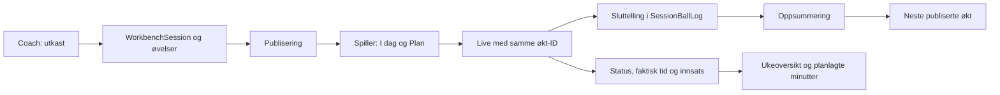

# Klargjøring: design, lagring og sammenhengende brukerreiser

Bestilt av Anders 01.10.2026. Claude Design eier designet; Codex eier fungerende kode og datakobling. Dette konkretiserer PRE-04–08 i [fullføringsplanen](codex-fullforing-claude-design-2026-09-30.md), og innfører ingen ny navigasjon, produktregel, tilgangsregel eller datamodell.

## Leveransen i denne arbeidsrunden

1. Et reproduserbart [sporingskart](../design-audit/design-data-journey-map-2026-10-01.json) fra samtlige side-/API-kilder gjennom importerte moduler og layout til serverhandlinger og kjente Prisma-operasjoner. Filavtrykk avslører når kartet er utdatert.
2. Prøver gjennom virkelig lokal lagring: trenerutkast → publisering → spillerens I dag/Plan → Live → fullføring/sluttelling → oppsummering og ukeoversikt. Bare forespørselsidentitet og Next sin cache er erstattet i serverprøvene; database, eierskapsspørringer og domenelogikk er ekte. Innlogging i nettleseren kontrolleres separat.
3. Rettede, påviste brudd: I dag manglet Workbench/eldre planøkter, neste-økt-kjeden manglet Workbench, og innsats-skjemaet kunne fullføre utkast eller overskrive ferdig historikk ved nytt forsøk.
4. En konkret overleveringsavtale for å koble ferdige designreiser til dagens kode. Ingen designprototype behandles som ferdig datalagring.

Målt resultat og begrensninger føres i [kontrollrapporten](../design-audit/design-lagring-kontroll-2026-10-01.md).

## Avtalen mellom skjerm og lagring

| Del | Kobling og kontrollpunkt |
|---|---|
| Designreferanse | Gjeldende [designautoritet](../design-system/design-autoritet.md). Registrer konkret eksport, skjerm/tilstand og kildefil når reisen velges for bygging. Kartets `designReference: null` betyr at den koblingen ennå ikke er gjennomgått; systemvalget er allerede bestemt |
| Lesemodell | Bruk eksisterende typer, for eksempel `WeekViewModel`, `WorkbenchSession`, `TodaySession` og `LiveV2Summary`. En visning får validerte data, aldri et parallelt lager med eksempeldata |
| Skrivehandling | Bind kontrollen til navngitt eksisterende serverhandling med inputskjema, returtype og feilhåndtering. En klikkbar knapp er utilstrekkelig før lagring og neste leser er kontrollert |
| Identitet | Behold `playerId`, plan-/økt-/øvelse-/kilde-ID og modell gjennom reisen. En design-ID identifiserer skjermen, ikke databaseobjektet. Tre eksisterende øktmodeller beholdes inntil bestilt migreringsfase |
| Eierskap | Bruk serverens innloggede identitet og eksisterende spiller-/coachvakter. Skjult meny eller klientrolle er aldri kontrollen. Tillatte og avviste eiere prøves separat |
| Publisering | Utkast redigeres hos coach, publisering gjør økten tilgjengelig. Gjennomføring krever eksisterende gyldig status og godkjenning. Gjentatt fullføring bevarer historikken |
| Tid | Kalenderdag lagres som UTC-datokolonne, tidspunkt vises i Europe/Oslo. Prøv sommertid, midnatt og årsskifte. Skille planlagte minutter fra faktisk tid |
| Tall og nullverdier | Brutto score og vedtatte enheter. Ukjent måling er ikke null eller et estimat uten merking. Ikke utled målt tid fra planlagt varighet |
| Feil og ny innlasting | Behold skjemaet ved feil, bekreft bare vellykket lagring, og les objektet på nytt før ukjent utfall gjentas. `updatedAt` brukes der handlingene allerede har kontroll for samtidige endringer |
| Lokal/offline lagring | Eksisterende køer må knyttes til innlogget eier og samme økt. Kontroller eierskifte, ny innlasting og forsinket innsending. Lokal kø er ikke bekreftet serverlagring |
| Visuell overlevering | Funksjonsprøver og grønt bygg er egne bevis. Mobil 390 px, desktop, avtalte temaer og relevante tomme/lastende/feiltilstander vises mot valgt referanse til Anders |

## Treningskjeden som er klargjort



Dette er de prøvde Workbench-overgangene. Felles øktvolum, faktisk slagtelling og treningsakse er nå kontrollert for alle tre øktmodeller på forside og Analyse. Full analyse av tekniske resultat, FYS-dose og samtlige coachflater er fortsatt egne kontrollpunkter. Midlertidige Live-tellere er ikke automatisk varig resultatregistrering i hver treningsgren.

## Register for alle brukerreisefamilier

Sporingskartet grupperer alle 590 side-/API-kilder i 13 arbeidsområder. Grupperingen er sortering av kildekode, ikke valgt appmeny. Hver rute har filavtrykk, tilgjengelige handlinger/lagre via `boundaryFiles`, og uttrykkelig status `not-verified-as-whole-route`. Kilderekkefølgen i AGENTS gjelder fortsatt.

| Reise | Kontroll før designkoblingen regnes som fungerende | Utgangspunkt og neste rest |
|---|---|---|
| Konto og innlogging | Konto → ekte Auth-sesjon → rolle → tilgang → gjenoppretting | Lokal innlogging og avvist tilgang finnes; Google/SMS og faktisk pilotaktivering gjenstår |
| År, periode, måned og uke | Samme spiller/plan, valgte datoer, budsjett og kilder hos coach/spiller | Eksisterende Workbench-typer og handlinger; flere plan-/budsjettvalg må kontrolleres mot ferdig design |
| Teknisk plan, FYS, mal og turnering | Kilde-ID/revisjon → oppgave/dose → planlagt økt → resultat | Kildekode kartlagt. Kontroller hver kildegren med lagring; prototypens simulering er ikke bevis |
| Publisering, I dag og Plan | Utkast, publisert, trukket tilbake, venter/avvist og duplikater | Workbench-kjeden prøvd mot lokal lagring. Gruppepublisering og alle modellvarianter gjenstår |
| Live og oppsummering | Start → ny innlasting → teller → fullføring → oppsummering → neste økt | Lokal Workbench-lagring og slagteller prøvd. Full offline-/FYS-/V2-kjede gjenstår |
| Registrering og analyse | Runde/slag/import/test → korrekt enhet og brutto score → analyse → coach | Øktvolum og Workbench-slag er bevist inn i spillerens Stats; helhetlig resultat- og coachanalyse mangler |
| Booking, credits og abonnement | Ledig tid → reservasjon → betaling/credit → kalender → endring/avbestilling | Lokal rigg sperrer ekte eksterne handlinger. Leverandørtest og kollisjonsreiser gjenstår |
| Grupper, meldinger og kalender | Medlemskap → publisering/varsel → riktig mottaker/kalender og utmelding | To separate eiere finnes. Gruppe-, meldings- og kalenderkjedene må prøves |
| AgencyOS og intern drift | Stall → spiller → plan/oppfølging/rapport med korrekt coachomfang | Søk og Workbench-eierskap er prøvd; øvrige skriveruter står åpne for kontroll |
| AI og godkjenning | Forslag → riktig eier/kilderevisjon → eksplisitt godkjenning → én utføring | Eksisterende godkjenningskode beholdes. Ingen AI-tjeneste aktiveres i lokal rigg |
| Foresatt og personvern | Samtykke → delt innsyn → tilbaketrekking → eksport/sletting | Venterom prøvd; øvrige reiser og kjente eksport-/slettehull består |
| WANG, GFGK og Team Norway | Samme spillergrunnlag med riktig organisasjon, samtykke og synlighet | Kilder kartlagt. Hver organisasjonsreise må prøves med separat syntetisk medlemskap |
| Offentlig nettsted og personlige/interne flater | Riktig offentlig innhold, lenkemål og tydelig skille til beskyttet innhold | Kilder kartlagt; publisert innhold, ME-database og eksterne integrasjoner krever egen kontroll |

## Neste arbeidsrekkefølge

1. Koble ferdig valgt treningsreise til de eksisterende typene/handlingene. Registrer konkrete skjermreferanser og alle knapp-/skjemakoblinger.
2. Utvid lokale prøver til teknisk oppgave/FYS/gruppe → økt → gjennomføring → resultat/analyse. Kontroller samme ID og kilderevisjon på hver side.
3. Kontroller kopi/serie/flytting, samtidige redigeringer og offline-kø med reelle lagringsutfall. Ikke innfør nytt skjema som en snarvei.
4. Ta booking/betaling, samtykke, organisasjoner og AI som adskilte reiser med passende testmodus og eksisterende godkjenninger.
5. Gjennomfør visuell sammenligning og pilot først etter at de samme reisene er funksjonelt prøvd.

En rute markeres ikke ferdig ved filtilstedeværelse eller grønn enhetstest. Først kreves funksjon, lagring, neste leser, korrekt tilgang, feil/gjenoppretting og avtalt visuell gjennomgang. Ukjente forhold føres som rest, ikke som grønn status.

## Reproduserbar kontroll

Kjør fra den separate lokale arbeidskopien med prosjektets Node.js 24:

```sh
node scripts/design-data-journey-map.mjs
node scripts/design-data-journey-map.mjs --check
node scripts/local-users-run.mjs journeys
node scripts/local-users-run.mjs dev
```

Når dev-serveren kjører, bruk `node scripts/local-users-run.mjs users`. Stopp den før `node scripts/local-users-run.mjs verify`. Se [miljøoppskriften](../utvikling/lokal-brukertest.md). Kartkommandoene leser bare kode; `journeys` oppretter og rydder kun sine egne syntetiske økter i den kontrollerte lokale databasen. Ingen hostet lagring, e-post, betaling eller apppublisering utføres av disse kontrollene.
