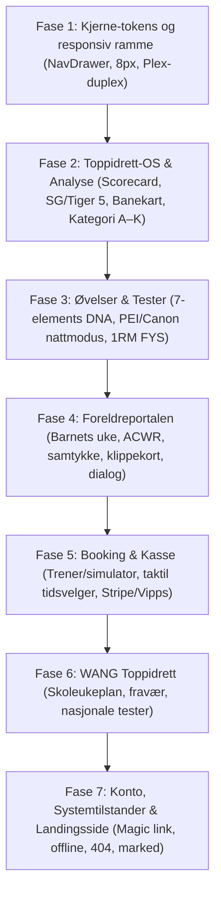

# Plan: Portering fra Claude Design (Precision Athletics) til produksjonskode

**Dato:** 25.09.2026  
**Status:** Godkjent planlegging  
**Kilde / Autoritet:** Claude Design-prosjekt `7d7c2994-cf63-4c5f-9bdc-fdaf67655a70` og [design-autoritet.md](../design-system/design-autoritet.md).  
**Mål:** Etablere 100 % designdekning i produksjonskode for alle 496 ruter i AK Golf HQ uten visuell eller funksjonell gjetting.

---

## 1. Faseinndeling og rekkefølge

---

## 2. Detaljert arbeidsplan per fase

### Fase 1: Kjerne-tokens og responsivt skall
*Mål: Sikre at alle nye skjermer arver identiske fonter, farger, radier og layoutregler.*
- **Oppgaver:**
  1. Kontrollere `src/app/globals.css` mot `tokens.json`:
     - IBM Plex Sans (400, 500, 600) for tekst og knapper.
     - IBM Plex Mono (400, 500, 600) for alle tall, målinger, vinkler og klokkeslett.
     - 8 px radius som standard på alle kort, knapper og inndatafelt.
     - Sand `#E6E3DD`, Grafitt `#141413`, og Signalrust `#9B2415`.
  2. Implementere `NavDrawer.tsx`:
     - Felles minimalistisk slide-out hamburgermeny for mobil (390 px) og iPad (768/1024 px) med 48 px radhøyde.
  3. Håndheve Jernloven: `scrollWidth === clientWidth` på alle visninger.

### Fase 2: Toppidrett-OS & Ytelsesanalyse
*Mål: Implementere de 6 kjernekomponentene for spilleroppfølging og spatial analyse.*
- **Filer som opprettes under `src/components/portal/toppidrett/`:**
  1. `YtelsesbildeScorecard.tsx`:
     - 18-hulls interaktivt hullkart hvor spilleren trykker på hullene der energien falt.
     - Registrering av 5 faktorer: Smerte/helse, Mental, Sosial, Søvn/kosthold, Teknikk.
     - Automatisk generering av treneroppsummering.
  2. `HierarkiskMaalTracker.tsx`:
     - Visuell framgangsindikator fra Årsplan → Periode → Måned → Uke → Dagens økt.
  3. `StrokesGainedDeepDive.tsx` & `Tiger5Card.tsx`:
     - OTT, APP, ARG, PUTT fliser med automatisk rust-fremheving på største lekkasje.
     - Tiger 5 tapsanalyse (feil fra fairway, 3-putter, bogeys på par 5 osv.).
  4. `BanekartSpatialView.tsx`:
     - Interaktiv spatial hullvisning fra tee til green med avstandsbuer på 50, 100, 150 og 200 m.
     - 7 konsentriske puttingringer rundt koppen med suksessrate mot Kategori D-norm.
  5. `KategoriOversikt.tsx`:
     - Kategori A–K basert på bruttoscore-snitt (64 til 100+ slag).
  6. `TrackmanGappingView.tsx`:
     - 2D-spredningskart med 68 % og 95 % ellipser, pluss 14-køllers carry-stige med avstandsgap.

### Fase 3: Øvelser & Ferdighetstester (Workbench)
*Mål: Fullføre øvelses-DNA og heve eksisterende testverktøy til nattmodus.*
- **Oppgaver:**
  1. Videreføre `DrillListEditor.tsx` med de 7 elementene i øvelsens DNA (Område, Hastighet, Type, P1–P10, Cue, Repetisjoner, Tid).
  2. Oppgradere `PeiLiveArtefakt.tsx`, `GateLiveArtefakt.tsx` og `ScorekortKlient.tsx` til `data-theme="night"` med 8 px radius, IBM Plex Mono og grafittknapper.
  3. Bygge testskjerm for fysiske baseløft (1RM markløft, knebøy) koblet til `src/lib/domain/fys/styrkeprogram.ts`.

### Fase 4: Foreldreportalen (`/forelder`)
*Mål: Gi foreldre trygg og oversiktlig tilgang til barnets treningshverdag og økonomi.*
- **Filer som opprettes under `src/app/forelder/`:**
  1. `page.tsx` (`ForelderHjem`):
     - Ukeplan med planlagte økter og hviledager.
     - ACWR-belastningskurve (grønn sone 0,8–1,3, rustvarsel ved >1,5).
     - «Siste fra coach Anders».
  2. `samtykke/page.tsx` (`ForelderSamtykke`):
     - Samtykkeregistrering for spillere under 16 år (video, TrackMan, data).
  3. `okonomi/page.tsx` (`ForelderOkonomi`):
     - Månedlig kontingent (TALENT / FULL), klippekortoversikt og Stripe-kvitteringer.
  4. `dialog/page.tsx` (`ForelderDialog`):
     - Beskyttet treparts dialogtråd mellom trener, forelder og spiller.

### Fase 5: Offentlig Booking & Kasse (`/booking`)
*Mål: Fullverdig timebestilling og betaling for både simulator og coaching.*
- **Filer som opprettes under `src/app/booking/`:**
  1. `page.tsx` (`BookingTjenester`): Valg av privattime med Anders eller simulatorbås 1–4.
  2. `tid/page.tsx` (`BookingTidspunkt`): Taktil kalender- og tidsvelger.
  3. `kasse/page.tsx` (`BookingKasse`): Stripe Elements og Vipps hurtigkasse med avbestillingsvilkår.
  4. `bekreftelse/page.tsx`: Kvittering og `.ics`-nedlasting for Apple/Google Kalender.

### Fase 6: Lag & Skole — WANG Toppidrett (`/team-wang`)
*Mål: Støtte skoletrening og nasjonale fysiske standarder.*
- **Filer under `src/app/team-wang/`:**
  1. `page.tsx` (`WangUkeplan`): Morgentreninger, samlinger og fraværsmelding.
  2. `tester/page.tsx` (`WangFysiskeTester`): De 5 standardtestene sammenlignet med landsgjennomsnittet.

### Fase 7: Konto, Systemtilstander & Landingsside
*Mål: Robusthet, sikker innlogging og profesjonell presentasjon.*
- **Filer som opprettes/oppdateres:**
  1. `src/app/login/page.tsx`: Magisk lenke på e-post med engangskode/SMS tofaktor.
  2. `src/app/profil/page.tsx`: 14-køllers bag-oppsett, rollebytte og GDPR-dataeksport (JSON).
  3. `src/components/ui/OfflineBanner.tsx`: Frakoblet banner for Live-økt med lokal lagring.
  4. `src/app/not-found.tsx`: 404-side i Sand/Grafitt-drakt med snarvei til I dag.
  5. `src/app/page.tsx`: Landingsside for akademiet med Verksted-estetikk (#E8E4DC / #B83217).

---

## 3. Kvalitetskontroll og verifisering

For hver fullførte fase skal følgende kvalitetskontroll bestås:
1. `npm test`: Alle 3 445 enhetstester må forbli 100 % grønne.
2. `npm run verify:static`: Null TypeScript-feil, null token-avvik, gyldig Prisma-skjema.
3. Responsiv kontroll: Ingen horisontal scroll på 390 px, 768 px eller 1280 px.
4. Git-disiplin: Små, atomiske commits på `antigravity-forbedring` med tydelige meldinger.
