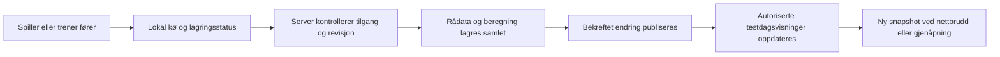

# Gjennomføringsplan: komplett testbatteri fra kilder til main

Dato: 02.10.2026. Bestilling: Anders Kristiansen. Status: gjennomføring startet på `codex/testbatteri-plan-2026-10-02`; kilde-/fasitregister og første resultatvisningsrettelser er under verifisering. Ingen merge eller produksjonsendring utført.

**Bestilt sluttresultat:** Testlogikken skal verifiseres, nødvendige skjermer ferdigstilles og kontrolleres i Claude Design, deretter porteres til fungerende appkode, verifiseres samlet og flettes inn i `main`. Oppgaven er ikke ferdig ved en prototype, en åpen PR eller et grønt enkeltstående testsett. Rekkefølgen, arbeidspakkene og sluttkontrollen står i punkt 8, 11 og 12.

Oppdatert etter Anders' to vedlegg og PEI-presisering samme dato: **lagret PEI 0,032 skal alltid vises som 3,2 %, aldri 0,032 %.** Se [gjennomgang av alle testene og logikken](../design-audit/testbatteri-testlogikk-fra-vedlegg-2026-10-02.md). Vedleggene er det konkrete testgrunnlaget; tidligere IUP 2027-sammenligning erstatter dem ikke automatisk.

## Konklusjon

Testbatteriet er ikke komplett for den bestilte brukerreisen. Grunnlaget for mange beregninger er godt, men testprotokoller, visning, scorekort og felles testdag henger ennå ikke sammen. Dette må behandles som én sammenhengende leveranse.

Siste scorekortfil som NGF lenket til på kontrolldatoen, er kontrollert mot appens referanser: 332 målavstander og 650 referanserader stemmer. 169 relevante automatiske tester bestod. En ekstra syntetisk kontroll bestod for hovedberegningen i alle 27 åpne katalogvarianter. Dette er ikke bevis på korrekt lagring i en virkelig database eller på fungerende livescoring mellom enheter.

| Område | Faktisk funn | Hva som må leveres |
|---|---|---|
| Testutvalg | 38 katalogvarianter; 11 sperret. Vedlagt teknikkpanel C har fem måleforsøk, appen krever ti | Versjonert oversikt over alle protokoller, inkludert fem separat vedtatte fysiske tester |
| Formel og visning | WANG kan vise PEI 0,05 i stedet for 5 %. Felles formatterer gjør 12,5 poeng til 13 | Én beregning og én entydig resultatvisning på alle flater |
| Lagring | Eierskap, revisjonskontroll og atomisk fullføring finnes. Spillerskjermen lagrer utkast manuelt | Automatisk lagring per forsøk, gjenopptakelse og dokumentert kontroll i database |
| Claude Design | PH-15-TN viser 8-ball med 8 slag/maks 32; korrekt protokoll har 24/maks 96 | Korrigerte scorekort for hver resultatfamilie og alle nødvendige tilstander |
| Deling | Samtykkemotor finnes; direkte trenerlesere bruker også gruppemedlemskap uten samme avgrensning | Én konsekvent regel for spiller, skole, TN-gruppe, arrangør og testdag |
| Slagbilde | Ikke knyttet til testforsøk i dagens TN-flyt | Frivillig bilde fra kamera/bibliotek, privat lagring og korrekt tilgang |
| Felles testdag | Én TN-gruppe og én test per testdag; spiller kan ikke føre i trenerens testdag | Ett arrangement med flere skoler/grupper, stasjoner og spillerføring |
| Livescoring | Oppfriskning etter egen handling; ingen dokumentert automatisk oppdatering hos andre | Oppdatering fra bekreftet lagring til autoriserte mottakere, også etter nettbrudd |

Detaljert kilde- og testbevis: [kontrollrapporten](../design-audit/testbatteri-kildekontroll-2026-10-02.md).

## 1. Lås protokollene og bevar historikken

Kildeorden: Anders' vedtak og [produktreglene](../platform/BUSINESS-RULES.md), deretter navngitt og datert testprotokoll. Excel er beregningsgrunnlag, men ufullstendige formler skal ikke kopieres som riktig faglig oppførsel. [Språk og treningsplanlegging](../treningsplanlegging.md) eier begrepene.

Bruk v3-scorekortet og testbeskrivelsen Anders har vedlagt for gjennomgangen av både golfslag- og teknikktestene. IUP 2027 er en separat sammenligningskilde, ikke automatisk erstatning for den tekniske testen i vedlegget. De fem fysiske testene følger vedtatt seksårsløp: benkpress, trapbar, lengdehopp, rotasjonskast og Club Speed. Eldre fystester skal kunne leses historisk, men skal ikke bli ny standard ved et uhell.

Opprett ett protokollregister med stabil identitet, versjon, kildefilens kontrollsum, ark/celler, testfamilie, antall forsøk, rekkefølge, målavstander, utstyr, inndata, enheter, gyldige grenser, beregning, avrunding og retning for bedre resultat. Skill protokoll, testresultat og normnivå. Samme test skal brukes fra PlayerHQ, WANG, TN og trenerflaten.

Alle varianter i kontrollrapporten skal ha status: klar, trenger beregning, trenger scorekort eller avventer en bestemt kildeavklaring. Et navn i katalogen er ikke ferdig funksjon. Hjelpeark som TeeGate og SG-prediksjon skal enten kobles til dokumentert appfunksjon eller stå eksplisitt som gjenstående støtteverktøy.

### Beregningsfamilier

| Familie | Data og hovedregel | Viktig kontroll |
|---|---|---|
| PEI, presisjon i forhold til målavstand | Restavstand / målavstand; gjennomsnitt av forsøkenes forholdstall. Ved carry og sideavvik brukes geometrisk restavstand | Lagre brøk; vis prosent. Ikke erstatt gjennomsnitt av forholdstall med forholdet mellom summer |
| 8-ball | 24 forsøk, riktig blocked/variation-rekkefølge; PEI totalt/per slagtype og kildefast poengoppslag | Maks 96 poeng; PEI vises i prosent og skal ikke forsvinne bak poengsummen |
| Putt 1–3 m | 25 forsøk, riktig kildebasert opptelling og eventuelle referanseverdier | Ikke bland antall putter, treffandel og SG, som betyr slag vunnet/tapt mot referanse |
| 9 hull lengde | Ni forsøk, egen registrering av senket putt og vedtatt poengtabell | Bevar halve poeng. Avklar målavstandens enhet; dokumenter avvik mot Excel-oppslag |
| Nærspill Gate / VISA Express | Manuelle poeng per forsøk, summert | Allerede besluttet. Ikke behold gammel generell sperre om manglende poengskala |
| Wedge Gate | Treff per forsøk, summert av ni | Allerede besluttet. Ikke bruk generisk avstandsformel eller PDF-poeng i stedet |
| Driver Gate / Putt Gate | Godkjent/ikke godkjent etter korrekt oppsett | Tell godkjente forsøk, ikke alle tallceller. Putt Gate inkluderer både gate og lengdesone |
| Putt Speed | Restavstand til mållinjen, retning kort/lang og gjennomsnitt | Semantikken fremgår av testbeskrivelsen; velg og dokumenter enhet |
| Teknisk test i vedlagt v3 | Fem grunnmålinger per panel; ti måleforsøk i A/B og fem i C. PEI, median/gjennomsnitt, impact-data og spredning | Ikke krev 15 slag i alle tre paneler. Korriger median inkludert som ekstra observasjon i én gjennomsnittsformel. IUP 2027 må eventuelt være egen versjon |
| Fysiske tester | Protokollbestemt råresultat, enhet, belastning og gyldige forsøk | Normer separat fra råresultat; ingen oppdiktede terskler eller samlet poengsum |

For hver beregning skal fasitsett inneholde null, tomt felt, gyldig minste/største verdi, desimaler, grensene rett under/på/over terskel, ufullstendig serie og full serie. Excel og app skal sammenlignes på hovedresultat og alle sekundærverdier som faktisk vises. Tomme felt er ikke null. En avbrutt test er ikke et fullført resultat.

For ni-hullsputting styrer vedtaket 28.09 der Excel-oppslaget avviker: senket/0–0,1 fot gir 6, deretter til 1 fot 3, til 2 fot 1, til 4 fot 0,5, over 4 fot 0. Dokumenter avviket som en bevisst regelversjon og lås grensene i tester; ikke be om samme poengbeslutning på nytt.

Historiske resultater beholder protokoll, formelversjon, referanseversjon, råverdier og tidligere beregning. Nye protokoller skal ikke gjøre gamle økter eller utkast uleselige. Eventuell omberegning blir eksplisitt og sporbar, aldri en stille overskriving.

Vedleggskontrollen avdekket også feil kategorier i jentenes banetest, full poengsum i tomme maler og misvisende SG-overskrifter. Disse skal ha egne fasitprøver. Innspill Basic skal vise de to relevante fem-slagsseriene samlet som gjennomføringsoppgave, med tydelige delresultater. PDF-en tillater tilpassede avstander; behold både standardmål og faktisk mål, og beregn fra det faktiske målet. Se den detaljerte testlogikken for kildereferanser og alle avvik.

## 2. Gjør lagring og resultatvisning pålitelig

Bevar eksisterende eierskapskontroll, revisjonskontroll, transaksjon ved fullføring og beskyttelse mot doble resultater. Utvid dem til hvert forsøk og felles testdag.

1. Opprett økten med spiller, protokollversjon og eventuell testdag/stasjon. Hvert forsøk får stabil identitet før et bilde eller en nettverkskø knyttes til det.
2. Lagre gyldige endringer automatisk. Vis «Lagrer», «Lagret» med tidspunkt, «Venter på nett» eller «Kunne ikke lagre». Ikke vis «Lagret» før serveren har bekreftet.
3. Behold en minimal lokal kø for egne, usendte endringer. Gjenopprett etter oppfriskning, lukking og midlertidig nettbrudd. Rydd kø og private data ved utlogging/bytte av bruker.
4. Gi hver skrivehandling en unik identitet. Gjentatt innsending skal ikke gi doble slag, bilder eller resultater. Samtidig redigering av samme forsøk skal gi synlig konflikt; ulike forsøk skal ikke overskrive hverandre.
5. Beregn autoritativt resultat på serveren. Forhåndsvisning på telefonen skal bruke samme regelversjon og være merket foreløpig mens testen pågår.
6. Fullføring krever alle nødvendige forsøk og gyldige felt. Lagre rådata, beregning og koblinger samlet, én gang. Rettelse etter fullføring skal ha aktør, tidspunkt og begrunnelse og oppdatere alle tillatte visninger.
7. Kontroller databasens lagrede innhold ved gjenlesing fra en ny økt/enhet. Test dette med syntetiske kontoer i separat lokalt miljø.

Alle flater skal få resultatet fra én felles funksjon med verdi, enhet, presisjon, bedre-retning, protokoll og fullføringsstatus. PEI 0,032 skal være «3,2 %» og PEI 0,05 «5 %» overalt; 12,5 poeng skal beholde desimalen. Fjern heuristikken som gjetter prosent ut fra verdistørrelsen for nye versjonerte resultater; eldre data får en dokumentert leseregel. Resultatkort, historikk, WANG/TN-profil, testdag, rangering og eksport skal gi samme tall. Prøv også rå PEI 1,6 → 160 % for å avdekke skala som gjettes ut fra størrelsen.

## 3. Ferdigstill scorekortene i Claude Design

Gjeldende system er [AK Golf Precision Athletics](../design-system/design-autoritet.md). Det skal ikke velges på nytt. Bruk samme faglige scorekort med organisasjonens godkjente profil.

Referanser kontrollert 02.10.2026:

- [Precision Athletics](https://claude.ai/design/p/7d7c2994-cf63-4c5f-9bdc-fdaf67655a70): PH-14, PH-15, PH-15-TN og AG-15.
- [WANG](https://claude.ai/design/p/6cfa623c-b2c7-494f-b1bd-9c254b02f335): testflate og WANG-08 Testdag.
- [Team Norway](https://claude.ai/design/p/bc3e41fc-0386-4624-9b14-27355b64e2f7): fellestesting og resultatføring.

WANG-testdagens valg mellom øvelse og spiller, talltastatur og tydelig lagringsstatus er et nyttig utgangspunkt. Prototypens nettfrakoblet-modus er en tegnet tilstand; den beviser ikke at appen lagrer uten nett.

### Skjermbestilling

| Skjerm | Innhold og handling |
|---|---|
| Testoversikt | Golfslag, teknikk og fys; sist gjennomført, neste planlagte test, variant, status og eget kontra kontrollert resultat |
| Før start | Kort oppsett med utstyr, målavstander, enheter, forsøk og oppvarming; hvem som fører og hvilke grupper resultatet deles med |
| Spillerscorekort, 390 px | Ett tydelig aktuelt forsøk, stort relevant inndatafelt, neste mål, fremdrift, redigerbar forsøksoversikt, frivillig kamera og synlig lagringsstatus |
| Scorekort på desktop | Samme handlinger pluss nyttig oversikt over alle forsøk og måleverdier; ikke bare en smal mobilkolonne midt på skjermen |
| Oppsummering | Riktig hovedresultat, delverdier, alle forsøk og bilder, protokoll/kildeversjon, egenført/kontrollert, fullfør/fortsett og delingsstatus |
| Trenerens testdag | Stasjons- og spillervisning, skole-/gruppefilter, hvem som er i gang, manglende resultater og konflikter |
| Spillerens testdag | Mine stasjoner, rekkefølge, start/fortsett, egen fremdrift og tillatte liveresultater |
| Liveoversikt | Bekreftede lagringer, tidspunkt, antall forsøk og foreløpig/endelig; filter per test og sammenlignbar klasse |
| Historikk og profildeling | Samme tall og bilderettigheter i spillerprofil, WANG og TN; tydelig testversjon og hvem resultatet er delt med |

Lag scorekort for avstand/carry, restavstand og poeng, treff/ikke treff, putter, tekniske målefelt og fysisk måling. Ikke press alle tester inn i ett generisk ti-slagskort.

Rett særlig: 8-ball til 24 slag og maks 96; synlig variant og mål per slag; desimalvisning som forklarer tildelte poeng; målavstander i ni-hullsputting; korrekt prosent/enhet i TN-fellestesting; frivillig bildeknapp og synlig tilgang; mulighet til å redigere et tidligere forsøk uten å angre hele rekken.

Vis og prøv tom, lastende, feil, ufullstendig, lagret, uten nett, konflikt, fullført, rettet, avbrutt og ikke tilgang. Bildekort må også ha opplasting, avbrutt opplasting og ny prøve. Store trykkflater, synlige feltetiketter, norsk desimaltegn, riktig mobiltastatur, god kontrast og status som ikke bare formidles med farge.

Leveransen skal inneholde en datert designversjon og skjerm-/tilstandsmatrise. Anders skal se app og valgt referanse ved siden av hverandre på 390 px og desktop, i avtalte lyse/mørke temaer. Teknisk grønt bygg erstatter ikke denne kontrollen. Den første kontrollen vurderte prototypene. Gjennomføringen er nå bestilt i alle tre eksisterende Claude Design-prosjekter; produksjon og visuell kontroll er ikke ferdige. Se [gjennomføringsloggen](../design-audit/testbatteri-gjennomforing-2026-10-02.md).

## 4. Del resultatet riktig mellom spiller, WANG og Team Norway

Resultatet tilhører spilleren og lagres én gang. WANG og TN skal lese samme resultat gjennom hver sin gyldige tilgang. En spiller i to grupper skal ikke få to kopier eller to ulike poengsummer.

| Rolle | Anbefalt standardtilgang |
|---|---|
| Spiller | Egne økter, resultater og bilder; føring på egne tildelte stasjoner |
| Skoletrener | Egne tilknyttede spillere og godkjent datadelingsomfang |
| TN-trener | Tilknyttede spillere med dokumentert tilgang, samt WANG-testresultater omfattet av opptaksavtalens delingsordning |
| Testdagsarrangør | Deltakelse, tildelte testresultater og nødvendig fremdrift i arrangementet; ikke hele IUP/helseprofilen |
| Stasjonstrener | Føring/kontroll for tildelte deltakere og tester |
| Andre deltakere | Egne detaljer; felles resultatliste bare dersom arrangementets synlighetsregel tillater dette |
| Uvedkommende/offentlig bruker | Ingen tilgang til private resultater, bilder eller livestrøm |

Den vedtatte WANG→TN-flyten etter opptaksavtale skal støttes med registrert grunnlag og datakategorier. Den separate vedtatte profildelingen omfatter også helse og meldinger når spilleren har gitt denne tilgangen; ikke reduser dette til bare tester. Oppdater tekst og tilgangsmodell slik at omfanget fremgår tydelig, men ikke utvid et gammelt smalere samtykke automatisk. Eksisterende samtykkemotor og foresattflyt under 16 år må brukes konsekvent der samtykke er tilgangsgrunnlaget. Gruppemedlemskap og datadeling er to separate kontroller.

Bevar vedtatt delingsreise fra Meg til treneradresse på @wang.no eller @golfforbundet.no, lenkens syv dagers gyldighet og umiddelbar tilbakekalling av trenerinnsyn. En invitasjon til testdag er ikke en slik full profildeling.

Tilgang må gjelde likt på siden, serverhandlingen, eksporten, bildeutleveringen og liveabonnementet. Test avsluttet medlemskap, tilbakekalt deling, bytte av skole, dobbel gruppetilhørighet og flere trenere. En skolebetegnelse som fritekst er ikke tilstrekkelig tilgangsgrense.

Første leveranse bør gi trenere en felles autorisert liveoversikt og spillere egen fremdrift. Rangering synlig for alle deltakere krever uttrykkelig definert publikum; dette er en av de få åpne produktbeslutningene nedenfor.

## 5. Frivillig bilde av et slag

Gi hvert forsøk «Legg til bilde» fra kamera eller bildebibliotek. Vis miniatyr, full visning og erstatt/fjern. Et bilde skal aldri være nødvendig for å fullføre et ellers gyldig forsøk. Tillat eksempelvis bilde av ballplassering, oppsett eller måleresultat; ikke lov automatisk tolkning som ikke finnes.

Bruk eksisterende privat fillagring etter kontroll av tilgangsmodellen. Lagre filreferanse og metadata mot stabil forsøks-ID; dagens TN-flyt skriver ikke automatisk separate `TestShot`-rader, så løsningen kan ikke forutsette at disse finnes. Kontroller eierskap ved opplasting, kobling, lesing og sletting. Utlever kortvarig tilgang først etter autorisasjon, og fjern tilgang ved tilbakekalling så langt utleveringsmodellen tillater.

Valider faktisk filtype, størrelse og dimensjoner. Håndter mobilbilder/HEIC og komprimer til egnet størrelse, fjern unødvendige posisjonsmetadata, og bruk gjenopptakbar kø med synlig feil. Ingen offentlige filadresser eller bilder i logger. Avklar lagringstid og rydding av avbrutte opplastinger; sletting av et bilde må ikke slette tallresultatet. Bilder skal ikke sendes til AI som del av denne funksjonen.

Delingsomfang for bilder er eksplisitt, separat fra ren tallvisning. Liveoversikten trenger normalt bare et bildeikon; full visning krever egen tilgangskontroll.

## 6. Ett arrangement på tvers av WANG-skoler og TN

Utvid testdag fra én gruppe/én test til ett arrangement med flere inviterte grupper og flere stasjoner. Bevar eksisterende testdager gjennom bakoverkompatibel kobling. Eksisterende testdag kan representeres som arrangement med én gruppe og én stasjon.

Nødvendige begreper, ikke endelige tabellnavn:

- Arrangement: navn, sted, dato/tidssone, arrangører, planlagt/åpen/avsluttet/avlyst og synlighetsregel.
- Deltakende organisasjoner/grupper: flere WANG-skoler og TN-grupper med avgrensede rettigheter.
- Stasjon: navngitt og versjonert protokoll, ansvarlige trenere, utstyr, kapasitet og eventuelt tidsrom.
- Deltaker: spiller, relevant skole/gruppe, innsjekking og én identitet selv ved dobbel tilhørighet.
- Tildeling: deltaker + stasjon + gjennomføring, føringsrolle og kontrollstatus.
- Resultat: kobling til spillerens ordinære testresultat, aldri en egen konkurransekopi.

Flyt: planlegg → velg grupper/spillere og tester → fordel stasjoner → kontroller deltaker-/tilgangsliste → åpne → spiller eller trener fører → trener kontrollerer ved behov → lukk og oppsummer. Fremtidig testdag skal være planlagt frem til åpning. Håndter fravær, etterregistrering, bytte av stasjon, avbrutt test og rettelse etter avslutning.

Spilleren må kunne føre på sin tildeling uten dagens generelle sperre mot treneropprettet testdag. Trener kan føre på vegne av spiller når rollen gir tilgang. Vis alltid hvem som førte og om resultatet er kontrollert. Samtidig registrering på to enheter må håndteres eksplisitt.

Sammenligning skjer innen samme protokollversjon, testvariant og relevant klasse. Ikke summer prosent, kg, meter og poeng til én vilkårlig totalscore. Manglende tester skal ikke bli null. Skole-/lagresultater og eventuell totalrangering krever egen definert modell, inkludert hvordan dobbel tilhørighet teller.

Koble planlagt testdag til agenda og spillerens testplan. Støtt vedtatt fysisk testing hver sjette uke i grunnperioden. Resultater skal kunne følges opp i mål og treningsplan uten at samme test automatisk telles som to treningsøkter. WANG-/TN-trenerflatene viser felles data; spillerføringen skjer i PlayerHQ, ikke gjennom en ny spillerrolle i trenerappen.

## 7. Livescoring fra faktisk lagrede forsøk

Velg transport etter kontroll av eksisterende prosjektstøtte; planbestillingen krever ikke ny leverandør. Sanntidsmeldinger er varsler om lagrede data, ikke en alternativ resultatdatabase. Publiser først etter bekreftet databaselagring, og sørg for at lagret endring ikke forsvinner fra varslingen ved en mellomliggende feil. Bruk versjons-/sekvensnummer, sikker gjenlesing og opphenting av manglende endringer ved tilkobling.

Livekort viser spiller, skole/gruppe, test, utførte/planlagte forsøk, foreløpig resultat, lagrings-/kontrollstatus og sist oppdatert. Ufullførte tester merkes tydelig og blandes ikke med endelig rangering. Korrigerte resultater oppdateres hos alle tillatte mottakere. Rettigheter kontrolleres også på nytt ved gjenoppkobling og når deling trekkes tilbake.

Foreslåtte akseptmål: 95 % av bekreftede endringer synlige innen 2 sekunder ved normal forbindelse; reserveoppdatering innen 10 sekunder når sanntidskanalen feiler. Verifiser med minst 100 samtidige syntetiske spillere og 10 trenerflater. Dette er testmål, ikke målte kapasitetsløfter. Mål også gjenoppretting etter nettbrudd, manglende meldinger og dobbeltlevering.

## 8. Gjennomføringsrekkefølge og leveranser

### Fase A — verifiser reglene før design og portering

**TB-01: Én kontrollert testbeskrivelse per protokoll.** Bruk de to vedleggene, tidligere bindende vedtak og avvikslisten F01–F12 i [testlogikkrapporten](../design-audit/testbatteri-testlogikk-fra-vedlegg-2026-10-02.md). Registrer alle 38 katalogvarianter, de fem vedtatte fysiske testene og støttearkenes avgrensning. Hver test skal ha inngangsfelt, enheter, rekkefølge, antall forsøk, beregning, delresultater, avrunding, bedre-retning, kilde og versjon. Koble varianter til de 16 testbeskrivelsene, uten å telle variant og testfamilie som det samme.

**TB-02: Fasitverdier og åpne fagpunkter.** Lag syntetiske eksempelsett med forventet resultat, uavhengig av dagens appberegning. Dekningen skal omfatte alle beregningsfamilier, poenggrenser, delsummer, tomme felt, senket putt, nullmåling, ulike mål, median/gjennomsnitt og prosent. Lås PEI 0,032 → 3,2 %, 8-ball 24 slag, jentenes 20/6/4-fordeling og teknikkpanelets fem måleforsøk. Avklar bare de konkrete gjenværende punktene i avsnitt 10, før de berørte delene ferdigstilles.

**Ferdigkrav A:** Alle tester har en lesbar regelbeskrivelse og prøvbare forventede verdier. Kildeavvik er løst gjennom dokumentert vedtak eller står som ett presist ubesvart fagpunkt. Ingen generell «venter på regler»-sperre beholdes der reglene allerede er kjent. Matematisk kontroll er dokumentert separat fra lagring og nettlesertest, som kommer etter implementering.

### Fase B — ferdigstill og kontroller Claude Design

**TB-03: Samordnet designbestilling.** Bruk eksisterende prosjekter Precision Athletics, WANG UI og Team Norway fra punkt 3. Send den samme kontrollerte testlogikken, men avgrens hver bestilling til prosjektets skjermer. PlayerHQ er spillerens inngang; WANG/TN er trenerflater. Bevar nyere designarbeid i prosjektene, og samordne med pågående Workbench- og WANG/TN-leveranser før samme filer endres.

Designpakken skal inneholde regelbeskrivelsene, syntetiske data, skjermregisteret nedenfor, alle relevante tilstander og en klikkbar sammenhengende reise. Bestill konkret retting av eksisterende skjermer og bare de nye skjermene/overleggene som mangler. Claude Design skal ikke lage egne alternative formler eller finne på normer.

**TB-04: Prøv prototypene og rett avvik.** Codex kontrollerer hver testfamilie, rekkefølge, enhet og viste verdier mot fasiten. Prøv start, føring, retting, bilde, deling, testdag og liveoversikt med syntetiske data. Kontroller 390 px og desktop 1440 px, samt 1280 px der eksisterende referanse bruker dette. Lys-/nattema og andre temavarianter følger den aktuelle organisasjonens godkjente system. Dokumenter avvik og kontroller på nytt etter retting.

**Ferdigkrav B:** Alle skjermfamilier er dekket av en konkret, datert designversjon, med tilstander og handlinger. Anders får se den sammenhengende prototypen og den konkrete versjonen som skal bygges; et allerede valgt skjermuttrykk skal ikke åpnes på nytt. Ingen uløste formel-, enhets-, forsøksantalls- eller tilgangsfeil i versjonen som går videre. Prototype som simulerer lagring/live er merket som dette. Eksport/overlevering inneholder faktiske filer, ressurser, designverdier, referansebilder og kobling til appens ruter.

### Skjermregister for design og portering

S01–S17 er arbeids-ID-er i denne planen, ikke påstander om nye eksisterende skjerm-ID-er i Claude Design. Koble dem til faktiske filer/skjerm-ID-er i TB-03. En familie kan bestå av flere varianter eller et overlegg på samme side.

| ID | Familie | Designflate | Bevis før ferdig |
|---|---|---|---|
| S01 | Testoversikt og tildeling | PH-14, AG-15 og organisasjonenes oversikter | Riktig variant, status, sist/neste test og tildeling |
| S02 | Instruksjon og oppsett før start | PlayerHQ og trenerføring | Utstyr, standard/faktisk mål, enhet, forsøk, oppsett og deling |
| S03 | PEI: carry, bane og egne lengder | PlayerHQ, gjenbrukt i trenerføring | Restavstand, sidefortegn, PEI-prosent, delresultater og faktisk mål |
| S04 | 8-ball variation/blocked | PH-15-TN og trenerføring | 24 forsøk, riktig rekkefølge, slagtype, PEI og poeng |
| S05 | Putt 1–3 m og ni-hullsputting | PlayerHQ og trenerføring | To forskjellige registreringsmønstre; slag versus fot/senket/poeng |
| S06 | Driver/Putt/Wedge Gate, Nærspill og VISA | PlayerHQ og trenerføring | Treffvilkår, lengdebom/sidebom og riktig treff- eller poengsum |
| S07 | Putt Speed | PlayerHQ og trenerføring | 1×5/3×3, riktig avstandsrekkefølge og absolutt restavstand |
| S08 | Teknikkpanelene | PlayerHQ og trenerføring | Grunnmåling, riktig antall, målefelt, median/snitt og spredning |
| S09 | Fysiske tester | PlayerHQ, WANG og TN | Fem protokoller, belastning/enhet, forsøk og kildebaserte normer |
| S10 | Oppsummering, historikk og resultater i profil | PlayerHQ, WANG/TN og Spiller 360 | Ett lagret resultat med samme tall og versjon på alle tillatte flater |
| S11 | Bilde per forsøk | Overlegg på scorekort/resultat | Kamera/bibliotek, opplasting, feil, erstatt/fjern og bildeinnsyn |
| S12 | Deling og tilgang | Spillerens delingsreise og trenerens lesetilstand | Hvem ser tall/bilder/profil, foresattflyt, tilbakekalling og avvisning |
| S13 | Opprett og planlegg testdag | Trener/arrangør | Flere skoler/grupper, protokoller, stasjoner, roller og deltakere |
| S14 | Trenerens kø, stasjon og kontroll | WANG/TN og relevant AK-trenerflate | Før på vegne av spiller, mangler, konflikt, retting og kontrollstatus |
| S15 | Spillerens testdag | PlayerHQ | Mine stasjoner, start/fortsett, føring og fremdrift |
| S16 | Felles liveoversikt | Autoriserte trenerflater og valgt deltakersyn | Foreløpig/endelig, antall forsøk, oppdatert tidspunkt og nettilstand |
| S17 | Avslutt, sammenlign og følg opp | Trener og spillerens egne resultater | Fravær/avbrutt, historikk, sammenlignbare grupper og videre trening |

Hver registerrad får status for kilde, design, kode, funksjonstest og visuell vurdering hver for seg. «Gjenbrukt» krever lenke til konkret komponent og prøvde varianter. Ingen rad kan forsvinne ved portering fordi den ikke passer i den gamle komponenten.

### Fase C — portering til fungerende kode

Portering starter fra den kontrollerte designversjonen og testbeskrivelsene. Kode på egen `codex/`-gren, med ny kontroll av gjeldende main og berørte åpne PR-er. Les sikkerhets-/personvernreglene og relevant installert Next.js-dokumentasjon før implementeringen. Nye persondata-/filendringer får egne tilgangsprøver.

| Pakke | Implementering og hovedområde | Avhengighet | Ferdigkrav |
|---|---|---|---|
| TB-05 | Felles protokollregister, beregning, validering, formattering og historisk versjonslesing i `src/lib/portal-tester/` og `src/lib/domain/pei/` | TB-01–04 | Alle fasitsett består; ingen prosentgjetting; alle manglende beregningsgrener finnes; riktig testområde og sammenligningsretning |
| TB-06 | Økter/forsøk/resultater, felles tilgang og private bilder; datamodell og serverhandlinger | TB-05 | Automatisk lagring, stabil forsøks-ID, gjenopptakelse, konfliktkontroll, én fullføring, reell databasetest og avvist uvedkommende |
| TB-07 | Portér spillerreisen S01–S12 og S15 til PlayerHQ; organiser gjenbrukbare scorekortfamilier | TB-05–06 | Alle protokoller kan føres/fullføres; bilder og deling virker; mobil/desktop følger valgt design |
| TB-08 | Portér trenerresultater og arrangement S10/S13/S14/S17 til AK, WANG og TN; flere grupper/stasjoner | TB-06–07 | Spilleren fører egen tildeling; trener fører/kontrollerer; én deltaker og ett resultat ved dobbel tilhørighet |
| TB-09 | Bekreftet liveoppdatering, S16, gjenoppkobling og reservemetode | TB-06 og TB-08 | Ingen manuell oppfriskning nødvendig; riktige rettigheter; ingen tap/duplikater; kapasitetsmål målt |
| TB-10 | Samlet pilot, visuell sammenligning, full prosjektkontroll, PR-er og merge | TB-05–09 | Alle akseptprøver bestått og den samlede leveransen kontrollert etter fletting til main |

Datamodell, tilgang og lagring i TB-06 er grunnmur for skjermene; en portert knapp er ikke ferdig før handlingen lagrer og gjenleser korrekt. Bruk én beregning og ett resultat på tvers av organisasjoner. UI-komponenter kan ha forskjellige organisasjonsprofiler, men får ikke egne kopierte poengregler.

Ikke la tilleggsarbeid på nye SG-modeller eller DataGolf blokkere kildefaste PEI-/poengtester. Behold navngitte Excel-referanser der de hører til; eventuell ny norm-/SG-modell er et separat versjonert arbeid. Testresultat skal kunne lagres også når et normnivå mangler.

### Ansvar og samordning

Claude Design eier utforming og designleveransen. Codex eier kildekontroll, konkrete designbestillinger, prototypekontroll, appkode, testing, PR-er, merge og kontroll av den publiserte versjonen. Anders avklarer bare reelle fag-/produktvalg og vurderer den konkrete skjermversjonen. Dette beskriver arbeidsdelingen; planen oppretter ikke nye agentøkter eller sender bestillinger i seg selv.

Eksisterende PR-er skal gjenbrukes etter kontroll mot denne leveransen. Fersk GitHub-kontroll i denne planoppdateringen viser fortsatt følgende åpne arbeid:

| Eksisterende arbeid | Hvordan brukes det i planen? |
|---|---|
| [#1043 PH-14](https://github.com/akgolfsoftware/Golf_Headquarters/pull/1043) | Utgangspunkt for S01; sjekk at alle protokollvarianter og statuser faktisk støttes |
| [#1054 PH-15](https://github.com/akgolfsoftware/Golf_Headquarters/pull/1054) | Utgangspunkt for føring; koble valgt nytt design til verifiserte regler fremfor å videreføre gammel generisk scoreføring |
| [#1023 AG-15](https://github.com/akgolfsoftware/Golf_Headquarters/pull/1023) | Tildeling og normvisning; behold manglende norm som manglende, og bruk felles testidentitet |
| [#1004 WANG/TN](https://github.com/akgolfsoftware/Golf_Headquarters/pull/1004) | Eksisterende organisasjonsskjermer; utvid riktig deling, testdag og resultatvisning |
| [#1060 felles kjerne](https://github.com/akgolfsoftware/Golf_Headquarters/pull/1060) | Bygger på #1004-grenen, ikke main. Bevar avhengigheten eller flytt grunnlaget kontrollert etter at #1004 er flettet |

Les ferske endringer før gjenbruk; eldre grønne kjøringer er ikke bevis på nytt innhold. Opprett egne logiske PR-er for felles motor/data og felles testdag/live der eksisterende PR-er ikke dekker oppgaven. #1056 gjelder live golf-runde og løser ikke testdagens livescoring. Ikke flett, lukk eller erstatt uvedkommende PR-er som del av denne bestillingen.

## 9. Akseptprøver før «komplett»

| ID | Prøve | Forventet bevis |
|---|---|---|
| K01 | Alle katalogvarianter og separat vedtatte fysprotokoller gjennomføres | Råverdier, enheter og alle viste delresultater mot navngitt fasit; riktig antall i hvert teknikkpanel |
| K02 | 8-ball variation og blocked, alle 24 slag | Riktig rekkefølge, poeng og maks; ingen usynlig åtte-slagsforkorting |
| K03 | Grenser, halvpoeng, PEI og norsk desimal | Samme resultat i alle profiler, scorekort, live og eksport |
| K04 | Tomt felt, negativ/umulig verdi og ufullstendig serie | Tydelig validering; ikke null/resultat ved manglende data |
| L01 | Lagre, lukke, åpne på nytt og åpne annen enhet | Gjenlest databaseinnhold identisk med bekreftet føring |
| L02 | Nettbrudd før/etter svar, dobbeltklikk, to faner og samtidig trener | Ingen tap, overskriving eller doble resultater; synlig konflikt |
| L03 | Endre gammelt slag og fullføre to ganger | Ett resultat, riktig ny beregning, sporbar endring |
| D01 | Spiller i WANG A og TN, samt spiller bare i WANG B | Riktig synlighet i hver gruppe; ingen krysslekkasje |
| D02 | Under 16, manglende grunnlag, avsluttet medlemskap og tilbakekalling | Avvisning gjelder profil, eksport, bilde og aktiv livestrøm |
| B01 | Kamera/bibliotek, stort/ugyldig bilde, avbrutt opplasting og sletting | Riktig forsøkstilknytning, privat tilgang, tallresultat bevart |
| T01 | To WANG-skoler og TN, flere stasjoner, spillerfører og trenerfører | Én deltaker ved dobbel tilhørighet; komplette tildelinger og resultater |
| T02 | Fravær, delvis test, kontroll, rettelse og avslutning | Riktig status og rangering; ingen nullresultater for fravær |
| R01 | Minst to virkelige klienter, deretter syntetisk last | Synlige endringer uten oppfriskning; målt forsinkelse |
| R02 | Sanntidskanal borte, reconnect, tapte/dupliserte meldinger | Full gjenoppretting fra lagrede data; ingen dobbeltelling |
| H01 | Gamle resultater, gammel testdag og gammelt utkast | Fortsatt lesbare med riktig versjon og kilde |
| V01 | Mobil/desktop, lyst/mørkt, feil/tomt/laster og tastatur | Sammenlignet mot valgt Claude-versjon; Anders har sett resultatet |

Ved gjennomføring: prosjektets `npm run verify`, `npm test` og relevante nettlesertester. Bruk separat lokal database med syntetiske brukere og bevar tilgangsvaktene. Dokumenter resultat per prøve, kodeversjon, skjermversjon og miljø. Produksjonsstatus skal dokumenteres separat fra lokal test.

Utrulling gjøres trinnvis med additive skjemaendringer, beskyttelse av nye tabeller og mulighet til å slå av ny testdagsføring uten å miste innsendte data. Bevar gamle lesere under overgangen, kontroller historiske testdager og aktiver først for en avgrenset pilot. Overvåk feil ved lagring, etterslep i liveoppdatering og ufullførte opplastinger uten persondata i driftslogger. Ingen destruktiv omskriving av eksisterende resultater inngår i planen.

## 10. Avklaringer som faktisk gjenstår

Disse skal avklares før det avhengige detaljarbeidet; resten av planen kan gjennomføres uten å vente:

1. **9 hull lengde:** enhet for målavstand. Poenggrenser følger det eksisterende vedtaket; forskjellen fra Excel dokumenteres og testes.
2. **Fysiske protokoller:** korrekt ballvekt per klasse/variant og enhet for rotasjonskast/lengdehopp; dagens WANG- og TN-design viser ulike vekter og enheter. Fastsett også belastning/repetisjoner og utstyrskrav for styrke-/hastighetstestene.
3. **Teknisk test:** bruk vedlagt v3 som grunnlag nå. Få faglig avklaring av Impact Location og måleenheter som ikke er spesifisert. IUP 2027 skal bare inn som en tydelig annen protokollversjon hvis denne også skal tilbys; ingen stille erstatning av vedlegget.
4. **Felles resultatliste:** skal spillere se andre deltakeres navn/resultater, eller bare egne mens trenerne ser felles liveoversikt? Eventuell skolekonkurranse trenger egen rangeringsregel.

Ingen av disse avklaringene kreves for å rette kjent prosent-/desimalfeil, dokumentere lagring eller korrigere 8-ball til riktig antall slag.

## 11. Kontroll, PR-er og merge til main

En PR er et avgrenset endringsforslag i GitHub. Main er hovedgrenen som den ferdige leveransen skal inn i. Anders har nå uttrykkelig bestilt portering og merge etter verifisert logikk og design; det skal ikke bes om ny generell publiseringsgodkjenning for disse trinnene. Dette erstatter ikke faglige avklaringer, visuell kontroll eller sikkerhetskrav.

### Før første PR er klar for fletting

1. Kontroller endringene mot fersk main, riktig prosjekt og avtalt omfang. Bevar andres arbeid. Registrer hvilke eksisterende PR-er og designversjoner leveransen bygger på.
2. Kontroller sikkerhet og personvern etter prosjektets skills: eierskap til føring/resultat, gruppeskille, delingsgrunnlag, foresattflyt, filtilgang og liveabonnement. Besvar kontrollspørsmålene med prøvd oppførsel og kodebevis. Dokumenter RLS, altså databasens tilgangsregler, for nye tabeller i `public`.
3. Kjør `npm run verify` før commit. Kommandoen inkluderer prosjektets automatiske tester og bygg; følg faktisk `package.json`. Kjør relevante nettleserreiser og den separate visuelle sammenligningen i tillegg. Ikke omgå kontroller med `--no-verify` eller skjul feil ved å svekke testene.
4. Bruk syntetiske spillere og minst to WANG-skoler + TN i separat lokal database. Kontroller lagrede rådata, beregnede resultater, forsøks-/bildeforbindelser og historikk direkte, ikke bare synlig suksessmelding.
5. Vis fungerende app ved siden av valgt Claude Design-versjon på 390 px og desktop, med samme syntetiske data og tema. Registrer skjermfamilie, tilstand, avvik og hva Anders faktisk har sett. Rett avvik før en skjerm kalles ferdig.
6. Opprett eller oppdater de relevante PR-ene med problem, endret oppførsel, protokoll-/designversjon, tester, databasetrinn og gjenstående avvik. Knytt opprettede/aktivt bearbeidede PR-er til Codex-oppgaven.
7. Kontroller den siste GitHub-kjøringen, altså CI, på nøyaktig versjon som skal flettes. Se gjennom endringene for feil og datatap. Både lokal kontroll og CI må være grønne; det ene erstatter ikke det andre.

### Samlet pilot før den nye brukerreisen aktiveres

Pilotoppsettet skal inneholde to skoler, én TN-gruppe, skoletrenere, TN-trener, arrangør, spiller i én gruppe, spiller i begge, spiller uten deling og syntetisk mindreårig med/uten foresattgodkjenning. Det krever ingen ekte invitasjoner, e-poster, betalinger eller spillerdata.

Gjennomfør denne sammenhengende prøven:

1. Arrangør oppretter fremtidig testdag med flere stasjoner og deltakende grupper. Kontroller status planlagt og at deltaker med dobbel tilhørighet bare finnes én gang.
2. Åpne testdagen. To spillere fører fra hver sin enhet samtidig som en trener følger liveoversikten og en annen fører på vegne av en spiller.
3. Før en PEI-test, en poeng-/puttetest, en gate-/speedtest, teknikk og fys; bruk de øvrige akseptprøvene til å dekke alle varianter. Legg bilde til ett bestemt forsøk og rett et tidligere resultat.
4. Bryt nett på én klient, fortsett føring, last siden på nytt og koble til igjen. Prøv gjentatt innsending og samtidig redigering. Verifiser ingen tap, duplikat eller stille overskriving.
5. Fullfør og kontroller. Sammenlign resultatet i spillerhistorikk, WANG, TN, trenerprofil og liveoversikt. PEI 3,2 % skal være samme verdi overalt. Delvis/avbrutt er ikke nullscore eller fullført.
6. Trekk tilbake relevant tilgang mens trenerflaten er åpen. Prøv direkte bilde-/resultatlenke, eksport og gjenoppkobling til live. Uautorisert innsyn skal avvises.
7. Avslutt arrangementet, gjenåpne resultatene og kontroller varig lagring. Prøv en dokumentert rettelse og en gammel økt med gammel protokollversjon.
8. Mål liveforsinkelse og test minst 100 syntetiske spillerklienter og 10 trenerflater mot målene i punkt 7. Dokumenter både normal drift og reservemetode.

Alle bestilte funksjoner skal ha bestått bevis. Ingen feil i score, lagring, tilgang, deltakerføring eller testdag kan stå igjen når leveransen kalles komplett. Eventuell kosmetisk rest må beskrives konkret og kan ikke erstatte manglende skjermkontroll.

### Fletterekkefølge og publisert versjon

Flett først nødvendige, bakoverkompatible deler av felles motor og datalag, så spillerreisen, organisasjonsflater/testdag og live. Følg faktiske PR-avhengigheter; #1060 kan ikke behandles som en uavhengig main-PR mens den bygger på #1004. Små, selvstendige rettelser kan flettes når de er verifisert. En ufullstendig ny testdagsreise holdes utilgjengelig til den samlede piloten er bestått.

Etter hver nødvendig ombasering eller konfliktløsning kontrolleres berørte reiser på nytt. Når alle delene er samlet, kjøres full sluttkontroll mot det samlede kodetreet, ikke bare hver gren isolert. Flett gjennom PR-er; ingen direkte push til main.

Skjemaendringer utføres additivt etter prosjektets godkjente fremgangsmåte og miljøkontroll. Ikke bruk `migrate dev`, `db push` eller `migrate deploy` mot den hostede databasen. Bevar gamle data og tilgangsvakter, og dokumenter en tilbakeføringsmåte som deaktiverer den nye funksjonen uten å slette resultater.

Etter merge skal hovedgrenens automatiske kontroller og den tilhørende utrullingen følges til faktisk resultat. Kontroller at publisert versjon bygger på riktig commit, at berørte sider åpner og at eksisterende data fortsatt kan leses med riktig tilgang. Bruk godkjente testkontoer der slike finnes; ikke opprett ekte spillerdata for å få en produksjonsprøve grønn. Hvis bare lokal fullreise er prøvd, skal dette fremgå tydelig.

**Sluttleveransen skal vise:** sammenslåtte PR-er, commit på main, valgt designversjon per familie, gjennomførte akseptprøver, dokumentert database-/tilgangskontroll, lokal test, CI, visuell vurdering og faktisk publiseringsstatus. En deploy som feiler eller fortsatt pågår skal ikke omtales som ferdig.

## 12. Arbeidsstatus og første konkrete steg

| Arbeid | Status ved denne planoppdateringen | Neste bevis |
|---|---|---|
| Kildekontroll og feilfunn | Gjennomført og dokumentert | Gjøre funnene til komplett protokollregister og fasitsett i TB-01–02 |
| PEI-regel | Fastlagt av Anders, målrettet kontrollert | Samme regel i alle produksjonslesere etter TB-05 |
| Claude Design | Eksisterende skjermer inspisert; vesentlige avvik funnet | TB-03–04: korrigert og kontrollert leveranse med alle S01–S17 |
| Kode og data | Dagens kode undersøkt; 169 tidligere tester grønne, kjente hull gjenstår | TB-05–09 og reelle database-/nettleserprøver |
| Merge til main | Bestilt etter verifisert logikk, design og kode; ikke utført for denne leveransen | TB-10 og alle kontrollpunkter i avsnitt 11 |

**Første arbeidsøkt i gjennomføringen:** ferdigstill TB-01–02 fra de to rapportene, samle gjenværende fagavklaringer i én konkret liste og klargjør de tre samordnede Claude Design-bestillingene. Bevar PEI-/poengvedtakene som allerede er avklart. Neste kontrollpunkt er en komplett og klikkbar designleveranse med verifiserte eksempelverdier; deretter begynner porteringen.

Rapporter fremdrift med pakke-ID, hva som faktisk er ferdig, bevis og ett neste steg. Oppdater denne planen og kildenes avviksstatus fremfor å opprette konkurrerende planer. Kalendertid fastsettes når åpne fagpunkter og første komplette designleveranse er avklart; antall skjermer alene er ikke et troverdig tidsestimat.
