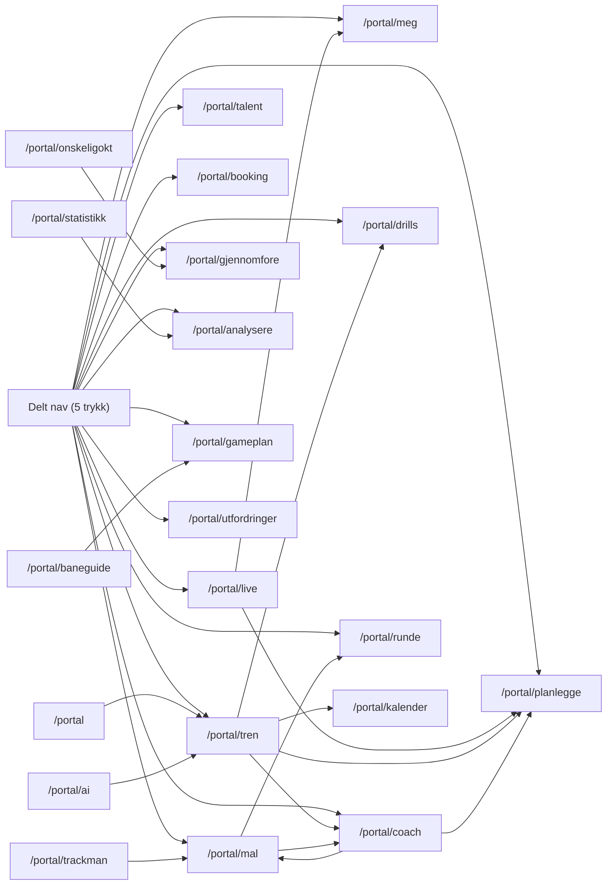
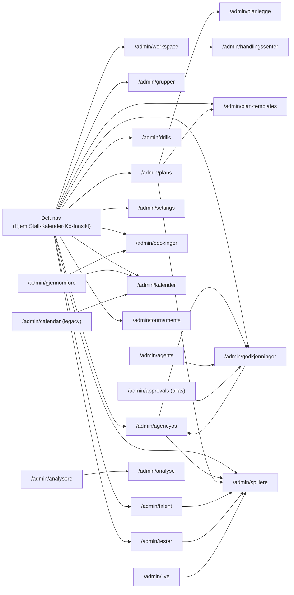
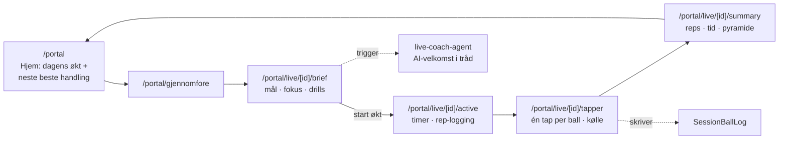
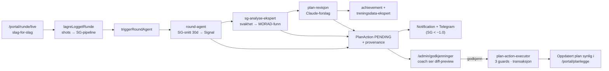
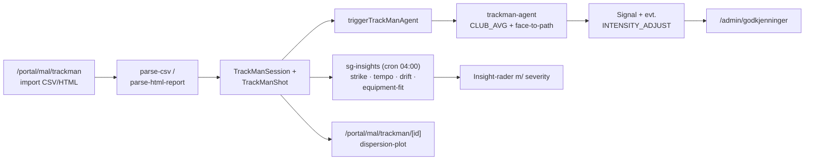
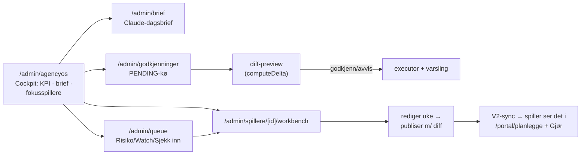
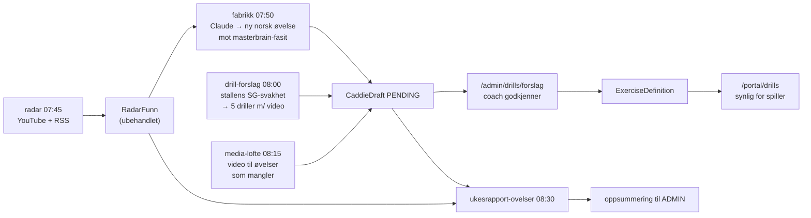
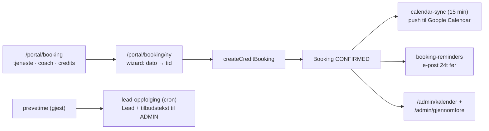

# AK Golf HQ — Faktisk user flow (PlayerHQ & AgencyOS)

**Generert 2026-07-30** · Verktøy: `scripts/rute-graf.mjs` · Rådata: `docs/platform/rute-graf-data.json`
**Regenerer:** `node scripts/rute-graf.mjs`

> **ADVARSEL (lagt til 02.09.2026):** Grafen og rutetallene under er over en måned gamle.
> Faktisk `page.tsx`-antall i dag: **343** (168 portal · 163 admin · 12 forelder) mot 330
> (166 · 153 · 11) da grafen ble generert — og STEG 15-konsolideringen (30.–31.08.2026, se
> `docs/MASTERPLAN-GJENSTAAENDE.md`) har siden erstattet store deler av AgencyOS-navigasjonen
> under med redirects til nye samleflater. Kjør `node scripts/rute-graf.mjs` og lim inn fersk
> output før du stoler på diagrammene eller tallene under.

## Metode og begrensninger

Grafen er bygget ved å lese alle `page.tsx` under `src/app/{portal,admin,forelder}` og trekke ut alle strenge-literals som peker på interne ruter (`href=`, `redirect()`, `router.push()`, `Link`). Det betyr:

- Grafen viser **faktisk kablet navigasjon**, ikke ønsket flyt.
- Lenker bygget helt dynamisk (f.eks. søkeresultater, programmatiske redirects med betingelser) kan mangle.
- Feature-gates (`FEATURES.TALENT`, Pro-gating) og rolle-betingelser er usynlige i grafen — en kant betyr ikke at alle brukere ser lenken.
- Blindgate-listen er **kandidater å verifisere manuelt**, ikke beviste feil (noen ruter nås bevisst kun via søk, varsel-lenker eller e-post).

## Nøkkeltall

| Mål | Verdi |
|---|---|
| Ruter totalt | 330 (166 portal · 153 admin · 11 forelder) |
| Navigasjonskanter | 763 |
| Rene redirect-sider | 83 (legacy-kompatibilitet) |
| Blindgate-kandidater | 23 (se under) |

## Blindgate-kandidater (ingen innkommende lenker funnet)

**Sannsynlig greie** (nås via varsel/e-post/søk/programmatisk navigasjon — verifiser likevel):
`/portal/booking/ny/bekreft`, `/portal/onskeligokt/bekreftet`, `/portal/statistikk/[metric]`, `/portal/trening/logg`, `/portal/tren/[sessionId]/planlagt`, `/admin/drills/forslag` (lenkes fra agentsider), `/forelder/barn/[childId]`

**Bør sjekkes — ser ut som reelle blindgater:**
- `/portal/ai/foresla-turnering`, `/portal/ai/mal-bygger` — AI-funksjoner uten inngang fra UI?
- `/portal/trening/putte-laboratoriet`, `/portal/trening/break-tabell` — putte-verktøy uten lenke inn
- `/portal/meg/innstillinger/ai-coach`, `/portal/meg/innstillinger/okter` — innstillings-sider uten inngang
- `/portal/booking/anlegg/[anleggId]`, `/portal/booking/coach/[coachId]` — booking-innganger
- `/portal/tren/aarsplan/periode/ny` + `[id]/rediger` — eneste gjenværende ekte legacy-sider, nås de?
- `/admin/settings/api`, `/admin/settings/security`, `/admin/stats/overview`, `/admin/talent/wagr-import`, `/admin/grupper/[id]/arsplan/skoledata`
- `/portal/mal/sg-hub/coach/[spillerId]/equipment` — kjent gjenværende legacy-side

---

## Seksjonsgraf — PlayerHQ (kanter med ≥2 lenker)

**Avlesning:** Hovedsløyfen er `NAV → tren/gjennomfore → live → planlegge` — akkurat den daglige loopen plattformen er bygget rundt. `/portal/mal` fungerer som analyse-hub (inn fra TrackMan, ut til coach og runde). Merk at `mal` her er *mål*-hubben — den bærer mye mer enn mål.

## Seksjonsgraf — AgencyOS (kanter med ≥2 lenker)

**Avlesning:** `/admin/spillere` er gravitasjonssenteret — alt av innsikt (talent, tester, plans, live) peker dit. Morgen-loopen er `agencyos → godkjenninger → tilbake`. Legacy-omveier (`approvals→godkjenninger`, `calendar→kalender`) viser at alias-strukturen fungerer.

## Kryss-lenker portal → admin (verdt å verifisere)

21 kanter går fra portal-sider til admin-ruter — mest til `/admin/kalender` (f.eks. `/portal/meg → /admin/kalender` ×8). Dette er mest sannsynlig **coach-rolle-lenker** (coach ser spiller-flaten, men lenkes tilbake til admin), men bør verifiseres som bevisst design — ellers er det rolle-lekkasje i navigasjonen. Unntak: `/portal/mal → /admin/spillere` ×3 og `/portal/tren → /admin/godkjenninger` ser ut som coach-modus-innganger (`/portal/mal/sg-hub/coach/[spillerId]`-mønsteret).

---

## Kuraterte gyldne stier (verifisert mot actions/agenter)

### 1. PlayerHQ — daglig treningsloop

### 2. Runde → agent-kjeden → coach-loop (plattformens kjerne-loop)

### 3. TrackMan-import → innsikt

### 4. AgencyOS — morgenflyt

### 5. Drill-pipeline (ukentlig, mandag)

### 6. Booking (felles reise)

---

## Konklusjon og anbefalinger

1. **Kjernesløyfene er intakte** — daglig loop, runde→coach-loop og drill-pipeline er alle fullt kablet. Plattformens hjerte fungerer som designet.
2. **23 blindgate-kandidater** bør verifiseres manuelt; de mest mistenkelige er AI-sidene (`foresla-turnering`, `mal-bygger`), putte-verktøyene og to innstillings-sider uten inngang.
3. **21 portal→admin-lenker** bør bekreftes som bevisste coach-rolle-innganger.
4. Kjør `node scripts/rute-graf.mjs` på nytt etter større navigasjons-endringer — diff av `rute-graf-data.json` i git viser nøyaktig hvilke kanter som forsvant/kom.
